# RetroPlug2 Architecture

RetroPlug2 is a multi-system retro emulator audio plugin: a single [DPF](https://github.com/DISTRHO/DPF)-based plugin that hosts Game Boy (SameBoy), NES, and GBA (Mesen) cores and exposes them as a music-production instrument, complete with a React UI rendered through an embedded LVGL/QuickJS runtime. One CMake target compiles to every plugin format (VST3 / CLAP / LV2 / VST2 / AU) plus a JACK standalone, splitting at runtime into a realtime DSP half and a UI half that talk only through lock-free queues and snapshot buffers.

**How to read this doc:** each section pairs short prose with one or two Mermaid diagrams (caption in italics beneath) and a "Gotchas / non-obvious" list; every box, arrow, and claim is anchored to `file:line`. A consolidated **Key files** table closes the document. Throughout, the generic plugin framework (the sibling `../dpf.js` repo) is kept visually and textually separate from RetroPlug product code.

## Repository layout

RetroPlug is a pnpm workspace. The generic framework is consumed as an npm *source* package from a sibling repo (`../dpf.js`) via `node -e "require.resolve('dpf.js/package.json')"` + `add_subdirectory` ([CMakeLists.txt:52-63](CMakeLists.txt#L52)); the product keeps its emulator cores and the file watcher in-tree.

| Path | Role |
|---|---|
| `packages/native/src/` | Production C++: DPF plugin (`PluginDSP`/`PluginUI`), JS bridge, RPC service, transport queues, `project/`, `system/`, `lsdj/`, `config/` |
| `packages/native/cli/` | CLI test harness (`TestHarness`, `HarnessRpcService`) — separate synchronous RPC surface |
| `packages/native/test/` | C++/Catch2 tests + the UI test harness (`test/ui/UiTestHarness`) |
| `packages/ui/` | React/TSX UI bundle (`PluginUI.tsx`, `plugin/client.ts`, `menu/`) |
| `packages/retroplug/` | TS facade (`src/emu.ts`) shared by CLI tests and the end-user CLI |
| `packages/cli/` | End-user TypeScript CLI |
| `test/harness/` + `test/ts/` | TS test harness glue (`index.ts`, `ui.ts`) + the test suites |
| `tools/` | Codegen + headless scripts (`gen-rpc-ts.js`, `build-ui.js`, …) |
| `build/` | **Derived** (gitignored): UI bundle, `bundle_data.c`, generated `PluginService.ts` |
| `deps/` | Product-specific native deps: `sameboy`, `mesen`, `efsw` (config/ROM watcher), `catch2`, r8brain/enkiTS/miniaudio (kit compile) |
| `../dpf.js/` | **Sibling repo (generic):** DPF (`deps/dpf`), lv_binding_js → LVGL/txiki QuickJS, rpcpp, msgpack-c, dpf-widgets; one link target `dpfjs::core` |

---

## System overview & layering

This is the "read this first" view. RetroPlug2 is a single DPF plugin (CMake target `retroplug`, `set(NAME retroplug)` at [CMakeLists.txt:19](CMakeLists.txt#L19)) that DPF emits in every plugin format plus a standalone, all from one shared codebase.

**The dpf.js boundary (generic vs product).** The generic plugin framework is consumed as an npm *source* package from a sibling repo. CMake resolves it via `node -e "require.resolve('dpf.js/package.json')"` and `add_subdirectory`s it ([CMakeLists.txt:52-63](CMakeLists.txt#L52)). That subdirectory is where **DPF itself lives** — `../dpf.js/deps/dpf` — and its `add_subdirectory(deps/dpf)` is what defines `dpf_add_plugin()` globally so RetroPlug can call it ([../dpf.js/CMakeLists.txt:28-30](../dpf.js/CMakeLists.txt)). dpf.js also vendors `deps/lv_binding_js` (LVGL + txiki/QuickJS), `deps/rpcpp`, and `deps/dpf-widgets`, and exposes one link target, `dpfjs::core` ([../dpf.js/CMakeLists.txt:150-154](../dpf.js/CMakeLists.txt)). RetroPlug links it as `target_link_libraries(retroplug PUBLIC dpfjs::core ...)` ([CMakeLists.txt:326](CMakeLists.txt#L326)) and passes its own env prefix `DPFJS_ENV_PREFIX="RETROPLUG_"` ([CMakeLists.txt:323](CMakeLists.txt#L323)). RetroPlug keeps the product-specific native deps in-repo: `deps/sameboy` (Game Boy core, [CMakeLists.txt:88](CMakeLists.txt#L88)), `deps/mesen` (NES/GBA, [CMakeLists.txt:91](CMakeLists.txt#L91)), `deps/efsw` (the RetroPlug-specific config/ROM file watcher, [CMakeLists.txt:108-116](CMakeLists.txt#L108)), plus r8brain/enkiTS/miniaudio for LSDj kit compilation and `deps/catch2` for tests.

**Plugin formats and the standalone.** `dpf_add_plugin(retroplug TARGETS au clap jack lv2 vst2 vst3 ...)` ([CMakeLists.txt:254-255](CMakeLists.txt#L254)) generates every format from the same `FILES_DSP` / `FILES_UI` source lists. DPF's `jack` target is the **standalone**: its binary is `bin/retroplug`, produced by the `retroplug-jack` target (`cmake --build --target retroplug` does *not* rebuild it). The product identity is declared at runtime in `PluginShared.hpp` (`kRetroPlugDescriptor`, [PluginShared.hpp:51-53](packages/native/src/PluginShared.hpp#L51)) and must agree with the compile-time `DistrhoPluginInfo.h`. The plugin advertises 8 audio outputs (four stereo pairs) and one host-readable/writable state key, `"project"` ([PluginDSP.cpp:138-190](packages/native/src/PluginDSP.cpp#L138)).

**The two halves.** DPF instantiates a DSP object and (for UI-bearing formats) a UI object:

- **DSP half** — `LVGLPluginDSP : Plugin` in [PluginDSP.cpp:50](packages/native/src/PluginDSP.cpp#L50). It *owns* the canonical domain state: a `Project`, the `CommandQueue commands`, the `EventQueue events`, and atomics for sample rate and focused system ([PluginDSP.cpp:61-66](packages/native/src/PluginDSP.cpp#L61)). It publishes those pointers through a `SharedDSPData shared` struct ([PluginDSP.cpp:83-86](packages/native/src/PluginDSP.cpp#L83)). Its `run()` (audio thread) first drains the `CommandQueue` (LoadRom/AddSystem/SetZoom/PatchKit/…), then steps every system and mixes audio per the routing mode, pushing `ConfigChanged` back onto the `EventQueue` whenever the project tree mutates ([PluginDSP.cpp:285-587](packages/native/src/PluginDSP.cpp#L285)). DPF's `getState`/`setState` serialize the whole project to/from a base64-wrapped PKZIP via `projectConfigToZip`/`projectConfigFromZip` ([PluginDSP.cpp:192-222](packages/native/src/PluginDSP.cpp#L192)).

- **UI half** — `PluginUI.cpp` runs on the UI thread. It holds an `LvglJsEngine jsEngine` and a `std::unique_ptr<PluginJsBridge> bridge` ([PluginUI.cpp:63-64](packages/native/src/PluginUI.cpp#L63)). At construction it reaches the DSP via `getSharedDSPData(getPluginInstancePointer())` ([PluginUI.cpp:210-211](packages/native/src/PluginUI.cpp#L210)) and constructs the bridge with those shared pointers ([PluginUI.cpp:265](packages/native/src/PluginUI.cpp#L265)). The engine loads the embedded React bundle (or a dev path). `uiIdle()` is the per-frame pump that drives `bridge->pumpAsync()`, `pumpMemorySnapshots`, `pumpRomWatchers`, etc. ([PluginUI.cpp:386-406](packages/native/src/PluginUI.cpp#L386)).

**The bridge and RPC surface.** `PluginJsBridge` owns a `PluginRpcService service_` and a generic `dpfjs::JsRpcBridge<PluginRpcService> rpc_` ([PluginJsBridge.hpp:124-125](packages/native/src/PluginJsBridge.hpp#L124)). The generic bridge owns the rpcpp server + msgpack transport and installs the `Symbol.for("plugin")` namespace exposing `__rpcSend`/`__log` to the QuickJS runtime; `registerPluginRpcMethods(rpc_.server())` binds the service methods ([PluginJsBridge.cpp:35-58](packages/native/src/PluginJsBridge.cpp#L35)). `PluginRpcService` is the plain reflect-cpp method surface — `loadRomFromPath`, `listSystems`, `getFrame`, kit patching, etc. ([PluginRpcService.hpp:39](packages/native/src/PluginRpcService.hpp#L39)) — with **no QuickJS/LVGL references**, so it's reusable headless. Mutations it can't do synchronously are posted as `Command`s onto the DSP's `CommandQueue`; reads come back over `EventQueue` / memory-snapshot triple-buffers.

**Domain layer.** `Project` holds the authoritative `ProjectConfig` and the live `systems_`; `snapshotConfig()` serializes runtime systems to config and `loadFromConfig()` rebuilds them ([Project.hpp:19-197](packages/native/src/project/Project.hpp#L19)). Systems derive from `SystemBase` (`SameBoySystem`, `MesenNesSystem`, `MesenGbaSystem`), with roles (LsdjSyncRole, LsdjKitPatchRole, …) auto-attached by `RomSniffer`. SameBoy link-cable sync runs through `LinkGroup`.

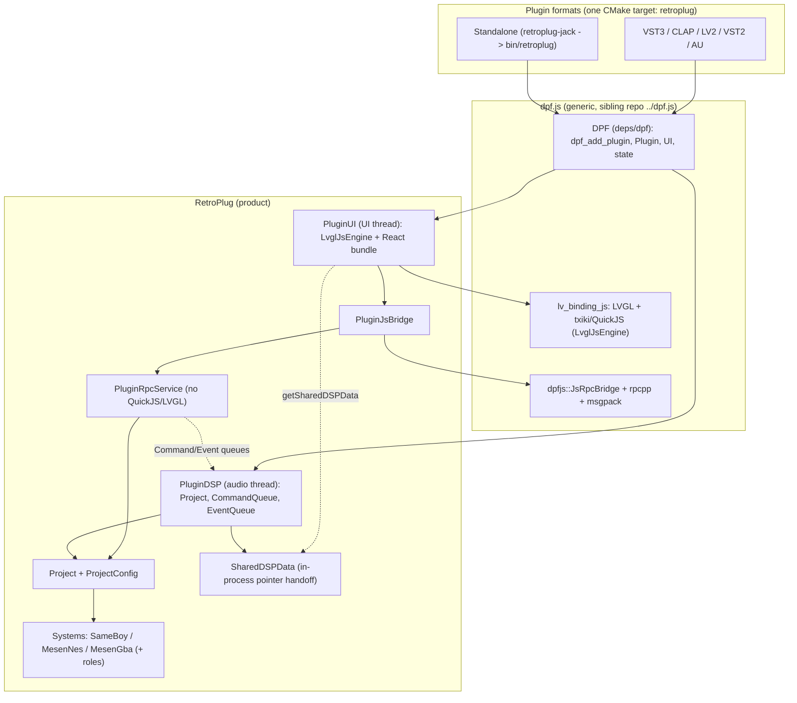

*One retroplug target produces every format and the JACK standalone. dpf.js (sibling repo) provides DPF, the LVGL/QuickJS engine, and the rpcpp bridge; RetroPlug provides the DSP/UI halves, the bridge wiring, the RPC service, and the Project/Systems domain. The UI reaches DSP-owned state through SharedDSPData and mutates it via the Command/Event queues.*

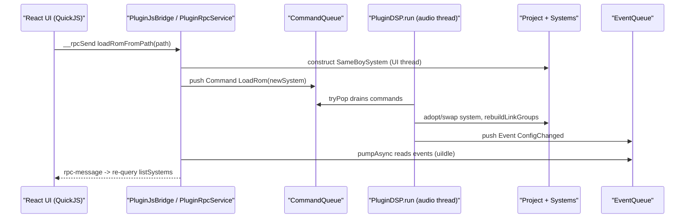

*How a UI action crosses the thread boundary: the UI thread constructs the system and posts a Command; the audio-thread run-loop drains it, mutates the Project, and posts a ConfigChanged Event that the UI's uiIdle pump reads back to refresh React. No domain state is mutated on the audio thread except through the queue.*

**Gotchas / non-obvious**

- `cmake --build --target retroplug` builds the static plugin library and runs `ui-regenerate` but does **not** rebuild `bin/retroplug` — that's the `retroplug-jack` target. Use a bare build (no `--target`) when verifying UI changes.
- `PluginRpcService` deliberately has **no QuickJS/LVGL references**, which is what lets the same method surface run headless in the UI test harness.
- There is no `ARCHITECTURE.md`/`docs/` precedent — this is the first; existing docs (`README.md`, `AGENTS.md`, `dpfjs.md`) use prose-with-anchors and keep framework vs product clearly separated.

---

## Threads & cross-thread data flow

There are exactly two threads that matter for data flow, plus incidental file-watcher threads:

- **DSP / audio thread** — DPF calls `LVGLPluginDSP::run()` ([PluginDSP.cpp:285](packages/native/src/PluginDSP.cpp#L285)) once per audio block. This *is* the realtime audio callback (the standalone is `retroplug-jack`; in a DAW it is the host's audio thread). There is **no separate audio thread distinct from `run()`** — emulator stepping, mixing, MIDI translation, and snapshot publishing all happen inline inside `run()`. The `Project` object lives here and is owned by the DSP plugin instance.
- **UI / main thread** — DPF calls `LVGLPluginUI::uiIdle()` ([PluginUI.cpp:386](packages/native/src/PluginUI.cpp#L386)) on the GUI thread. This drains DSP→UI events, pumps the rpcpp transport, and ticks the QuickJS/LVGL React runtime. All file I/O, ROM/`.rplg` parsing, and `SystemBase` construction/`make_unique`/`delete` happen here.
- **efsw watcher threads** (incidental) — `UserConfig` / `RecentFiles` / the ROM-file watcher fire on background threads but only flip atomics; the actual parse + JS emit is pumped on the UI thread inside `uiIdle` (`pumpReloadsOnUiThread`, `pumpRomWatchers`). Not part of the RT boundary.

In-process plugin formats (VST3/CLAP/VST2/standalone) share one address space, so the UI reaches the DSP-owned `Project`/queues through a `SharedDSPData*` pointer ([PluginDSP.cpp:84-86](packages/native/src/PluginDSP.cpp#L84), `getSharedDSPData`). LV2 splits DSP and UI into separate binaries; there `getSharedDSPData` returns null (the weak fallback at [PluginUI.cpp:54-55](packages/native/src/PluginUI.cpp#L54)) and the bridge degrades.

### Channels crossing the boundary

**1. CommandQueue — UI → DSP (queued, async).** A hand-rolled power-of-two bounded SPSC ring of 1024 POD `Command` records ([CommandQueue.hpp:433](packages/native/src/transport/CommandQueue.hpp#L433)), single producer (UI), single consumer (DSP), lock-free both sides; `tryPush` returns false when full so the UI can drop/coalesce. The DSP drains it at the **top of `run()`** before stepping emulators ([PluginDSP.cpp:301](packages/native/src/PluginDSP.cpp#L301)) so keypresses queued since the last block land in this one. 23 command kinds: `ButtonPress`, `LoadRom`, `AddSystem`, `RemoveSystem`, `ReplaceSystem`, `SetLinkGroup`, `LoadProject`, `SetMidiRouting`/`SetZoom`/`SetLayout`/`SetAudioRouting`, `ResetSystem`, `NewSram`, `LoadSram`, `LoadState`, `SetFastBoot`, `SetModel`, `SetHighpass`, `SetReloadOnRomChange`, `SetLsdjSyncConfig`, `PatchKit`, `SubscribeMemory`, `UnsubscribeMemory`. **Heap ownership transfer pattern:** commands that carry a `SystemBase*` (`LoadRom`/`AddSystem`/`ReplaceSystem`) are fully built (`make_unique` + `onActivate`) on the UI thread; the DSP just swaps the raw pointer into the project with no alloc/free ([CommandQueue.hpp:26-30](packages/native/src/transport/CommandQueue.hpp#L26)). Byte-vector payloads (`LoadSram`/`LoadState`/`PatchKit`/`LoadProject`) are heap-allocated on the UI thread; the DSP frees them.

**2. EventQueue — DSP → UI (queued, async).** Same ring shape, 256 slots ([EventQueue.hpp:56](packages/native/src/transport/EventQueue.hpp#L56)), producer DSP / consumer UI, drained in `uiIdle`→`drainEvents()` ([PluginUI.cpp:135](packages/native/src/PluginUI.cpp#L135)). Two event kinds: `SystemReleased` ships a displaced `SystemBase*` back so the UI thread can `delete` it off the audio thread ([PluginUI.cpp:143](packages/native/src/PluginUI.cpp#L143)) — the return leg of the ownership-transfer protocol so the DSP never frees; and `ConfigChanged`, a payload-less "project tree changed" signal pushed once per block when `projectMutated` ([PluginDSP.cpp:583](packages/native/src/PluginDSP.cpp#L583)) or from `applyProjectFromConfig`/`setState`, which the UI re-emits to JS as `config-changed` so React re-queries `listSystems()`.

**3. Three lock-free triple-buffers — DSP writer / UI reader (seqlock, async).** All three share the seqlock + reader-hint discipline (`seq` even=stable / odd=writer-in-progress; reader brackets its memcpy with two `seq` reads and retries on mismatch; writer skips the reader's `readingHint` slot when picking the next write slot):

- **FrameBufferTriple** ([FrameBufferTriple.hpp:28](packages/native/src/transport/FrameBufferTriple.hpp#L28)) — one per system, XRGB8888. Written by the emulator pixel callback; SameBoy publishes in `onVblank` ([SameBoySystem.cpp:590](packages/native/src/system/sameboy/SameBoySystem.cpp#L590)) then re-points `GB_set_pixels_output` at the new write slot. Read UI-side via the `getFrame` RPC ([PluginRpcService.cpp:496](packages/native/src/PluginRpcService.cpp#L496)), driven by the per-tick `frame` event React polls.
- **MemorySnapshotTriple (live memory subs)** ([MemorySnapshotTriple.hpp:22](packages/native/src/transport/MemorySnapshotTriple.hpp#L22)) — allocated per `(system, type)` on `SubscribeMemory`, freed on `Unsubscribe` (refcounted). Written by `publishMemorySnapshots()` ([SystemBase.cpp:71](packages/native/src/system/SystemBase.cpp#L71)) at the end of each block (`finishBlock`/`onProcess`, e.g. [SameBoySystem.cpp:678](packages/native/src/system/sameboy/SameBoySystem.cpp#L678)). Read UI-side in `pumpMemorySnapshots()` ([PluginJsBridge.cpp:98](packages/native/src/PluginJsBridge.cpp#L98)), hashed for dedup, pushed as rpcpp `memory` notifications.
- **State (savestate) snapshot** — a `MemorySnapshotTriple` sized `[len:4][savestate]` per system, kept enabled every block in the plugin path ([PluginDSP.cpp:594](packages/native/src/PluginDSP.cpp#L594)). Written by `publishStateSnapshot()` ([SystemBase.cpp:101](packages/native/src/system/SystemBase.cpp#L101)) throttled to ~0.5 s. Read UI-side via `readStateSnapshot()` for Save State / SRAM / Duplicate ([PluginRpcService.cpp:577,1275,1336](packages/native/src/PluginRpcService.cpp#L577)).

### Synchronous vs queued

- **Queued / async (cross-thread):** every project mutation listed above (CommandQueue), every DSP→UI notification (EventQueue), and all three snapshot reads (triple-buffers). Nothing the UI does mutates DSP state directly.
- **Synchronous (same-thread, no queue):** `getState`/`setState` (DPF state save/restore) run **on the DSP side** before `activate` and call `project.snapshotConfig()` / `applyProjectFromConfig` directly ([PluginDSP.cpp:192,209](packages/native/src/PluginDSP.cpp#L192)). `Command::LoadProject` is the *user-driven* counterpart that funnels the same `applyProjectFromConfig` through the queue so it lands during the run-loop drain. Parameter writes use DPF's own `setParameterValue` path, not the CommandQueue.

The audio-thread invariant is that `run()` must never allocate, free, or block ([CommandQueue.hpp:26](packages/native/src/transport/CommandQueue.hpp#L26)). Constructing an emulator instance, parsing a `.rplg`, or deleting a system are all non-RT operations, so they are pushed to the UI thread and only the **already-built raw pointer** (or pre-allocated byte vector) crosses into `run()`, where the DSP does an O(1) pointer swap. The displaced object returns via EventQueue for the UI to delete. The triple-buffers exist for the reverse reason: the UI must read live emulator pixels/memory/state without taking a lock the audio thread would otherwise have to wait on — the seqlock lets the writer never block and the reader retry instead.

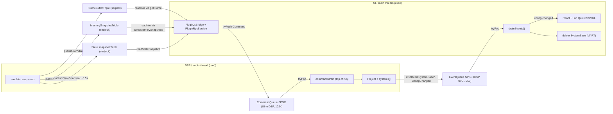

*All UI to DSP mutation is queued through the SPSC CommandQueue; DSP to UI uses the EventQueue (pointer hand-back + ConfigChanged) plus three DSP-writer / UI-reader seqlock triple-buffers. No shared-state mutation crosses the boundary.*

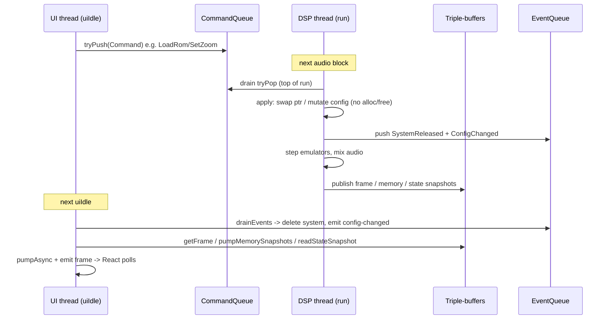

*Each audio block, run() first drains commands then publishes snapshots; each uiIdle, the UI drains events and reads the latest published snapshots. The two cadences are independent and never block each other.*

**Gotchas / non-obvious**

- `run()` **is** the audio callback itself — there is no separate audio thread. Emulator stepping, mixing, and all snapshot publishing happen inline in `run()`.
- Ownership transfer is asymmetric: the UI thread does every `make_unique`/`onActivate` (LoadRom/AddSystem) and every `delete` (via EventQueue `SystemReleased`); the DSP only swaps raw pointers, so it never allocates or frees on the audio thread.
- `getState`/`setState` run synchronously on the DSP side around `activate` and call `snapshotConfig`/`applyProjectFromConfig` directly — they do **not** go through CommandQueue. The user-driven Load Project (`Command::LoadProject`) is the queued counterpart and additionally calls `project.onActivate()` itself because no DPF `activate()` follows a mid-`run()` load.
- `ConfigChanged` is pushed at most once per block (`projectMutated` flag), and `Command::LoadProject` deliberately does **not** set `projectMutated` because `applyProjectFromConfig` already emits `ConfigChanged` — avoiding a double emit.
- FrameBuffer is published per emulator vblank (`onVblank`), not per audio block, so frame cadence is decoupled from block size; memory snapshots publish per block and state snapshots are throttled to ~0.5 s.
- The TSan suppression is intentionally narrow: only the two `readInto` memcpys (`race:MemorySnapshotTriple::readInto`, `race:FrameBufferTriple::readInto`) in [tsan.supp](packages/native/test/sanitizer/tsan.supp). The reader discards torn copies via the `seq` re-check, so it is benign; any other race still fails the build.

---

## JS↔C++ RPC bridge & the codegen/build pipeline

### The bridge: one synchronous entrypoint, async refresh

The UI never touches the QuickJS C-API directly. [client.ts:58](packages/ui/src/plugin/client.ts#L58) builds a typed rpcpp client over a passthrough codec (`objectCodec`, line 25 — `isBinary: false`, encode/decode are identity casts because the C++ side marshals JSON-RPC envelopes as *live JS objects* via rpcpp's QuickJS codec, not bytes). Its transport ([transport.ts:22](packages/ui/src/plugin/transport.ts#L22)) resolves `globalThis[Symbol.for("plugin")].__rpcSend` and, in `send()`, calls it synchronously: `const reply = rpcSend(frame)` (line 42). Async/notification frames arrive separately on the `"rpc-message"` lvgl channel (line 36) and are forwarded to the client's frame handler.

On the C++ side `Symbol.for("plugin")` and `__rpcSend` are created by the *generic* `dpfjs::JsRpcBridge` ([JsRpcBridge.hpp:42](../dpf.js/src/dpfjs/JsRpcBridge.hpp)), which RetroPlug instantiates as a member of `PluginJsBridge` ([PluginJsBridge.hpp:125](packages/native/src/PluginJsBridge.hpp#L125), constructed [PluginJsBridge.cpp:51](packages/native/src/PluginJsBridge.cpp#L51)). `__rpcSend`'s body ([JsRpcBridge.hpp:73](../dpf.js/src/dpfjs/JsRpcBridge.hpp)) calls `server_->processMessage(req)` on a `rpcpp::TypedRpcServer<PluginRpcService, QuickJSCodec>` and materializes the reply object on the JS thread; notifications return `JS_NULL`. The method bodies are registered onto that server by `registerPluginRpcMethods(rpc_.server())` ([PluginJsBridge.cpp:53](packages/native/src/PluginJsBridge.cpp#L53)).

**The mutating round-trip is deliberately async.** A method like `setZoom` ([PluginRpcService.cpp:726](packages/native/src/PluginRpcService.cpp#L726)) does *not* mutate the project — it validates, marks dirty, and `commands_->tryPush(Command::makeSetZoom(...))`, returning a bool. The zoom menu even calls it fire-and-forget: `plugin.$notify("setZoom", ...)` ([menuDefs.tsx:405](packages/ui/src/menu/menuDefs.tsx#L405)), which sends `id: null` (no reply expected). The actual apply happens on the **DSP thread**: [PluginDSP.cpp:301](packages/native/src/PluginDSP.cpp#L301) drains the `CommandQueue` each block; the `SetZoom` case (line 382) sets `projectMutated = true`; at the end of the drain (line 583) it pushes `Event::makeConfigChanged()` onto the `EventQueue`. Back on the UI thread, `PluginUI::drainEvents()` ([PluginUI.cpp:135](packages/native/src/PluginUI.cpp#L135)) pops the event and calls `jsEngine.emit("config-changed", ...)` (line 154). React's [PluginUI.tsx:132](packages/ui/src/PluginUI.tsx#L132) has `on("config-changed", handler)` wired to `refreshSystems()` (line 105), which re-queries `listSystems`, `getZoom`, `getFocus`, etc. via the typed client. This event indirection is why "rom-loaded" alone is insufficient — the bridge's emit fires before the DSP has drained the command, so React must wait for `ConfigChanged` to see committed state.

A second async path is the **memory snapshot** notification: `PluginJsBridge::pumpMemorySnapshots()` ([PluginJsBridge.cpp:75](packages/native/src/PluginJsBridge.cpp#L75)) reads each subscribed triple-buffer, dedups by FNV-1a hash, and calls `rpc_.server().writeNotification("memory", payload)` (line 126); `pumpAsync()` ([JsRpcBridge.hpp:118](../dpf.js/src/dpfjs/JsRpcBridge.hpp)) then drains the transport into `engine.emit("rpc-message", obj)`. Both pumps run each `PluginUI::uiIdle`.

### The codegen/build pipeline (ui-regenerate)

`PluginService.ts` is **not** hand-written. `RpcSchemaDump.cpp` is a tiny executable ([RpcSchemaDump.cpp:17](packages/native/src/RpcSchemaDump.cpp#L17)) that constructs an all-null `PluginRpcService`, registers the methods, and prints `server.dumpSchema()` (OpenRPC JSON) to stdout — no method bodies run; the schema is pure compile-time reflection on the signatures. The `rpc-schema-dump` target is defined at [CMakeLists.txt:125](CMakeLists.txt#L125).

The `ui-regenerate` target ([CMakeLists.txt:220](CMakeLists.txt#L220), `ALL`, depends on `rpc-schema-dump`) runs three commands in order:

1. `tools/gen-rpc-ts.js $<TARGET_FILE:rpc-schema-dump> build/ui/generated/PluginService.ts PluginService` — spawns the dumper, bundles rpcpp's TS codegen via esbuild, calls `writeService(...)`, then regex-patches mangled `std::optional`/`std::vector`/`basic_string` type names and `rfl::Bytestring`→`Uint8Array` ([gen-rpc-ts.js:94-118](tools/gen-rpc-ts.js#L94)); idempotent write (line 128).
2. `tools/build-ui.js build/ui/bundle.js bundle.d packages/ui/src/PluginUI.tsx` — esbuild bundles the React TSX entry to one `bundle.js`.
3. `${_TJSC_COMMAND} -m -s -p ui_ -o bundle_data.c.new bundle.js` then `copy_if_different bundle_data.c.new bundle_data.c` ([CMakeLists.txt:237-242](CMakeLists.txt#L237)) — txiki's `tjsc` (the QuickJS bytecode compiler; in-tree `tjsc` target or `-DTJSC_EXECUTABLE` for cross-compile, [CMakeLists.txt:186-196](CMakeLists.txt#L186)) compiles the bundle to a QuickJS bytecode C byte-array embedded into the plugin. `copy_if_different` keeps the `.o` from rebuilding when bytecode is unchanged.

`PluginService.ts` is consumed via the `"plugin-service"` import alias in [client.ts:11](packages/ui/src/plugin/client.ts#L11). The whole `/build/` tree is gitignored ([.gitignore:3](.gitignore#L3)), so `PluginService.ts`, `bundle.js`, and `bundle_data.c` are all **derived artifacts that must never be committed**. The CLI test harness has a parallel pipeline (`cli-regenerate` → `HarnessService.ts`, [CMakeLists.txt:407](CMakeLists.txt#L407)) reusing the same `gen-rpc-ts.js` against a different schema-dump exe.

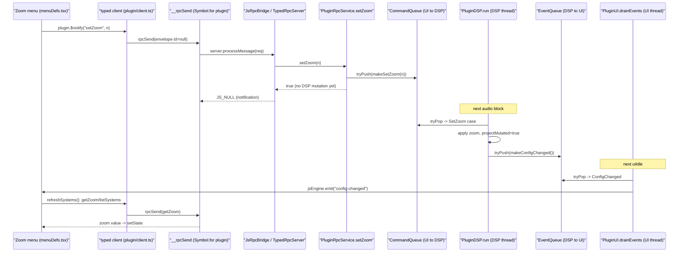

*A mutating RPC (setZoom) is fire-and-forget over the synchronous __rpcSend transport: the service only enqueues a Command and returns. The committed result is observed asynchronously — the DSP applies the command on its next block and pushes a ConfigChanged event, which PluginUI re-emits as the "config-changed" JS event, driving React to re-query the typed client. loadRomFromPath follows the identical shape (LoadRom command + ConfigChanged).*

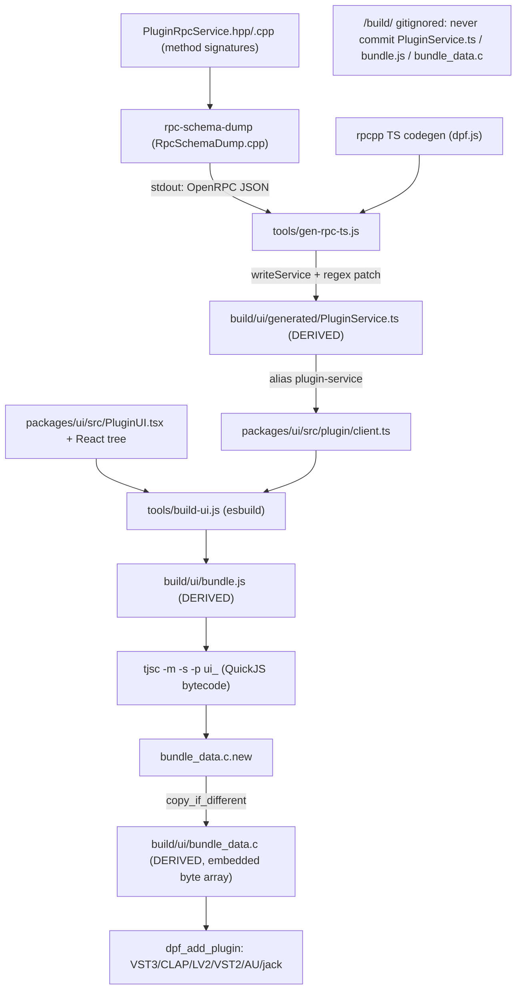

*The ui-regenerate target (CMakeLists.txt:220) runs three commands in sequence: (1) gen-rpc-ts.js turns rpc-schema-dump's OpenRPC JSON into the typed PluginService.ts client; (2) build-ui.js esbuild-bundles PluginUI.tsx (which imports that client) into bundle.js; (3) tjsc compiles the bundle to QuickJS bytecode emitted as bundle_data.c (via copy_if_different to avoid spurious .o rebuilds), embedded into every DPF plugin variant. Every node marked DERIVED lives under /build/ and is gitignored.*

**Gotchas / non-obvious**

- The transport `objectCodec` is a passthrough (`isBinary: false`, identity encode/decode) — the C++ QuickJS codec marshals JSON-RPC envelopes as live JS objects, not bytes.
- Mutating RPCs are fire-and-forget: `setZoom`/`loadRomFromPath` only `tryPush` a Command and return a bool. The committed state is observed only after `ConfigChanged` round-trips, which is why React keys refresh off `config-changed`, not the call's return.
- `RpcSchemaDump.cpp` constructs an **all-null** service and runs **no** method bodies — the OpenRPC schema is pure compile-time reflection over the signatures.
- `PluginService.ts`, `bundle.js`, and `bundle_data.c` all live under gitignored `/build/` and must never be committed; `copy_if_different` on `bundle_data.c` prevents spurious `.o` rebuilds when bytecode is unchanged.

---

## Domain model: Project, Systems, roles, serialization

### Two trees: plain-data config vs polymorphic runtime

The domain is deliberately split into a **serializable plain-data config tree** and a **runtime emulator tree**, joined only by the inverse pair `snapshotConfig()` / `loadFromConfig()`.

**Config tree (reflect-cpp serializable, DSP-owned).** `ProjectConfig` ([ProjectConfig.hpp:58](packages/native/src/project/ProjectConfig.hpp#L58)) holds a `schemaVersion`, a `ProjectSettings` ([ProjectConfig.hpp:48](packages/native/src/project/ProjectConfig.hpp#L48) — `layout`/`midiRouting`/`audioRouting`/`zoom`, where `zoom==0` means "inherit `UserConfig::defaultZoom`"), and a `std::vector<SystemConfig>`. `SystemConfig` ([SystemConfig.hpp:13](packages/native/src/system/SystemConfig.hpp#L13)) is an `rfl::TaggedUnion<"kind", SameBoyConfig, MesenNesConfig, MesenGbaConfig>` — the on-disk discriminator is `"kind"` with tags `"sameboy"`/`"nes"`/`"gba"`. Each alternative carries the same binary-blob trio (`romBytes`/`sram`/`savestate`) plus a `std::vector<RoleConfig> roles`. `RoleConfig` ([RoleConfig.hpp:11](packages/native/src/system/RoleConfig.hpp#L11)) is itself a tagged union with **three** alternatives: `MgbRoleConfig` (`"mgb"`), `LsdjSyncConfig` (`"lsdj-sync"`), and `rp::lsdj::LsdjKitPatchConfig` (`"lsdj-kit-patch"`).

**Runtime tree (DSP-owned, polymorphic).** `Project` ([Project.hpp:19](packages/native/src/project/Project.hpp#L19)) owns `std::vector<unique_ptr<SystemBase>> systems_`, a `std::vector<LinkGroup> linkGroups_`, and the authoritative `ProjectConfig config_`. `SystemBase` ([SystemBase.hpp:30](packages/native/src/system/SystemBase.hpp#L30)) is subclassed by `SameBoySystem`, `MesenNesSystem`, `MesenGbaSystem`. Only `SameBoySystem` carries runtime `RomRole` instances and participates in `LinkGroup`.

**The inverse pair.** `Project::snapshotConfig()` ([Project.cpp:223](packages/native/src/project/Project.cpp#L223)) starts from `config_`, clears `systems`, and re-pushes each `s->snapshotConfig()` (e.g. `SameBoySystem::snapshotConfig` at [SameBoySystem.cpp:761](packages/native/src/system/sameboy/SameBoySystem.cpp#L761), which embeds `romBytes` when `embedRom` and captures live savestate+SRAM). `Project::loadFromConfig()` ([Project.cpp:233](packages/native/src/project/Project.cpp#L233)) is the inverse: `clearSystems()`, copy `cfg.settings`, then `addSystem()` per config ([Project.cpp:50](packages/native/src/project/Project.cpp#L50)) — which dispatches on the variant, prefers embedded `romBytes` over `slurpFile(romPath)`, restores SRAM from the sibling `<rom>.sav` when absent ([Project.cpp:39](packages/native/src/project/Project.cpp#L39)), then `rebuildLinkGroups()`.

**Roles attach at activate, not load.** `addSystem` only constructs the system; roles materialize in `SameBoySystem::onActivate` ([SameBoySystem.cpp:215](packages/native/src/system/sameboy/SameBoySystem.cpp#L215)): if `config_.roles` is empty, `detectRomKind(rom_)` ([RomSniffer.cpp:22](packages/native/src/system/sameboy/RomSniffer.cpp#L22), matches title at 0x0134) seeds defaults — `MgbRoleConfig` for MGB, and **both** `LsdjSyncConfig` + `LsdjKitPatchConfig` for LSDj. Then `instantiateRoles()` ([SameBoySystem.cpp:445](packages/native/src/system/sameboy/SameBoySystem.cpp#L445)) turns each `RoleConfig` into a runtime `RomRole` and calls `onAttach`. The user's explicit role list always wins; the sniffer only fills an empty list.

**LinkGroup.** `rebuildLinkGroups()` ([Project.cpp:174](packages/native/src/project/Project.cpp#L174)) buckets `SameBoySystem`s by `SameBoyConfig::linkGroupId` (0 = standalone), dissolves singleton groups, and populates each member's `linkPeers_` so serial bits ferry in lockstep.

### Serialization: two .rplg shapes, one autodetecting loader

`ProjectSerialization.hpp` is the single source of truth for `ProjectConfig` ↔ on-disk form, used by both DPF `getState`/`setState` and the RPC save/load.

- **Thin path-only JSON** — `projectConfigToJsonFile()` ([ProjectSerialization.hpp:42](packages/native/src/project/ProjectSerialization.hpp#L42)) calls `project_binaries::clear()` ([ProjectBinaries.hpp:142](packages/native/src/project/ProjectBinaries.hpp#L142)) to empty every `romBytes`/`sram`/`savestate` and drop each kit's `compiledBytes`+`compiledHash`, then writes JSON. On load the ROM is re-read from `romPath`, SRAM from the sibling `<rom>.sav`, and kits are recompiled from sample metadata.
- **Self-contained PKZIP** — `projectConfigToZip()` ([ProjectSerialization.hpp:48](packages/native/src/project/ProjectSerialization.hpp#L48)) runs `project_binaries::strip()` ([ProjectBinaries.hpp:114](packages/native/src/project/ProjectBinaries.hpp#L114)), which moves each blob into a deterministically-keyed zip entry (`systems/{i}/rom|sram|state`, `systems/{i}/roles/{r}/kits/{k}/compiled` — [ProjectBinaries.hpp:21-27](packages/native/src/project/ProjectBinaries.hpp#L21)) and nulls it in the config, then adds the now-small `project.json`.

**Load path.** `projectConfigFromBytes()` ([ProjectSerialization.hpp:81](packages/native/src/project/ProjectSerialization.hpp#L81)) autodetects: a `PK` magic (`0x50 0x4B`) routes to `projectConfigFromZip()` (which restores blobs from entries), anything else parses as path-only JSON. `PluginRpcService::loadProjectFromPath` ([PluginRpcService.cpp:351](packages/native/src/PluginRpcService.cpp#L351)) parses, then holds the result in `pendingProject_`; if a UI is attached and `scanMissingFiles()` ([ProjectMissingFiles.hpp:79](packages/native/src/project/ProjectMissingFiles.hpp#L79)) finds moved ROMs/WAVs, it emits `missing-files` and waits for `relinkMissingFile` ([PluginRpcService.cpp:423](packages/native/src/PluginRpcService.cpp#L423), which calls `relinkInConfig` + `autoFindSiblings`). `commitPendingProject()` ([PluginRpcService.cpp:386](packages/native/src/PluginRpcService.cpp#L386)) then runs `recompileMissingKits()` ([ProjectKitRecompile.hpp:47](packages/native/src/lsdj/ProjectKitRecompile.hpp#L47)) for kits that have `samples` but empty `compiledBytes`, heap-allocates the config, and pushes a `LoadProject` command to the DSP — which ultimately calls `Project::loadFromConfig`.

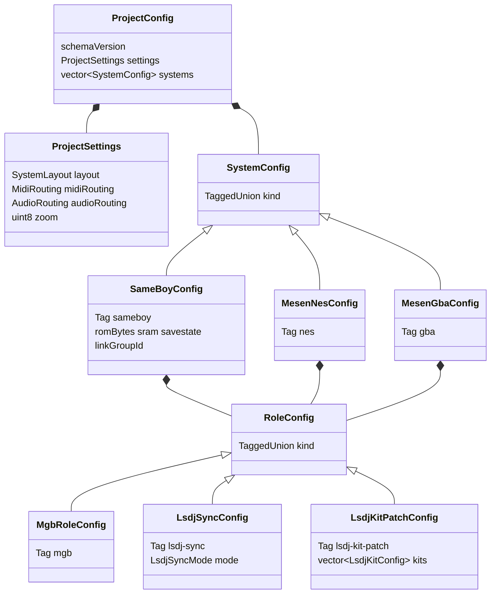

*The plain-data config tree: ProjectConfig holds ProjectSettings plus an rfl tagged-union vector of per-system configs (kind = sameboy/nes/gba), each carrying tagged-union RoleConfigs (mgb / lsdj-sync / lsdj-kit-patch). All reflect-cpp serializable. Files: ProjectConfig.hpp:48-64, SystemConfig.hpp:13, SameBoyConfig.hpp:40, MesenNesConfig.hpp:15, MesenGbaConfig.hpp:20, RoleConfig.hpp:11, LsdjSyncRole.hpp:25, LsdjKitPatchRole.hpp:46.*

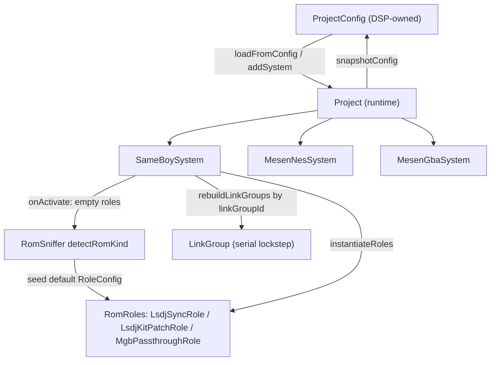

*Runtime mirror: Project builds SystemBase subclasses from config via addSystem/loadFromConfig and walks them back via snapshotConfig (Project.cpp:50,223,233). SameBoySystem::onActivate asks RomSniffer for a default role when config has none, then instantiateRoles builds runtime RomRoles; rebuildLinkGroups couples same-linkGroupId SameBoys (Project.cpp:174, SameBoySystem.cpp:215,445).*

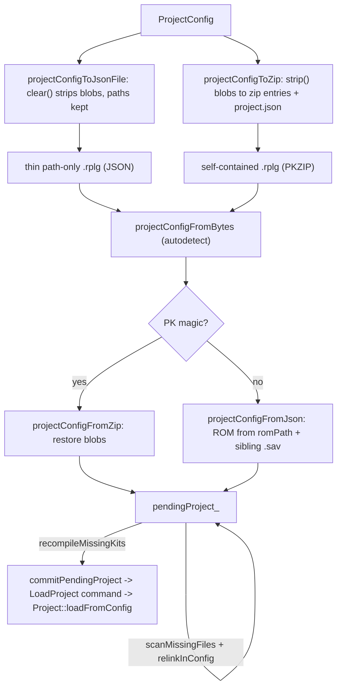

*Serialization: thin JSON strips binaries (re-read ROM from disk + sibling .sav, recompile kits); PKZIP embeds them as keyed entries. projectConfigFromBytes autodetects by PK magic. The RPC load path holds the parse pending for missing-file relink, recompiles kits, then commits to the DSP. Files: ProjectSerialization.hpp:42-87, ProjectBinaries.hpp:114-161, ProjectMissingFiles.hpp:79-148, ProjectKitRecompile.hpp:47, PluginRpcService.cpp:351-415.*

**Gotchas / non-obvious**

- `RoleConfig` is a **three-way** tagged union (`MgbRoleConfig`, `LsdjSyncConfig`, `LsdjKitPatchConfig`) — [RoleConfig.hpp:11](packages/native/src/system/RoleConfig.hpp#L11).
- Roles are **not** created during config load. `addSystem` only builds the system; runtime `RomRole` instances are created in `SameBoySystem::onActivate` via `instantiateRoles`, and `RomSniffer` only seeds a default when `config_.roles` is empty (the user's list always wins).
- An LSDj ROM gets **two** default roles: `LsdjSyncConfig` **and** `LsdjKitPatchConfig` (orthogonal) — [SameBoySystem.cpp:224-229](packages/native/src/system/sameboy/SameBoySystem.cpp#L224).
- Only SameBoy systems carry roles meaningfully at runtime and participate in `LinkGroup`; Mesen configs have a `roles` vector but `rebuildLinkGroups` `dynamic_cast`s to `SameBoySystem` and skips the rest — [Project.cpp:192](packages/native/src/project/Project.cpp#L192).
- The two `.rplg` shapes share the extension and one autodetecting loader (`projectConfigFromBytes` keys off the `PK` zip magic); DPF state chunks are the PKZIP form.
- Path-only JSON drops kit `compiledBytes` **and** `compiledHash`; they are rebuilt from sample WAV metadata by `recompileMissingKits` at commit time, after any missing-file relink.
- SRAM for a path-only save is restored from the sibling `<rom>.sav`, not from the project file — [Project.cpp:39](packages/native/src/project/Project.cpp#L39).

---

## Test & headless harness topology

RetroPlug's domain layer (`Project` + the `system/*` emulators) is exercised through three distinct front ends. Two share the production RPC surface; the third is a deliberately parallel one. Knowing which layers are shared vs duplicated is the key to this section.

**(a) Production — DPF host.** The DAW host instantiates a DPF plugin. `PluginDSP` is the `Plugin` subclass on the audio thread: its `run()` drains the UI→DSP `CommandQueue` each block ([PluginDSP.cpp:301](packages/native/src/PluginDSP.cpp#L301)) — `LoadRom`/`LoadProject`/`SetZoom`/`ButtonPress` etc. — then advances every system. `PluginUI` runs on the UI thread; in `uiIdle` it drains the DSP→UI `EventQueue` ([PluginUI.cpp:140](packages/native/src/PluginUI.cpp#L140)) and owns a `PluginJsBridge` ([PluginUI.cpp:64,265](packages/native/src/PluginUI.cpp#L64)). The bridge wraps `PluginRpcService` in a `dpfjs::JsRpcBridge` and installs the `Symbol.for("plugin")` namespace with `__rpcSend`/`__log` into the LVGL/QuickJS runtime that executes the React bundle ([PluginJsBridge.cpp:49-51](packages/native/src/PluginJsBridge.cpp#L49)). The React UI calls the typed client `build/ui/generated/PluginService.ts`, which marshals JSON-RPC objects through `__rpcSend` into `PluginRpcService`'s method bodies.

**(b) UI test harness — reuses production RPC.** [UiTestHarness.cpp](packages/native/test/ui/UiTestHarness.cpp) boots the REAL React bundle (`ui_bundle`, the same QuickJS bytecode the plugin embeds — `:235`) on a software LVGL display (no GL, no Xvfb: a memory draw-buffer + no-op flush, `boot()` at `:161`). Crucially it constructs a **real `PluginJsBridge`** with a real `PluginRpcService` (`:222`) — so UI tests exercise the exact production RPC path. It owns its own `CommandQueue`/`EventQueue`/`Project` but has **no DSP thread**: `pump()` drains the CommandQueue inline (`:334-365`, mirroring `PluginDSP::run`'s `ButtonPress`/`LoadProject`/`SetFastBoot` handlers) and advances the emulator directly via `project_.onProcess`. `UiTsRunner.cpp` (`retroplug-ui-test --test`) installs `Symbol.for("retroplug")` (TAP plumbing) + `Symbol.for("retroplug-ui")` (the `ui` API), then runs the test bundle in the SAME runtime that hosts the UI bundle. Tests under `test/ts/ui/**` import from `test/harness/ui.ts` and drive `ui.boot/loadRom/pump/snapshot/findByText/tapKey/clickAt`, asserting on the live LVGL tree.

**(c) CLI test harness — a SEPARATE synchronous RPC service.** [TestHarness.cpp](packages/native/cli/TestHarness.cpp) embeds the shared txiki/QuickJS host (`TjsHostRuntime`) and stands up its **own** rpcpp stack: `HarnessRpcService` + `HarnessRpcServer` over a `QuickJSCodec` (`:142-147`). It is fully synchronous — the transport's async-delivery callback is a no-op (`:144`) and there is **no DPF, no CommandQueue, no DSP thread**: `__rpcSend` calls `rpcServer_->processMessage(req)` and returns the reply inline (`:167-172`). It exposes test instrumentation absent from production RPC: the Mesen debugger/profiler, `savFromJson`, `drainSerial`/`drainMidi`, `runMsPerSystem`, `patchKit`, `saveRplg`. Tests under `test/ts/**` import `test/harness/index.ts`, which builds `emu` via `createEmu(harnessRpcSend())` — `harnessRpcSend` resolves `Symbol.for("retroplug").__rpcSend`. `emu` ([emu.ts:135](packages/retroplug/src/emu.ts#L135)) wraps the typed `createSyncClient<HarnessService>` client; the same facade is reused by the end-user CLI (`packages/cli`).

### The known duplication: two RPC services, two clients

There are **two independent reflect-cpp RPC services**, each with its own schema dump and generated TS client:

| | Production + UI harness | CLI harness |
|---|---|---|
| C++ service | `PluginRpcService` | `HarnessRpcService` |
| Bridge / runtime | `PluginJsBridge` (`Symbol.for("plugin")`) in LVGL QuickJS | `TjsHostRuntime` (`Symbol.for("retroplug")`) in txiki QuickJS |
| Cross-thread? | Yes — `CommandQueue`/`EventQueue` + triple-buffers | No — synchronous `processMessage`, no queues |
| Schema dump | `src/RpcSchemaDump.cpp` | `cli/HarnessSchemaDump.cpp` (own exe, runtime-free to avoid a build cycle) |
| Generated client | `build/ui/generated/PluginService.ts` | `HarnessService.ts` (via `gen-rpc-ts.js … HarnessService`) |
| Surface | product RPCs (loadRom, listSystems, recent files, browser, zoom) | test instrumentation (debugger, profiler, savFromJson, drainSerial, runMsPerSystem, patchKit) |

[HarnessSchemaDump.cpp:7](packages/native/cli/HarnessSchemaDump.cpp#L7) explicitly notes it mirrors `RpcSchemaDump.cpp` "for the plugin," and a wall of `static_assert`s in `TestHarness.cpp:22-42` guards the hand-mirrored TS enums (`Button`/`Mem`/`Routing`) against drift between the two surfaces — a tell that the duplication is maintained by hand, not generated from one source.

### Verification-command map

| Command | Builds | Drives | Exercises |
|---|---|---|---|
| `pnpm test:cli` | `retroplug-cli` + `cli-regenerate` | `test/ts/**` via HarnessRpcService | DSP/behaviour: memory, registers, audio, MIDI/serial, link sync, sav authoring |
| `pnpm test:ui` | `retroplug-ui-test` | `test/ts/ui/**` via real PluginJsBridge | React UI on software LVGL: tree structure + snapshots |
| `pnpm smoke` | `retroplug-cli` | `test/ts/gb/mgb` | quick mGB chord smoke (subset of test:cli) |
| `pnpm validate` | `retroplug-clap` + `retroplug-vst3` | `clap-validator` + `pluginval` | DPF format adapters: ABI / state-restore / threading |
| `pnpm screenshot` | `retroplug-jack` | `tools/run-standalone.sh` | live standalone eyeball check (`/tmp/retroplug.png`) |

`test:cli` and `validate`/`screenshot` exercise different stacks: `test:cli` bypasses DPF and the CommandQueue entirely (HarnessRpcService), while `validate` and `screenshot` go through the real DPF wrapper / standalone. `test:ui` is the only headless path that runs the production `PluginRpcService` + React bundle.

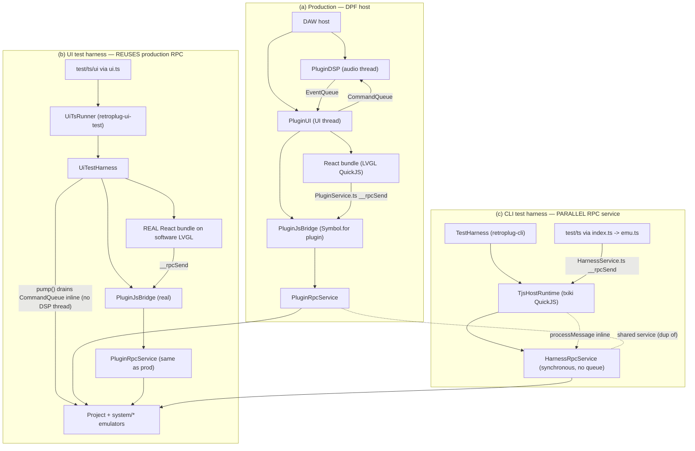

*Production (a) and the UI test harness (b) share PluginRpcService over PluginJsBridge; the CLI harness (c) is a separate synchronous HarnessRpcService. All three converge on Project + the system emulators. The UI harness has no DSP thread — pump() drains the CommandQueue inline.*

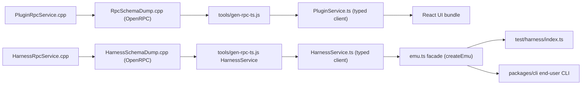

*The codegen pipeline runs twice in parallel — once per service. PluginRpcService feeds the React UI's PluginService.ts; HarnessRpcService feeds emu.ts (shared by CLI tests and the end-user CLI). The two services are maintained as separate surfaces.*

**Gotchas / non-obvious**

- **Two parallel RPC services, not one:** `PluginRpcService` (production + UI harness) and `HarnessRpcService` (CLI harness) are independent reflect-cpp surfaces with separate schema dumps and separate generated clients (`PluginService.ts` vs `HarnessService.ts`). `HarnessSchemaDump.cpp:7` calls itself a mirror of `RpcSchemaDump.cpp`.
- The UI test harness reuses the **real** `PluginJsBridge` + `PluginRpcService` ([UiTestHarness.cpp:222](packages/native/test/ui/UiTestHarness.cpp#L222)) — it is **not** a parallel service. It is the only headless path that exercises the production RPC surface and the real React bundle.
- The UI harness has **no DSP thread**: `pump()` drains the CommandQueue inline ([UiTestHarness.cpp:334-365](packages/native/test/ui/UiTestHarness.cpp#L334)), re-implementing a subset of `PluginDSP::run`'s handlers (`ButtonPress`, `LoadProject`, `SetFastBoot`). Commands not handled there silently no-op headlessly.
- The CLI harness is fully synchronous with **no** DPF/CommandQueue/EventQueue/triple-buffers — `__rpcSend` returns the reply inline ([TestHarness.cpp:167-172](packages/native/cli/TestHarness.cpp#L167)). Cross-thread transport regressions are therefore invisible to `test:cli`; `pnpm validate` (clap-validator/pluginval) covers the DPF format/threading paths.
- The harnesses use **different** global symbols: production+UI bridge installs `Symbol.for("plugin")`; the CLI/UI-runner TAP+emu plumbing uses `Symbol.for("retroplug")`; the UI API uses `Symbol.for("retroplug-ui")`. `index.ts` resolves `__rpcSend` lazily so merely importing it (for test/expect) doesn't require the harness bridge.
- `HarnessSchemaDump.cpp` is a standalone, runtime-free executable on purpose: `retroplug-cli` embeds a CLI bundle built from this schema, so dumping the schema from the bundle-embedding binary would create a build cycle.

---

## Key files

| Path | Role |
|---|---|
| [CMakeLists.txt](CMakeLists.txt) | `retroplug` target; dpf.js require.resolve + add_subdirectory; `dpf_add_plugin` formats; `ui-regenerate`/`rpc-schema-dump`/`tjsc` codegen chain |
| [../dpf.js/CMakeLists.txt](../dpf.js/CMakeLists.txt) | Sibling repo: `add_subdirectory(deps/dpf)` defines `dpf_add_plugin`; single link target `dpfjs::core` |
| [packages/native/src/PluginDSP.cpp](packages/native/src/PluginDSP.cpp) | DSP/audio-thread `Plugin`; owns Project/CommandQueue/EventQueue + SharedDSPData; `run()` drains commands, mixes, pushes ConfigChanged; getState/setState PKZIP |
| [packages/native/src/PluginUI.cpp](packages/native/src/PluginUI.cpp) | UI-thread wiring; `getSharedDSPData`, bridge construction, `uiIdle` pumps, `drainEvents` (off-RT delete + config-changed emit) |
| [packages/native/src/PluginShared.hpp](packages/native/src/PluginShared.hpp) | `SharedDSPData` in-process DSP→UI pointer handoff (null for LV2-UI); `kRetroPlugDescriptor` |
| [packages/native/src/PluginJsBridge.hpp](packages/native/src/PluginJsBridge.hpp) | Owns `PluginRpcService` + `dpfjs::JsRpcBridge`; wraps the service for the QuickJS runtime |
| [packages/native/src/PluginJsBridge.cpp](packages/native/src/PluginJsBridge.cpp) | Constructs bridge + `registerPluginRpcMethods`; `pumpMemorySnapshots`/`pumpAsync` each uiIdle |
| [packages/native/src/PluginRpcService.hpp](packages/native/src/PluginRpcService.hpp) | Plain reflect-cpp RPC method surface (no QuickJS/LVGL) |
| [packages/native/src/PluginRpcService.cpp](packages/native/src/PluginRpcService.cpp) | Method bodies; mutators only `tryPush` a Command; `getFrame`/`readStateSnapshot`; project load (`pendingProject_`, relink, commit) |
| [packages/native/src/RpcSchemaDump.cpp](packages/native/src/RpcSchemaDump.cpp) | `rpc-schema-dump` exe: all-null service → `server.dumpSchema()` OpenRPC JSON |
| [packages/native/src/transport/CommandQueue.hpp](packages/native/src/transport/CommandQueue.hpp) | SPSC UI→DSP ring (1024); 23 Command kinds; documents no-alloc/no-free RT invariant + raw-pointer ownership transfer |
| [packages/native/src/transport/EventQueue.hpp](packages/native/src/transport/EventQueue.hpp) | SPSC DSP→UI ring (256); `SystemReleased` (ptr hand-back) + `ConfigChanged` |
| [packages/native/src/transport/FrameBufferTriple.hpp](packages/native/src/transport/FrameBufferTriple.hpp) | Seqlock triple-buffer, one per system, DSP writer / UI reader |
| [packages/native/src/transport/MemorySnapshotTriple.hpp](packages/native/src/transport/MemorySnapshotTriple.hpp) | Same seqlock for memory regions + state snapshot; alloc on Subscribe |
| [packages/native/src/system/SystemBase.cpp](packages/native/src/system/SystemBase.cpp) | `publishMemorySnapshots` / `publishStateSnapshot` (~0.5s) writers; `readStateSnapshot` reader |
| [packages/native/src/system/SystemBase.hpp](packages/native/src/system/SystemBase.hpp) | Polymorphic base; subclasses SameBoy/MesenNes/MesenGba; `snapshotConfig()` pure virtual |
| [packages/native/src/system/sameboy/SameBoySystem.cpp](packages/native/src/system/sameboy/SameBoySystem.cpp) | `onActivate` seeds default roles via `detectRomKind`; `instantiateRoles`; frame/memory/state publish; `snapshotConfig` embeds rom+state |
| [packages/native/src/system/sameboy/RomSniffer.cpp](packages/native/src/system/sameboy/RomSniffer.cpp) | `detectRomKind` reads title @0x0134: MGB / LSDj prefix / Generic |
| [packages/native/src/project/Project.hpp](packages/native/src/project/Project.hpp) | Owns `systems_`/`linkGroups_`/authoritative `config_`; `snapshotConfig`/`loadFromConfig` |
| [packages/native/src/project/Project.cpp](packages/native/src/project/Project.cpp) | `addSystem` variant dispatch + sibling `.sav`; `snapshotConfig`/`loadFromConfig`; `rebuildLinkGroups` |
| [packages/native/src/project/ProjectConfig.hpp](packages/native/src/project/ProjectConfig.hpp) | `ProjectConfig` + `ProjectSettings` (layout/midiRouting/audioRouting/zoom; zoom 0 inherits) |
| [packages/native/src/system/SystemConfig.hpp](packages/native/src/system/SystemConfig.hpp) | `rfl::TaggedUnion<"kind", SameBoyConfig, MesenNesConfig, MesenGbaConfig>` |
| [packages/native/src/system/RoleConfig.hpp](packages/native/src/system/RoleConfig.hpp) | Three-way tagged union: MgbRoleConfig / LsdjSyncConfig / LsdjKitPatchConfig |
| [packages/native/src/system/sameboy/SameBoyConfig.hpp](packages/native/src/system/sameboy/SameBoyConfig.hpp) | `romBytes`/`sram`/`savestate` blobs, `linkGroupId`, `embedRom`, `roles` |
| [packages/native/src/project/ProjectSerialization.hpp](packages/native/src/project/ProjectSerialization.hpp) | thin JSON / PKZIP writers; `projectConfigFromBytes` autodetect by PK magic |
| [packages/native/src/project/ProjectBinaries.hpp](packages/native/src/project/ProjectBinaries.hpp) | `strip()`/`restore()`/`clear()` route blobs to deterministic zip keys |
| [packages/native/src/project/ProjectMissingFiles.hpp](packages/native/src/project/ProjectMissingFiles.hpp) | `scanMissingFiles`/`relinkInConfig`/`autoFindSiblings` for moved ROM/WAV |
| [packages/native/src/lsdj/ProjectKitRecompile.hpp](packages/native/src/lsdj/ProjectKitRecompile.hpp) | `recompileMissingKits` rebuilds kit compiled bytes from sample metadata |
| [packages/ui/src/plugin/client.ts](packages/ui/src/plugin/client.ts) | Typed rpcpp client over passthrough `objectCodec`; imports generated `PluginService.ts` |
| [packages/ui/src/plugin/transport.ts](packages/ui/src/plugin/transport.ts) | In-process transport: `__rpcSend` synchronous; async frames on `rpc-message` channel |
| [packages/ui/src/PluginUI.tsx](packages/ui/src/PluginUI.tsx) | `refreshSystems()`; `on("config-changed", …)` re-query |
| [packages/ui/src/menu/menuDefs.tsx](packages/ui/src/menu/menuDefs.tsx) | Concrete caller: zoom menu `$notify("setZoom", …)` fire-and-forget |
| [../dpf.js/src/dpfjs/JsRpcBridge.hpp](../dpf.js/src/dpfjs/JsRpcBridge.hpp) | Generic bridge: builds `Symbol.for(ns)` + `__rpcSend` → `processMessage`; `pumpAsync` |
| [tools/gen-rpc-ts.js](tools/gen-rpc-ts.js) | Spawns schema-dump, bundles rpcpp TS codegen, `writeService` → `PluginService.ts`, regex type-patch |
| [.gitignore](.gitignore) | `/build/` ignored — `PluginService.ts`/`bundle.js`/`bundle_data.c` are derived, never committed |
| [packages/native/test/ui/UiTestHarness.cpp](packages/native/test/ui/UiTestHarness.cpp) | UI harness: real React bundle on software LVGL + real PluginJsBridge/PluginRpcService; `pump()` drains CommandQueue inline (no DSP thread) |
| [packages/native/test/ui/UiTsRunner.cpp](packages/native/test/ui/UiTsRunner.cpp) | `retroplug-ui-test` runner: installs `Symbol.for("retroplug")` TAP + `Symbol.for("retroplug-ui")` ui API |
| [packages/native/cli/TestHarness.cpp](packages/native/cli/TestHarness.cpp) | CLI harness: separate synchronous `HarnessRpcService` over txiki QuickJS; `__rpcSend` inline; static_asserts guard mirrored enums |
| [packages/native/cli/HarnessRpcService.hpp](packages/native/cli/HarnessRpcService.hpp) | Synchronous CLI test RPC surface (no DPF/CommandQueue) |
| [packages/native/cli/HarnessSchemaDump.cpp](packages/native/cli/HarnessSchemaDump.cpp) | Runtime-free schema-dump exe for `HarnessService.ts` (avoids build cycle); mirror of RpcSchemaDump.cpp |
| [test/harness/index.ts](test/harness/index.ts) | CLI test front door: `createEmu(harnessRpcSend())`; TAP runner |
| [test/harness/ui.ts](test/harness/ui.ts) | UI test front door: `ui` facade over `Symbol.for("retroplug-ui")` |
| [packages/retroplug/src/emu.ts](packages/retroplug/src/emu.ts) | `emu` facade over typed `createSyncClient<HarnessService>`; shared by CLI tests + end-user CLI |
| [packages/native/test/sanitizer/tsan.supp](packages/native/test/sanitizer/tsan.supp) | Single benign seqlock suppression: `readInto` memcpys only |
