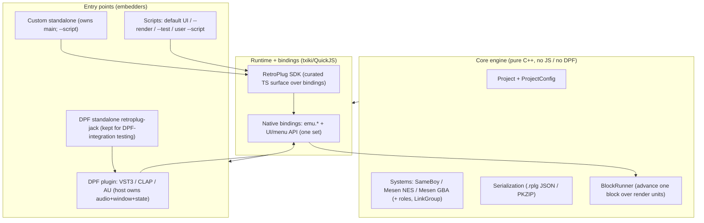
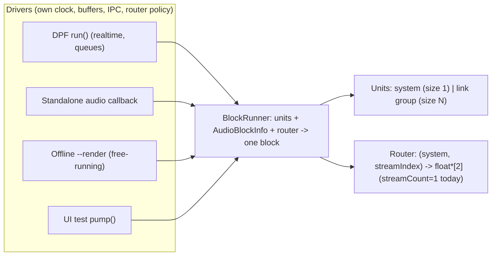
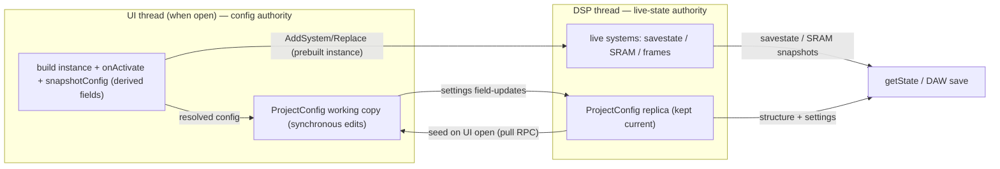
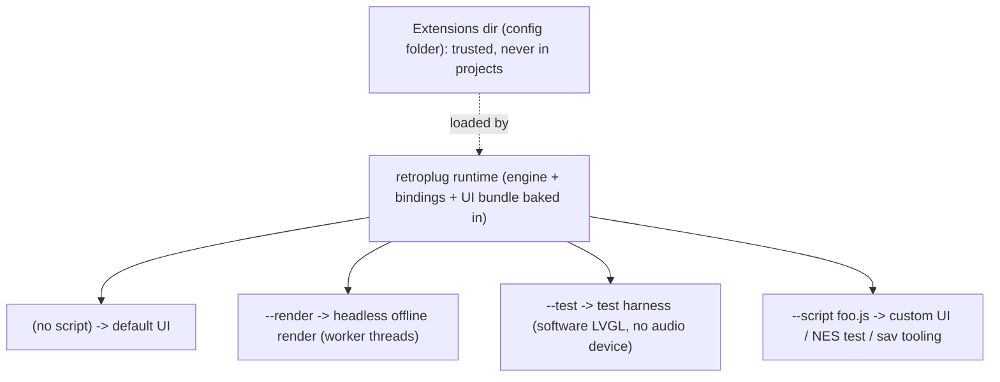

# RetroPlug2 — Architecture Evolution (Design Notes)

> **Status: WIP / proposal.** This is a living design doc we iterate on, not a
> committed plan or a description of current behaviour. For *current* state see
> [ARCHITECTURE.md](ARCHITECTURE.md). Nothing here is scheduled; the point is to
> shape today's architecture so these directions stay cheap to reach.

## Why this exists — the needs driving it

Four threads, in rough priority order:

1. **Keep and strengthen the CLI / `emu.*` capability** — the active, near-term
   use case: headless testing and developing/testing the owner's own NES
   software (memory/registers/debugger/audio/sav authoring). Any reorg must
   preserve or improve this.
2. **One scriptable runtime** — collapse the CLI, a (new) custom standalone, and
   the test runner into a single tjs/QuickJS runtime with RetroPlug baked in,
   selected by `--script`. No script → the normal UI; `--render` → headless
   render; `--test` → the test harness; `--script foo.js` → a user-provided
   experience.
3. **Simplify project-state ownership** — make the UI the authority for project
   *config* while the DSP keeps a replica + the live emulator state.
4. **Multithreading** — offline parallel render in the near term; realtime
   per-instance threading noted for the future.

User **extensibility** (scripts/extensions that drive `emu.*`, add UI
components, edit the menu) is the long-term reason JS/TS exists in RetroPlug,
but there are **no extension users yet** — so the public SDK is deliberately
*not* frozen now. Today's job is to keep the architecture extension-*ready*, not
to ship the SDK.

### Non-goals / explicitly deprioritized

- **Projects never contain code.** Extensions live in the RetroPlug config
  directory (alongside `config.json` / keybindings); projects reference them by
  id at most. This is a hard security rule, not a convenience.
- **No frozen public SDK yet.** Small user base, no extension users — `emu.*`
  and the UI/menu API may churn freely for now.
- **LV2 is not a constraint.** Untested, doesn't fit the RetroPlug model; none
  of these designs need to accommodate the split-process LV2-UI case.
- **Realtime audio-thread multithreading is future work** — captured here so the
  foundations don't preclude it, not scheduled.

## Guiding principles

- **Layered:** a pure core engine (no JS, no DPF) → a runtime + bindings layer →
  thin entry points that embed it.
- **One block-runner** shared by realtime and offline paths; threads/queues live
  *around* it, never inside it.
- **One binding set / SDK**, curated — entry points don't each hand-roll a
  parallel RPC surface (today's `PluginRpcService` vs `HarnessRpcService` split).
- **Config is UI-authoritative when the UI is open; live emulator state is
  always DSP-authoritative.**
- **Keep DPF for the plugin formats**; own `main()` only for the standalone.

---

## Target layering



*The core engine knows nothing about JS or plugin formats. The runtime exposes
one binding set (and a curated SDK on top). Entry points embed the runtime: the
DPF plugin keeps DPF for format/DAW integration; the custom standalone owns
`main()` and the `--script` story; the CLI, test runner, and "default UI" all
become scripts. The DPF standalone (`retroplug-jack`) is retained purely as a
way to exercise the DPF integration without a DAW.*

---

## Component 1 — The shared `BlockRunner` (foundational, do first)

Extract a thread/host-agnostic unit that, given a set of **render units** + a
transport snapshot + a **router**, advances exactly one block. It has **no
knowledge of threads, queues, DPF, or JS**, and it never owns or zeroes output
buffers.

Much of this shape already exists in the code; the runner mostly *unifies* it
(see [ARCHITECTURE.md](ARCHITECTURE.md) for current locations):

- **Transport is already a per-block snapshot** — `AudioBlockInfo { frames,
  sampleRate, tempo, ppqPosBlockStart, transportPlaying }`. The driver computes
  it (DSP from DPF BBT; offline advances ppq itself); the runner only consumes
  it. Keep this as the runner's transport input.
- **The per-system step is already a 3-phase lockstep protocol** for SameBoy:
  `prepareForBlock` → `stepIfBelowTarget` (looped) → `finishBlock(outs)`. A link
  group round-robins `stepIfBelowTarget` across members so serial bits ferry
  mid-block.
- **Output contract: systems SUM into caller-provided buffers, never overwrite.**
  That one rule is what already makes Stereo (everyone shares one pair) and the
  per-instance modes (each system gets a different slice) work.

### The unified model

A **standalone system and a link group are the same thing at different sizes**:
a *render unit = a set of systems stepped in lockstep*. A standalone system is a
unit of one. Per block, the runner does, for each unit:

```
prepare all member systems
round-robin stepIfBelowTarget(frames) until none below target   // 1 member = step-to-done
for each member system: finish into router-provided buffers      // member SUMS into them
```

That ~15 lines replaces the lockstep triad currently copied ~4× (`LinkGroup::onProcess`,
the inline re-impl in `PluginDSP::run`, and the CLI's `runMsPerSystem`/`renderInto`)
**and** structurally fixes the "LinkGroup hard-codes `outs[0]/[1]`" problem,
because finishing now asks a **router** where each system writes.

### Responsibility split

- **Runner (core engine):** the prepare → round-robin step → finish mechanics
  over units. Nothing else.
- **Router (driver-supplied):** maps a system's output **stream** to a
  destination buffer pair (see stream-indexing below). The plugin supplies its
  N-output policy; the CLI mix supplies "everyone → `outs[0]/[1]`"; per-system
  render supplies "system *i* → its own buffer."
- **Driver owns everything else:** the Command/Event queues (realtime only),
  MIDI-in dispatch + MIDI-out drain, output-buffer **ownership and zeroing**, the
  clock / `AudioBlockInfo`, and snapshot *enabling*.

### Resolved decisions

1. **Triad everywhere (one code path).** Give every `SystemBase`
   `prepareForBlock`/`stepIfBelowTarget`/`finishBlock`; the Mesen backends'
   `step` runs the whole block once and returns `false` (a degenerate 1-step
   unit). Then a unit is always "prepare → round-robin step → finish," size 1 or
   N — no fused-vs-split fork. (Mechanical wrap of Mesen's existing `onProcess`.)
2. **Routing is a driver-supplied router callback**, not baked into the runner.
   Systems sum; the driver pre-zeroes the buffers it owns.
3. **Transport is the `AudioBlockInfo` snapshot**, computed by the driver.

### Output is stream-indexed (so per-channel split is additive later)

A frequently-requested feature is **splitting individual sound channels** to
separate outputs — for Game Boy, the 4 channels as 4 stereo pairs **per
instance** — at *both* realtime and offline. We are **not** building it now, but
the runner's output contract is shaped so it becomes purely additive:

- A system writes **one or more stereo *streams***, not a single pair. The
  output argument to `finishBlock`/the render is a **set of stream pairs**
  (`AudioOutputs` = `{ pair[2] × streamCount }`), and the router maps
  **`(system, streamIndex) → float*[2]`**. **Today every system emits exactly
  one stream (the mix), so `streamCount == 1` everywhere** and the router ignores
  the stream index — but the *signature* already admits N.
- A system advertises an **audio-stream layout** (count + names): `1` ("mix")
  today; later a Game Boy system reports its 4 channels (and NES/GBA their own).
  The driver chooses mixed vs split and requests the matching stream count; the
  runner asks the router for each `(system, stream)` destination.
- Today's Stereo / TwoPerInstance / OnePerInstance modes are just "1 stream per
  system" router policies; "per-channel split" is "N streams per system" — the
  **same router abstraction, more destinations**. Per-channel then needs only:
  (a) the emulator rendering per-channel into the extra streams (deferred
  emulator capability), (b) a split router policy, (c) a layout that reports >1.
  No change to the runner, the unit model, or the contract.

> **Deployment nuance (note, not now):** *offline* per-channel split is
> unconstrained (just write more WAVs). *Realtime* per-channel split is bounded
> by the plugin's declared output count (DPF buses are fixed at instantiation),
> so it implies a large/configurable output bus and an `instance × channel →
> bus-channel` mapping in the router. That is a plugin-config decision, not a
> runner concern — the stream-indexed contract already expresses the mapping.

### Parallelism invariant

Concurrently-rendered units **must write to disjoint buffers** — no two threads
sum into the same bus. Offline parallel render satisfies this trivially (each
unit/stream → its own buffer; the mix is a single-threaded join-sum). Realtime
multi-out / per-channel modes satisfy it when streams map to distinct channels.
The one case needing care (future realtime MT in **Stereo** mode, where everyone
sums to one pair) uses per-thread scratch + a single-threaded join-sum — **not**
atomic adds. The stream-indexed, per-unit-buffer router already expresses this.

### Don't-lose-it gotcha

`publishMemorySnapshots()` currently runs *inside* each system's `onProcess`, and
state-snapshot *enabling* is plugin-only and done before processing. Under the
runner, publishing must still fire on the per-system finish path exactly as it
does today, or the plugin's live memory/state view silently breaks.



*One runner, many drivers. Realtime vs offline differ only in the clock source
and whether UI↔DSP queues exist around it. Output routing (incl. future
per-channel split) is entirely in the driver-supplied, stream-indexed router.*

---

## Component 2 — Project-state ownership (split authority)

Today `Project` (on the DSP/audio thread) owns the authoritative `ProjectConfig`
*and* the live systems, largely because config rides along with the instances.
Almost every config change therefore round-trips through the CommandQueue and is
only observable after a `ConfigChanged` event — the exact shape behind the
recent zoom-reset bug.

**Proposal: split authority.**

- **Live instance state** (savestate / SRAM / framebuffers) stays
  **DSP-authoritative** — it only exists on the thread that runs emulators.
- **`ProjectConfig`** (structure + settings: which ROMs, zoom, routing, layout,
  link groups, roles) becomes **UI-authoritative when the UI is open**; the DSP
  keeps a **replica**.

Flow:

- **UI open** → UI pulls the DSP's current config (one-shot RPC) as its working
  copy.
- **UI edits** → UI mutates its own copy **synchronously** (no round-trip to see
  your own change) and informs the DSP: instance lifecycle via prebuilt-instance
  commands (`AddSystem`/`RemoveSystem`/`ReplaceSystem`, as today), settings via
  cheap field updates to the replica.
- **UI closed** → the DSP replica is authoritative by default (nothing else
  edits it).
- **`getState` / DAW-save** → the DSP serializes its **replica** (structure +
  settings) **stitched with** its **live instance snapshots** (savestate/SRAM).
  It never has to ask the UI.

This is well-supported by current code: **instance construction + `onActivate`
already happen UI-side** (`buildSystemFromPath` builds and activates before the
DSP ever sees the instance), so the UI already runs `RomSniffer` and can capture
derived fields (roles, detected model) into its authoritative config before
handoff. We are mostly relocating the authoritative pointer, not moving work.



*Config edits are synchronous in the UI and merely informed to the DSP; the DSP
replica + live snapshots are what gets serialized. Live emulator state never
leaves the DSP.*

### Decisions (resolved)

1. **Sync mechanism.** Structural changes use the *existing* per-operation
   commands that preserve live instances (prebuilt instance in via
   `AddSystem`/`ReplaceSystem`, displaced instance out). Settings are cheap
   field-updates to the replica. **Not** "send whole config and rebuild" (that
   would discard live savestate/SRAM).
2. **Seed-on-open via `snapshotConfig()` — no derived-config back-channel
   needed.** The DSP never holds config the UI can't see, *because* the canonical
   "current resolved config" is `Project::snapshotConfig()`, which walks the live
   instances and pulls their resolved roles/model back out. The UI seeds its
   working copy from a **thin `snapshotConfig()`** (structure + settings + roles,
   binary blobs stripped) on open. This is *required*, not a preference: the raw
   `config_` field lags the live instances for derived fields (roles attach to
   the instance in `onActivate`; `config_` only catches up when `snapshotConfig`
   rebuilds it). After seeding, the UI is authoritative — the only thing the DSP
   ever resolves on its own is derived fields during a *DAW-load* while the UI is
   closed, and the next UI-open seed captures exactly that.
3. **`getState` source.** Always the DSP replica (structure + settings, kept
   current) + live instance snapshots (savestate/SRAM). The UI is never queried
   at save time.
4. **SRAM auto-save / dirty tracking (no change).** Already UI-thread, reading
   DSP snapshots.

### One real edge: the audio engine isn't running

If the host has stopped ticking `run()` (transport idle / audio-device issues),
the UI can't *reach* the audio thread — but this affects apply/save, not
visibility:

- **Seeding on open** is a cross-thread read of `snapshotConfig()` and is fine
  either way (same benign read `listSystems`/`getZoom` already do today; if
  `run()` is idle the Project isn't mutating anyway).
- **Applying** UI edits (`AddSystem`, etc.) only happens when `run()` drains the
  queue, so they lag until audio resumes. Harmless — the UI's working copy stays
  correct and the DSP catches up on resume.
- **`getState` while audio is stopped** is the one to handle: the replica could
  be behind unflushed edits. Mitigation: drain pending commands at `getState`
  time, or write settings to the replica via a path that doesn't depend on
  `run()`.

### Settings split (informs "cheap updates")

Settings are not uniform: **routing** (midi/audio) must reach the DSP's live
mixing, whereas **zoom/layout** are UI-only and the DSP needs them *solely* to
persist at save. So "cheap settings updates" means: always update the replica for
persistence; route-affecting settings additionally feed live processing.

Payoff: the whole "mutate → command → DSP applies → ConfigChanged → UI refetch"
dance for settings disappears, removing the bug class the zoom fix patched, and
it gives "render from UI" (§4) an authoritative config to build an offline
`Project` from.

---

## Component 3 — One scriptable runtime (CLI + standalone + test)

The organizing inversion: today the JS runtime is a *child of the UI*; make it
the **top-level application host**, with the UI as something a script opts into.

- **Custom standalone (committed).** Owns `main()`, embeds the engine + runtime,
  runs `--script` (default script = the normal UI bootstrap). It re-provides
  what DPF's app gives for free — audio device I/O (candidate: the vendored
  `miniaudio`), window + GL for LVGL, MIDI in. The owner has built this before;
  it's understood work, but it is the largest net-new piece here.
- **Keep `retroplug-jack` (DPF standalone) — for testing only.** It remains the
  easiest way to exercise the *DPF integration* without a DAW (some things are
  still DAW-only). It is not the user-facing app.
- **Modes are scripts/flags over one binary:** default UI / `--render` (bypass
  UI, headless) / `--test` (the harness) / `--script` (custom UX, NES test
  harness for the user's own ROMs, sav authoring, etc.). A **headless /
  software-render mode is first-class** (no audio device, no window) so tests and
  renders run in CI without Xvfb — that is exactly today's UI-test software-LVGL
  path, promoted to a real mode.
- **Unify the bindings.** Fold the CLI's `HarnessRpcService` capabilities and the
  plugin's `PluginJsBridge`/`PluginRpcService` into **one binding set**, then a
  curated **RetroPlug SDK** (TS) on top as the eventual public contract — but the
  SDK boundary can stay informal until extensibility is a real priority.



*One binary, modes chosen by flag/script. The CLI, the test runner, and the
default UI are all scripts over the same runtime. Extensions are loaded from the
trusted config directory, never from project files.*

### Near-term priority within this component

The merge must **preserve the current CLI/`emu.*` surface intact** — it is the
live use case (NES dev/testing). Practically: unify the runtime *under* the
existing `emu.*` API so test/dev workflows don't regress, before worrying about
the public SDK or UI extensibility.

### Extension model (future)

- Extensions live in the RetroPlug config dir; projects reference them by id and
  **never carry code**.
- Capability/permission model (fs/net vs emu+UI only) is TBD — decided when
  extensibility is actually built, not now.
- The SDK is a curated TS layer over the internal bindings, versioned once there
  are extension users.

---

## Component 4 — Multithreading

- **Offline parallel render (near-term, safe).** Render units (instance | link
  group) are independent offline, so farm them across an enkiTS pool. Link
  groups render as one unit. This is the first real consumer of the
  `BlockRunner` beyond the single-threaded paths and is low-risk.
- **Render-from-UI (leans on §2 + §1).** Triggered from the UI, it must *not*
  touch the live audio-thread instances. Instead build a fresh `Project` from the
  UI's authoritative config on a worker thread and run the offline `BlockRunner`
  over it → WAV. This is clean precisely because the UI owns the config.
- **Realtime per-instance threading (future — noted, not scheduled).** Pattern:
  process one unit on the audio thread, farm the rest to a **dedicated RT worker
  pool**, fork-join within the block deadline, with an **adaptive** activation
  (only when unit count and block size make it worth the sync overhead) and a
  **glitch fallback** on overrun. Link-group-as-unit still holds. Deferred
  because audio-thread fork-join is genuinely risky and offline render covers the
  pressing need.

---

## Suggested sequencing (each step independently valuable)

1. **`BlockRunner` + render-unit partitioning** → ship **offline parallel
   render**. No big reorg; also kills the LinkGroup/render-loop duplication.
2. **Project-state split authority (§2)** → biggest simplification; removes the
   settings round-trip bug class; unlocks render-from-UI.
3. **Unify the bindings into one set / SDK boundary** — preserving the current
   `emu.*` CLI surface as the priority.
4. **Custom standalone + `--script`** → collapse CLI + UI-test into scripts over
   it; keep `retroplug-jack` for DPF-integration testing.
5. **(Future)** realtime MT on the proven runner; the public extension SDK +
   capability model when there are extension users.

## Open questions to revisit

- The §2 confirmations (sync mechanism, derived-config audit, UI-open seeding).
- Custom-standalone tech choices: audio backend (miniaudio?), window/GL, MIDI in.
- The SDK shape + capability model — deferred until extensibility is a priority.
- Confirm link-group-as-unit holds in both offline and (future) realtime paths.

## How this maps onto today's code

- The `BlockRunner` extraction is the natural home for the duplicated
  prepare/step/finish lockstep and per-instance render loops flagged in the
  duplication audit.
- Split authority removes the `setZoom`-style "command → ConfigChanged →
  refetch" round-trip for settings (the mechanism behind the zoom-persistence
  bug) and is enabled by the fact that `buildSystemFromPath` already constructs +
  activates instances UI-side.
- Unifying the bindings is the product-motivated version of the audit's "two RPC
  services" finding — but consolidated toward a single extension/SDK surface,
  not merely de-duplicated.
- The custom standalone is where the "JS runtime as top-level host" inversion
  lands; the DPF plugin path in [ARCHITECTURE.md](ARCHITECTURE.md) is unchanged.
