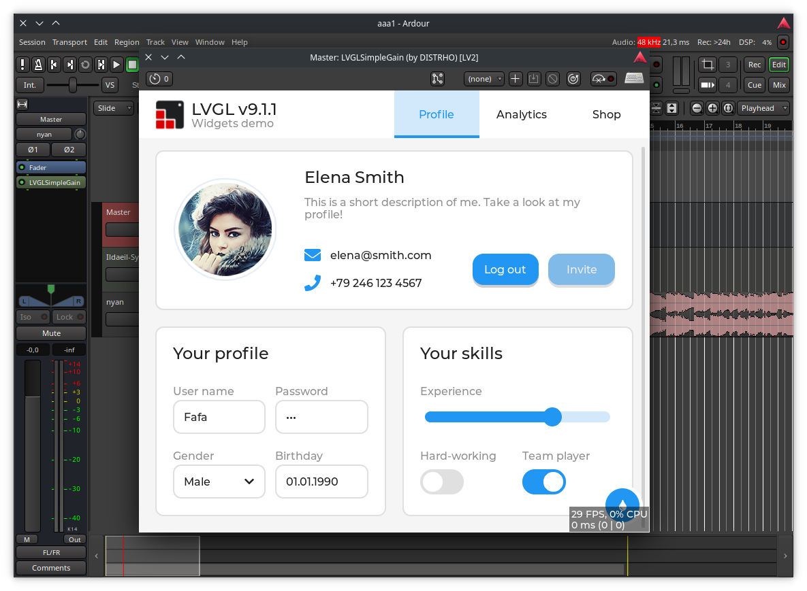

# DPF + LVGL + React/JS template plugin

An audio plugin template using [DPF](https://github.com/DISTRHO/DPF) (DISTRHO Plugin Framework) with [LVGL](https://github.com/lvgl/lvgl) for rendering and a React/JavaScript UI layer powered by [lv_binding_js](https://github.com/tommitytom/lv_binding_js).

Plugin UIs can be written in **TSX/JSX** using React components that map to native LVGL widgets, or directly in C++ with the LVGL API.



## How it works

```
TSX/JSX  →  esbuild  →  bundle.js  →  QuickJS (txiki.js)  →  LVGL native widgets  →  OpenGL texture  →  plugin window
```

- **React reconciler** diffs the virtual DOM and creates/updates native LVGL objects
- **txiki.js** (QuickJS + libuv) runs JavaScript non-blockingly via `UV_RUN_NOWAIT` in DPF's idle callback
- **LVGL** renders to a framebuffer, which DPF composites as an OpenGL texture
- Each plugin instance has its own JS runtime and LVGL display (multi-instance safe)

## Example UI (TSX)

```tsx
import { View, Text, Slider, Button, Render } from "lvgljs-ui";
import React, { useState } from "react";

function PluginUI() {
    const [gain, setGain] = useState(0);

    return (
        <View style={{
            width: "100%", height: "100%",
            "background-color": "#1a1a2e",
            display: "flex", "flex-direction": "column",
            "align-items": "center", "justify-content": "center",
        }}>
            <Text style={{ "text-color": "#4fc3f7", "font-size": 24 }}>
                {`Gain: ${gain.toFixed(1)} dB`}
            </Text>
            <Slider
                style={{ width: 400, height: 10, "margin-top": 30 }}
                range={[-90, 30]}
                value={gain}
                onChange={(e) => setGain(e.value)}
            />
            <Button
                style={{ width: 120, height: 50, "background-color": "#4fc3f7" }}
                onClick={() => setGain(0)}
            >
                <Text style={{ "text-color": "#1a1a2e" }}>Reset</Text>
            </Button>
        </View>
    );
}

Render.render(<PluginUI />);
```

## Building

### Prerequisites

- CMake 3.14+
- C/C++ compiler (GCC, Clang, or MSVC)
- Node.js (for bundling TSX)
- OpenGL development headers
- libcurl, libffi development headers

### Clone with submodules

```bash
git clone --recursive https://github.com/tommitytom/lvgl-template-plugin.git
cd lvgl-template-plugin
```

### Build the plugin

```bash
cmake -S . -B build -DCMAKE_BUILD_TYPE=Release
cmake --build build -j$(nproc)
```

This produces plugins in `build/bin/` for all supported formats: JACK (standalone), CLAP, VST2, VST3, LV2.

### Build the JS bundle

```bash
cd deps/lv_binding_js
pnpm install          # install React, esbuild, etc.
cd ../..
node ui/build.js      # bundle ui/PluginUI.tsx → ui/bundle.js
```

Edit `ui/PluginUI.tsx`, re-run `node ui/build.js`, and relaunch the plugin — no C++ recompilation needed.

## Project structure

```
├── src/
│   ├── PluginDSP.cpp          # Audio processing (gain example)
│   ├── PluginUI.cpp            # UI host: initializes JS engine, loads bundle
│   ├── LvglJsEngine.cpp/hpp   # Embeds txiki.js, drives libuv from DPF idle callback
│   ├── DistrhoPluginInfo.h     # Plugin metadata
│   └── lv_conf.h               # LVGL configuration
├── ui/
│   ├── PluginUI.tsx            # React UI source
│   ├── build.js                # esbuild bundler config
│   └── bundle.js               # Built JS bundle (not committed)
├── deps/
│   ├── dpf/                    # DISTRHO Plugin Framework
│   ├── dpf-widgets/            # DPF LVGL widget integration
│   └── lv_binding_js/          # JS/React LVGL bindings (fork with v9 port)
│       ├── deps/lvgl/          # LVGL v9.5.0 (single source of truth)
│       ├── deps/txiki/         # txiki.js v26.4.0 (QuickJS + libuv + ...)
│       └── src/render/native/  # C++ component bridge (LVGL ↔ QuickJS)
└── CMakeLists.txt
```

## Plugin formats

| Format | Output |
|--------|--------|
| JACK | `build/bin/lvgl-demo-plugin` (standalone) |
| CLAP | `build/bin/lvgl-demo-plugin.clap` |
| VST2 | `build/bin/lvgl-demo-plugin-vst2.so` |
| VST3 | `build/bin/lvgl-demo-plugin.vst3/` |
| LV2 | `build/bin/lvgl-demo-plugin.lv2/` |

## Dependencies

- [DPF](https://github.com/DISTRHO/DPF) — Cross-platform audio plugin framework
- [DPF-Widgets](https://github.com/DISTRHO/DPF-Widgets) — LVGL integration for DPF
- [lv_binding_js](https://github.com/tommitytom/lv_binding_js) — React/JS bindings for LVGL (v9 fork)
  - [LVGL v9.5.0](https://github.com/lvgl/lvgl) — UI toolkit
  - [txiki.js v26.4.0](https://github.com/saghul/txiki.js) — JavaScript runtime (QuickJS + libuv)
