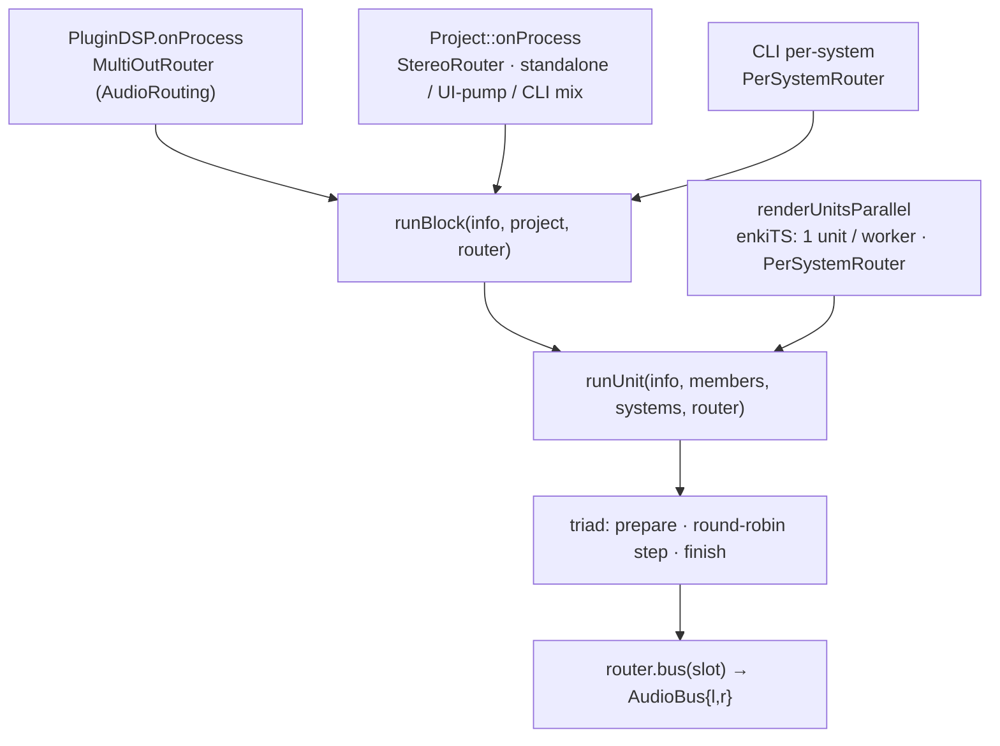

# The Block Runner (render core)

## Status

**Shipped** (extract + triad + parallel offline render) with **one deferred
feature** (per-channel stream split). The realtime render core is one small,
thread-agnostic C++ unit that every audio path drives; the split-stream hook is
already in the signature but unused (`streamCount == 1` everywhere).

## Why

Advancing emulators by one audio block is the plugin's hot path, and it used to
exist as four divergent copies — the plugin DSP run-loop, the standalone
callback, the offline / CLI render, the headless UI pump — each re-deriving the
per-system step loop, the link-group lockstep, and the output routing slightly
differently. That was a correctness hazard (the linked-vs-unlinked decision and
the "who zeroes the buffer" contract lived in four places) and it blocked
parallel offline render, which needs to drive one unit on one worker thread
without dragging in threads/DPF/JS.

The fix: collapse the block step into a single pure-C++ runner
([`system/BlockRunner.cpp`](../packages/native/src/system/BlockRunner.cpp)) that
knows nothing about threads, queues, DPF, or the txiki runtime. Callers differ
only in the *driver* around it (the clock, any IPC) and the `AudioRouter` they
supply. This is the foundation the rest of the architecture rests on — it is
squarely the "genuine DSP" that belongs in C++, and every other doc treats the
runner as fixed ground.

## Design

### Render unit

The unit of scheduling is a **render unit**: 1..N systems stepped in lockstep.

| Unit | Members | Why lockstep |
| --- | --- | --- |
| Singleton | one unlinked system (any backend) | trivially independent |
| Link group | N SameBoys sharing a nonzero `linkGroupId` | serial bits must ferry mid-block or the master/slave handshake desyncs |

A singleton is just the size-1 case of a link group, so both drive through one
function. [`LinkGroup`](../packages/native/src/system/sameboy/LinkGroup.hpp) is
only a membership container — it caches its members both as `SameBoySystem*` and
(via `membersBase()`,
[LinkGroup.hpp:40](../packages/native/src/system/sameboy/LinkGroup.hpp#L40)) as
upcast `SystemBase*`, so the runner takes a `SystemBase* const*` with no
per-block allocation or pointer reinterpret. The link-vs-singleton partition
lives in exactly one place
([BlockRunner.cpp:54-74](../packages/native/src/system/BlockRunner.cpp#L54)).

### The triad

Every system — every backend, singleton or linked — advances through the same
three virtual phases on `SystemBase`
([SystemBase.hpp:63-65](../packages/native/src/system/SystemBase.hpp#L63)):

```
prepareForBlock(info)                     // once per block
stepIfBelowTarget(framesNeeded) -> bool   // looped until false
finishBlock(info, outs)                   // once, sums into the routed bus
```

`runUnit`
([BlockRunner.cpp:26-52](../packages/native/src/system/BlockRunner.cpp#L26))
prepares every member, then **round-robins `stepIfBelowTarget` across the
members** until all reach the block's frame target — for a link group this
interleaves `GB_run()` (≈1 instruction / call) so the serial-bit handshake stays
in sync mid-block; for a singleton it just steps to done. Then it finishes each
member into its own routed bus.

`SystemBase::onProcess`
([SystemBase.cpp:15-21](../packages/native/src/system/SystemBase.cpp#L15)) is a
*fused convenience* entry (`prepare → step-to-done → finish`) for direct callers
and test doubles — it is **not** on the runner's hot path. `runUnit` drives the
three phases itself; backends implement the triad, never `onProcess`. The triad
defaults are inert (no-op / "done") so trivial backends and test doubles need
not implement them.

### Output contract

The **caller zeroes the output buffers; systems SUM (`+=`) into them.** The
runner never zeros: in Stereo routing many systems finish into one bus, so a
per-slot zero inside the runner would wipe earlier systems. `finishBlock`
receives planar L/R (`outs[0]`/`outs[1]`, DPF convention). Every driver honours
this — the plugin memsets its output channels before `runBlock`
([PluginDSP.cpp:685-686](../packages/native/src/PluginDSP.cpp#L685)); the offline
renderer zeroes each unit's slot scratch before `runUnit`
([OfflineRender.cpp:48-52](../packages/native/src/system/OfflineRender.cpp#L48)).

### Routing = a driver-supplied `AudioRouter`, keyed by slot

The runner does not decide where audio lands. It asks an
[`AudioRouter`](../packages/native/src/system/BlockRunner.hpp#L37) for the
`AudioBus` (an `{l, r}` planar pair; `l == r` legal and means a mono sum) of a
system's **slot** — its index in `Project::systems()`, resolved by a linear
`slotOf` scan
([BlockRunner.cpp:16-22](../packages/native/src/system/BlockRunner.cpp#L16);
alloc-free, system count is tiny). Three routers ship:

| Router | `bus(slot)` policy | Driver |
| --- | --- | --- |
| `StereoRouter` | every slot → one fixed L/R pair | `Project::onProcess` + every headless / mix path |
| `MultiOutRouter` | `AudioRouting` policy over a flat channel array (see below) | the plugin DSP run-loop |
| `PerSystemRouter` | slot i → its own L/R buffer | CLI per-system render; offline parallel |

`MultiOutRouter`
([BlockRunner.hpp:55-76](../packages/native/src/system/BlockRunner.hpp#L55))
carries the plugin's `AudioRouting` mode
([ProjectConfig.hpp:42-46](../packages/native/src/project/ProjectConfig.hpp#L42))
over `DISTRHO_PLUGIN_NUM_OUTPUTS` (= 8,
[DistrhoPluginInfo.h:30](../packages/native/src/DistrhoPluginInfo.h#L30)) host
channels: `Stereo` (everyone → ch 0/1), `TwoPerInstance` (slot i → ch
`2i%N`/`2i+1%N`), `OnePerInstance` (slot i → ch `i%N` for both L and R). The
header stays free of any DPF macro — `numChannels` is passed in.

### One runner, many drivers



`runBlock`
([BlockRunner.cpp:54](../packages/native/src/system/BlockRunner.cpp#L54)) walks
every unlinked system as a singleton unit and every link group as a multi-member
unit, driving both via `runUnit`. Realtime drivers build `AudioBlockInfo`
([SystemTypes.hpp:14-20](../packages/native/src/system/SystemTypes.hpp#L14):
frames, sample rate, tempo, PPQ-at-block-start, transport flag) from the host
timeline and call it once per block.

### Offline parallel render (shipped)

`runUnit` owns and zeroes nothing and touches only its members' state, so
**disjoint units render concurrently.**
[`renderUnitsParallel`](../packages/native/src/system/OfflineRender.cpp#L83)
partitions the project into units exactly as `runBlock` does, wraps each in an
enkiTS `ITaskSet` with `m_SetSize == 1` (the whole unit runs on one worker —
required so a Mesen unit's emulation thread stays fixed across the render), and
farms them across the pool. Each unit renders its whole timeline into its own
per-slot buffer via a shared `PerSystemRouter` over disjoint scratch, so there
is no shared mutable state to guard. The contract is **byte-identity**: the
result equals a single-threaded `runBlock` + `PerSystemRouter` sequence over the
same starting state
([OfflineRender.hpp:20-30](../packages/native/src/system/OfflineRender.hpp#L20)),
verified in
[ParallelRenderTests.cpp](../packages/native/test/ParallelRenderTests.cpp) and
run under ThreadSanitizer. It is a pure-audio path (mid-render MIDI/serial
capture and scripted input stay on the single-threaded harness path) exposed to
TS tests as `renderWavPerSystemParallel`
([TestHarnessImpl.hpp:501](../packages/native/cli/TestHarnessImpl.hpp#L501)).

## C++ vs TS

The runner is the canonical example of "C++ only where genuinely needed": it is
realtime DSP + lock-stepped emulator stepping, and it stays native in full. The
only TS-adjacent seam is **which router the driver constructs** — the
`AudioRouting` mode is a `ProjectConfig` field, and the future output-bus
configuration (below) is a plugin-config decision. That policy is owned by the
TS orchestration / project-config authority; the runner just consumes an
`AudioRouter` it is handed. See [the C++/TS boundary](03-cpp-ts-boundary.md) and
[project-state ownership](02-project-state-ownership.md).

## Migration / build steps

As-built, in order:

1. **Extract the shared runner + routers** — collapse the four copies into
   `BlockRunner` (`ad0bbd7e`).
2. **Promote the triad to `SystemBase`** — every backend and both unit kinds
   flow the one `prepare / round-robin step / finish` path; `onProcess` demoted
   to a convenience wrapper (`2c66c701`).
3. **Offline parallel render** — `renderUnitsParallel` over an enkiTS pool, one
   unit per worker, byte-identical to the serial path (`14cffe46`), with the
   adversarial-review test-hardening pass (`d8790dd5`).

**Remaining — per-channel stream split (deferred, designed here):**

Today a system emits exactly one stereo stream. The goal: a system emits **N
stereo streams** (e.g. the 4 Game Boy channels, or Mesen's APU voices) that the
router maps `(system, streamIndex) → float*[2]` independently. The hook is
already additive:

- `AudioRouter::bus` already takes `streamIndex` (default 0), and all three
  routers accept-and-ignore it
  ([BlockRunner.hpp:39](../packages/native/src/system/BlockRunner.hpp#L39)).
  Nothing in the signature changes.
- Net-new: `SystemBase::streamCount()` (virtual, default 1) and a `finishBlock`
  that can write per-stream — either an N-slice `outs` or a per-stream finish
  call. `runUnit` loops `streamIndex` 0..`streamCount-1`, resolving
  `router.bus(slot, streamIndex)` for each. Backends that stay mono-mixed keep
  `streamCount == 1` and the current one-bus behaviour.
- **Offline** per-channel split is unconstrained — allocate one output buffer
  per `(slot, stream)` and the byte-identity contract extends trivially.
- **Realtime** is bounded by the **DPF declared output bus count**, which is
  fixed at instantiation (`DISTRHO_PLUGIN_NUM_OUTPUTS`). Splitting more streams
  than declared channels has nowhere to land. So realtime per-channel implies a
  **configurable output bus count** plus an `instance × stream → bus-channel`
  mapping — a plugin-config decision expressed as a richer `MultiOutRouter`, not
  a change to the runner. The runner already supports it the moment such a
  router exists.

## Open questions

- **`finishBlock` shape for N streams** — extend `outs` to an interleaved
  per-stream array, or add a `finishBlockStream(info, streamIndex, outs)` the
  runner calls per stream? The latter keeps the mono-stream default untouched
  but adds a virtual; the former is one call but reshapes the buffer contract.
- **Declared bus count vs host reality** — DPF fixes the output bus at
  instantiation. A configurable count means a plugin restart / re-instantiation
  boundary; is that acceptable, or is a fixed generous channel count (e.g. the
  current 8) with a router-side mapping enough for the realistic system counts?
- **Stream identity across backends** — GB's 4 channels, NES's APU voices, and
  GBA's DirectSound don't share a stream taxonomy. Does the router key on an
  opaque per-backend index, or a normalised channel enum?

## Links

- Runner: [BlockRunner.hpp](../packages/native/src/system/BlockRunner.hpp) ·
  [BlockRunner.cpp](../packages/native/src/system/BlockRunner.cpp)
- Triad + convenience entry:
  [SystemBase.hpp:47-79](../packages/native/src/system/SystemBase.hpp#L47) ·
  [SystemBase.cpp:15-21](../packages/native/src/system/SystemBase.cpp#L15)
- Link group container:
  [LinkGroup.hpp](../packages/native/src/system/sameboy/LinkGroup.hpp)
- Offline parallel render:
  [OfflineRender.cpp](../packages/native/src/system/OfflineRender.cpp) ·
  [OfflineRender.hpp](../packages/native/src/system/OfflineRender.hpp) ·
  [ParallelRenderTests.cpp](../packages/native/test/ParallelRenderTests.cpp)
- Drivers:
  [PluginDSP.cpp:685-715](../packages/native/src/PluginDSP.cpp#L685) (realtime) ·
  [Project.cpp:174-179](../packages/native/src/project/Project.cpp#L174) (stereo
  convenience) ·
  [TestHarnessImpl.hpp:501-528](../packages/native/cli/TestHarnessImpl.hpp#L501)
  (CLI / parallel)
- Sibling docs: [multithreading](07-multithreading.md) (offline pool + future
  realtime) · [the C++/TS boundary](03-cpp-ts-boundary.md) (router policy
  ownership) · [current-state](current-state.md)
