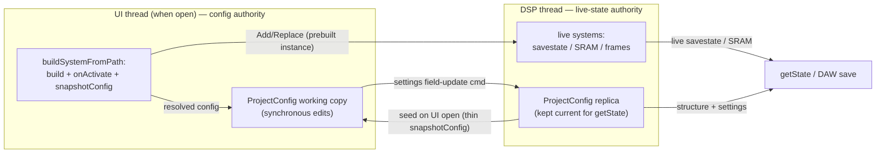

# Project-state ownership (split authority)

## Status

**Steps 1–3 shipped** (branch `arch/rework`). The editing UI now owns the
project-wide settings and edits them synchronously; the DSP holds a replica
(routing still feeds live mixing). Live emulator state stays DSP-authoritative.
Realized as: a `getProjectView()` RPC (atomic, blob-free seed = systems + focus
+ settings) replacing the UI's six-getter fan-out; a `ProjectLoaded` event
distinct from `ConfigChanged` so a load re-seeds settings while a structural
change does not; and the four settings command handlers dropping the
`ConfigChanged` echo. **Deferred:** the stopped-audio `getState` edge (step 4)
and relocating the authoritative `ProjectConfig` into TS (step 5, gated on the
[control-plane runtime](04-scriptable-runtime.md)).

## Why

`Project` runs on the DSP/audio thread and today owns **both** the live systems
*and* the authoritative `ProjectConfig`
([Project.hpp:19-209](../packages/native/src/project/Project.hpp#L19)). Config
rides along with the instances, so almost every config change round-trips
through the `CommandQueue` and only becomes visible to the UI after a
`ConfigChanged` event:

- UI calls `setZoom(z)` → pushes `SetZoom`
  ([PluginRpcService.cpp:1058](../packages/native/src/PluginRpcService.cpp#L1058)).
- The DSP drains it in `run()`, mutates `config_.settings.zoom`, sets
  `projectMutated`
  ([PluginDSP.cpp:440-448](../packages/native/src/PluginDSP.cpp#L440)).
- `projectMutated` emits `ConfigChanged`
  ([PluginDSP.cpp:651](../packages/native/src/PluginDSP.cpp#L651)).
- The UI's `config-changed` handler re-runs `refreshSystems()`, re-fetching
  `getProjectZoom()`/`getLayout()`/routing wholesale
  ([PluginUI.tsx:124-153](../packages/ui/src/PluginUI.tsx#L124)).

That "mutate → command → DSP applies → `ConfigChanged` → UI refetch" dance is
the mechanism behind the **zoom-reset bug** (commit `96930a2a`): an optimistic
UI value gets clobbered when the refetch races the drain, or when the applied
config drops a field. The UI can't trust its own edit until the DSP echoes it
back. It also means settings are only observable when `run()` is actually
ticking — a problem the moment we want **render-from-UI**
([07-multithreading.md](07-multithreading.md)) to build an offline `Project`
from a config the UI knows synchronously.

## Design

**Split the authority along the line that already exists in the data:**

| State | Lives where | Authority |
| --- | --- | --- |
| Live instance state — savestate, SRAM, framebuffers | Only on the DSP thread (inside the emulator cores) | **DSP** (unchanged) |
| `ProjectConfig` — which ROMs, roles, zoom, layout, MIDI/audio routing, link groups | Plain data, serializable | **UI when open**; DSP keeps a **replica** |

Live instance state is irreducibly DSP-owned: it *is* the running emulator.
`ProjectConfig` is plain reflect-cpp data
([ProjectConfig.hpp:58](../packages/native/src/project/ProjectConfig.hpp#L58))
with no thread affinity of its own — it only sits on the DSP today because that
is where `Project` lives.

### Flow

- **UI open** → UI seeds its working copy from a one-shot `snapshotConfig()`
  pull (see *seed-on-open* below).
- **UI edits** → UI mutates its own copy **synchronously** (no round-trip to see
  its own change), then merely *informs* the DSP:
  - **instance lifecycle** via the existing prebuilt-instance commands —
    `AddSystem` / `ReplaceSystem` / `RemoveSystem`
    ([PluginRpcService.cpp:398,537](../packages/native/src/PluginRpcService.cpp#L398)).
    These already carry a fully-built, already-`onActivate`'d `SystemBase*`, so
    the live savestate/SRAM is preserved across the swap.
  - **settings** via a cheap field-update to the replica (the same `SetZoom` /
    `SetLayout` / `SetMidiRouting` / `SetAudioRouting` commands, but now
    fire-and-forget — the DSP no longer needs to echo `ConfigChanged` for the UI
    to observe its own edit).
- **UI closed** → the DSP replica is authoritative by default; nothing else
  edits it.
- **`getState` / DAW save** → the DSP serializes its **replica** (structure +
  settings) **stitched with its live instance snapshots** (savestate/SRAM). It
  never queries the UI. `getState` is synchronous and hosts don't drive it from
  the audio thread at load, so this stays on the current inline path
  ([PluginDSP.cpp:221](../packages/native/src/PluginDSP.cpp#L221)).

### Seed-on-open via a thin `snapshotConfig()`

The DSP must never hold config the UI can't reconstruct. That already holds,
*because* the canonical "current resolved config" is
`Project::snapshotConfig()`
([Project.cpp:230](../packages/native/src/project/Project.cpp#L230)), which
walks the **live** instances rather than returning the raw `config_` field.
This matters: derived fields (attached roles, detected model) live on the
instance after `onActivate`; `config_` only catches up when `snapshotConfig`
rebuilds it. So seeding from `snapshotConfig()` — not `config()` — is
**required**, not a preference.

Today `snapshotConfig()` embeds the heavy blobs: `SameBoySystem::snapshotConfig`
reads the live core via `GB_save_state_to_buffer` and
`GB_save_battery_to_buffer`
([SameBoySystem.cpp:788-819](../packages/native/src/system/sameboy/SameBoySystem.cpp#L788)).
That live read is the **irreducible C++ dependency** — it cannot move to TS
because it touches the running emulator. But seed-on-open doesn't need the
blobs; it needs structure + settings + resolved roles. So the net-new primitive
is a **thin `snapshotConfig()`** variant that walks the same live instances but
strips `romBytes` / `savestate` / `sram`. Large blobs cross the boundary only at
`getState` (or explicit save-state ops), marshalled as `ArrayBuffer`/handles per
the [minimal native contract](03-cpp-ts-boundary.md), never as JS strings.

### Settings split (what "cheap update" means)

Settings are not uniform:

| Setting | DSP needs it for | On edit |
| --- | --- | --- |
| `midiRouting` / `audioRouting` | **Live mixing** — read every block ([PluginDSP.cpp:670,713](../packages/native/src/PluginDSP.cpp#L670)) | update replica **and** feed live processing |
| `zoom` / `layout` | Persistence only (the DSP never renders UI) | update replica **only**, so `getState` carries it |

So "cheap settings update" = always write the replica (for persistence);
route-affecting settings *additionally* reach live processing. The whole
refetch dance disappears for the persistence-only settings, killing the
zoom-reset bug class.

## C++ vs TS

The mechanism is mostly already positioned in C++; the change is *who holds the
authoritative pointer*, and eventually *what language that pointer lives in*.

| Concern | Stays C++ | Moves toward TS |
| --- | --- | --- |
| Live emulator read (savestate/SRAM via `GB_save_*`) | ✅ irreducible | — |
| Instance construction + `onActivate` + `RomSniffer` | ✅ (`buildSystemFromPath`, [PluginRpcService.cpp:159](../packages/native/src/PluginRpcService.cpp#L159)) | invoked *from* TS orchestration |
| `getState` replica-serialize + blob stitch | ✅ (sync, DSP-side) | — |
| **Authoritative `ProjectConfig`** | replica only | ✅ working copy + edit policy |
| Settings mutation & observation | route-affecting → live | ✅ synchronous UI edits |

**Native contract this doc needs** (most already exist; see the
[C++/TS boundary](03-cpp-ts-boundary.md) for the full set):

- **thin `snapshotConfig(i)` / `snapshotProjectConfig()`** — structure +
  settings + resolved roles, blobs stripped, for seed-on-open. *(net-new, small:
  a strip flag or sibling method over [Project.cpp:230](../packages/native/src/project/Project.cpp#L230))*
- `AddSystem` / `ReplaceSystem` / `RemoveSystem` prebuilt-instance commands —
  **exist**, preserve live state across swaps
  ([Project.hpp:52,68](../packages/native/src/project/Project.hpp#L52)).
- Cheap settings field-update commands — **exist**
  ([PluginDSP.cpp:432-464](../packages/native/src/PluginDSP.cpp#L432)); change is
  to stop treating them as `ConfigChanged` triggers for the editing UI.
- `getState` blob source — `readStateSnapshot(i)`
  ([SystemBase.hpp:299](../packages/native/src/system/SystemBase.hpp#L299)) +
  `stateRegions()` for slicing — **exists**, triple-buffered race-free.

Once the [control-plane runtime](04-scriptable-runtime.md) exists and
orchestration is TS, the authoritative `ProjectConfig` naturally lives on the TS
side (window-independent), with the DSP holding only the replica it needs for
`getState`. This doc is the enabling frame for that: it draws the authority line
first, so 03/04 can move the *language* of the authority without re-litigating
*where* it lives.

## Migration / build steps

Each step is independently shippable and leaves the plugin working.

1. ✅ **Atomic, blob-free seed.** Realized as a `getProjectView()` RPC (systems
   + focus + settings in one tear-free call) rather than a thin
   `Project::snapshotConfig` variant — the UI's six-getter fan-out
   (`listSystems`/`getFocus`/`getMidiRouting`/`getAudioRouting`/`getProjectZoom`/
   `getLayout`) collapses to it. `SystemEntry` was already blob-free, so the
   heavier live-instance-walking thin snapshot the UI *doesn't* need was avoided.
2. ✅ **The editing UI is authoritative for the project-wide settings.** It
   holds `zoom`/`layout`/`midiRouting`/`audioRouting` in its working copy, edits
   them synchronously (`applyProjectZoom`/`applyLayout`/…), and sends the
   field-update command *without* a `ConfigChanged` echo; the four DSP settings
   handlers no longer set `projectMutated`. Routing still reaches the DSP for
   live mixing (it always did — the command still fires).
3. ✅ **`ConfigChanged` narrowed to structural.** A whole-project load emits the
   new `ProjectLoaded` event → the UI full-re-seeds (incl. settings);
   `ConfigChanged` now covers only structural changes → the UI refetches systems
   + focus and keeps the settings it owns. This is what makes the optimism
   correct: settings are re-adopted only on a load, never clobbered by a
   structural tick.
4. **`getState` while audio is stopped** (see edge below) — *deferred*: drain
   pending commands at `getState`, or write settings to the replica on a path
   that doesn't depend on `run()`. In practice `run()` (the audio process
   callback) ticks continuously, so the replica is current by save time; the
   clean fix is left until the edge is shown to bite, to avoid a lock ahead of need.
5. **(with 04)** *deferred* — relocate the authoritative `ProjectConfig` into the
   TS control-plane runtime; the DSP `config_` becomes a pure replica fed by the
   same commands.

## One real edge: the audio engine isn't ticking

If the host has stopped calling `run()` (transport idle, audio-device change),
the UI can't reach the audio thread. This affects *apply*, not *visibility*:

- **Seed-on-open** is a benign cross-thread read (same category as today's
  `listSystems` / `getZoom`); if `run()` is idle the Project isn't mutating
  anyway.
- **Applying** UI edits lags until the queue drains — harmless, the UI working
  copy stays correct and the DSP catches up on resume.
- **`getState` while stopped** is the one to handle: the replica may be behind
  unflushed field-updates. Mitigation: **drain pending commands at `getState`
  time**, or make settings field-updates a `run()`-independent replica write
  (they touch only plain data, not live emulators, so a short mutex-guarded
  write off the audio thread is safe).

## Open questions

- **Replica write path off `run()`.** Do settings field-updates keep going
  through `CommandQueue` (simple, but `run()`-gated) or get a direct
  mutex-guarded replica write (fixes the stopped-audio edge but adds a lock on
  the config)? The inline/shared control-plane model
  ([04-scriptable-runtime.md](04-scriptable-runtime.md)) already serializes
  access with a mutex — this may fall out for free.
- **`ConfigChanged` granularity.** One coarse event today. Splitting into
  *structural* vs *settings* (or carrying a source tag so the UI ignores echoes
  of its own edits) would let the UI drop needless refetches without a full
  event-schema change.
- **Multi-editor / no-editor consistency.** With authority in the UI, what
  arbitrates if two editor windows are open, or an editor opens mid-DAW-load?
  Seed-on-open from the live `snapshotConfig` is the tiebreaker, but the
  ordering against an in-flight `setState` wants nailing down.

## Links

- **Code**
  - [Project.hpp:19-209](../packages/native/src/project/Project.hpp#L19) — owns systems + authoritative config; `swapSystem`/`adoptSystem` RT-safe primitives
  - [Project.cpp:55-133](../packages/native/src/project/Project.cpp#L55) — `addSystem` (entangles fs byte-sourcing with construction; split target for 03)
  - [Project.cpp:230](../packages/native/src/project/Project.cpp#L230) — `snapshotConfig()` walks live instances (canonical resolved config)
  - [SameBoySystem.cpp:788-819](../packages/native/src/system/sameboy/SameBoySystem.cpp#L788) — live core read (the irreducible C++ dependency)
  - [PluginRpcService.cpp:159](../packages/native/src/PluginRpcService.cpp#L159) — `buildSystemFromPath` (build + activate UI-side, already)
  - [PluginDSP.cpp:221,241](../packages/native/src/PluginDSP.cpp#L221) — `getState` / `setState`; [432-464](../packages/native/src/PluginDSP.cpp#L432) settings drain; [651](../packages/native/src/PluginDSP.cpp#L651) `ConfigChanged` emit
  - [PluginUI.tsx:124-153](../packages/ui/src/PluginUI.tsx#L124) — UI refetch on `config-changed`
- **Sibling docs**
  - [03-cpp-ts-boundary.md](03-cpp-ts-boundary.md) — the native contract + what moves to TS
  - [04-scriptable-runtime.md](04-scriptable-runtime.md) — control-plane runtime that ends up holding the authoritative config
  - [07-multithreading.md](07-multithreading.md) — render-from-UI needs the UI's authoritative config to build an offline `Project`
  - [09-project-isolation.md](09-project-isolation.md) — the greenfield realization: takes this authority line to its end (state, not just config), `Project` isolated to DSP-only behind a command ring + snapshot registry
  - [current-state.md](current-state.md) — as-is `Project` / `snapshotConfig` / `loadFromConfig` reference
- **Design origin:** DESIGN.md Component 2 (retired into this doc).
