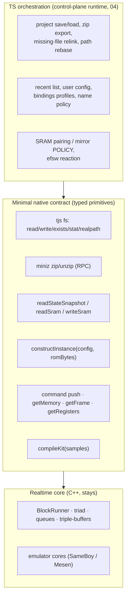

# The C++/TS boundary

## Status

**Increment 1 shipped** (branch `arch/rework`): project save/load **serialization**
moved to shared TS (`@retroplug/retroplug`) for the **CLI-harness host**, over new
native byte-mover primitives (`zipEntries`/`unzipEntries` (miniz), a thin
`snapshotProjectConfig` = config JSON + keyed blob `ArrayBuffer`s, `applyProjectConfig`,
`fileExists`) — deleting the harness's C++ `saveRplg`/`saveProjectFile`/`loadRplg`
duplicate. `ProjectSerialization` + the `ProjectBinaries` entry-key contract +
`SchemaVersions` are now TS; the config JSON stays opaque (native writes/reads it),
and blobs never cross as JSON. `project_binaries::strip/restore` were templated on
the sink/source so the plugin's `.rplg` codec is unchanged.

**Increment 2 shipped** (branch `arch/rework`): the **plugin** save + zip-export paths
now run the *same* shared TS, over the same primitives added to `PluginRpcService`
(`readFile`/`writeFile`/`zipEntries`/`unzipEntries`/`snapshotProjectConfig` + a
`notifyProjectSaved` bookkeeping call). The C++ `saveProjectToPath`/`exportZipToPath`/
`saveProject` orchestration is deleted; the native file dialog hands the chosen path
to the UI via `save-path-selected`/`export-path-selected` events (mirroring the relink
flow), and the silent "Save Project" runs the TS directly from the menu. The UI drives
it through a plugin `ProjectHost` adapter that binds the harness's `createSyncClient`
to the synchronous in-process `Symbol.for("plugin").__rpcSend` (the UI's async client
is untouched); transport-free package subpath exports keep the harness-only transport
out of the UI bundle. `snapshotProjectConfig(baseDir)` does the thin-save `toRelative`
natively (so `ProjectPaths` stays deferred). Exercised end-to-end through the **real**
`PluginRpcService` + UI bundle by `test:ui`.

**Increment 3 shipped** (branch `arch/rework`): the **plugin project-file LOAD** path +
its `pendingProject_` / missing-files / relink machine moved to shared TS. `loadProjectFromPath`,
`commitPendingProject`, `getMissingFiles`, `relinkMissingFile`, `cancelMissingFiles` and the
pending latch are deleted; the UI drives load through `project/loadProject.ts`
(`startLoad`/`relinkOne`/`cancelLoad`) over two new primitives — `fileExists` and
`commitProject` (restore blobs → recompile kits → `Command::makeLoadProject` → recent +
emit `project-loaded`; the DSP applies + re-emits `ProjectLoaded`). The native dialog /
recent / autoload / sibling-`.rplg` hand the path to the UI via `load-path-selected`.
`ProjectMissingFiles`'s scan/relink/`autoFindSiblings` became shared TS (`missingFiles.ts`,
incl. `toAbsolute`); the header shrank to just `sanitizeSavTargets` (the DAW `setState`
path still needs it). Net **−227 C++ src**, taking the work-stream cumulative to **−87** —
net-negative for the first time.

**Still C++ (later increments):** the **ROM-build band** (`buildSystemFromPath` / pairing —
needs the `Project::addSystem` → `constructInstance` split, the deep cut), the DAW
`getState`/`setState` headless path (needs the bare-`jsHost` non-UI bundle,
[04](04-scriptable-runtime.md) §A step 2 — the gate to deleting the codec headers +
`sanitizeSavTargets`), `ProjectPaths` `toRelative` (needs a `realpath` primitive), and the
config layer. The rest of this doc is the forward plan for those.

## Why

C++ should own only what genuinely needs C++: the emulator cores, the block
runner and its lock-free queues/triple-buffers, the plugin-format ABI, and a
few perf-critical binary codecs. A large amount of *orchestration* lives in C++
today not because it is realtime or perf-sensitive, but because of a **gravity
well**:

- **`ProjectConfig` is a C++ reflect-cpp struct** ([ProjectConfig.hpp:58](../packages/native/src/project/ProjectConfig.hpp#L58)).
  Every operation that reads or edits the project — save, load, missing-file
  relink, path rebasing, SRAM pairing — is therefore easiest to write in C++
  next to the struct.
- **JS was window-gated.** The txiki/QuickJS runtime ran only on the editor/UI
  thread, so it did not exist when a DAW called `setState`/`getState` with the
  editor closed. Anything on the project-load path *had* to be C++, because
  there was no runtime to call.

Together those two forced project/file orchestration down into C++ even though
almost none of it touches audio. The countermeasures are covered in the
siblings: [02-project-state-ownership.md](02-project-state-ownership.md) splits
who *owns* `ProjectConfig`, and [04-scriptable-runtime.md](04-scriptable-runtime.md)
gives the plugin an always-available (window-independent) runtime. This doc is
about the third piece: **what actually moves across the boundary, and the small
native contract it moves onto.**

### The shape of the debt: `PluginRpcService.cpp`

[`PluginRpcService.cpp`](../packages/native/src/PluginRpcService.cpp) is 1,956
lines and is the clearest single exhibit. It has no QuickJS/LVGL references (by
design — it runs headless in the test harness too), but it mixes three very
different jobs:

| Band | ~Lines | What it is | Belongs in |
| --- | --- | --- | --- |
| Thin core-proxy | ~350 | validate args, `commands_->tryPush(Command::…)` or flip an atomic, return bool. `setFocus`, `pressButton`, `setLinkGroupId`, `setMidiRouting`, `subscribeMemory` ([PluginRpcService.cpp:958-1017](../packages/native/src/PluginRpcService.cpp#L958)) | **stays** — the native command seam |
| Fat orchestration | ~1,250 | project save/load, zip export, missing-file scan/relink, path rebasing, SRAM pairing/flush, recent list. `saveProjectToPath`, `loadProjectFromPath`, `commitPendingProject`, `relinkMissingFile`, `saveSramToPath` ([PluginRpcService.cpp:550-738](../packages/native/src/PluginRpcService.cpp#L550)) | **moves to TS** |
| UI / file-browser glue | ~150 | native open/save dialog plumbing (`openRomBrowser`, `onFileBrowserSelected`, `openRelinkBrowser`) | **moves to TS** over a thin dialog primitive |

The ~1,250 orchestration lines only live in C++ because the *data structures*
do. Note they are also **duplicated in spirit** in the CLI's
[`HarnessRpcService`](../packages/native/cli/HarnessRpcService.cpp) (a second,
synchronous RPC surface that re-implements `saveProjectFile` etc.) — two copies
of the same orchestration, one per host. Collapsing both onto one TS
implementation over one native binding is the [04](04-scriptable-runtime.md)
one-runtime/one-binding thesis; this doc supplies the boundary it runs on.

## Design

The principle: **native exposes a small set of typed primitives; all project /
file / config policy is TS that calls them.** The primitives are byte-movers and
emulator handles, not policy. The policy — "a thin `.rplg` re-reads its ROM from
`romPath`", "an empty `savPath` means use the suffix sibling", "refuse a project
stamped newer than this build" — is duck-typed TS over the same JSON the C++
structs serialize.

Most of the moving orchestration is, on inspection, *pure `ProjectConfig`
transforms plus `std::filesystem::exists`* — nothing that needs to be native:

- **`ProjectSerialization`** ([ProjectSerialization.hpp](../packages/native/src/project/ProjectSerialization.hpp),
  100 lines) — `projectConfigToZip` / `FromZip` / `ToJsonFile` / `FromBytes`.
  Pure `ProjectConfig` ⇄ JSON/zip. The only native dependency is miniz, which
  becomes a binding.
- **`ProjectBinaries`** ([ProjectBinaries.hpp](../packages/native/src/project/ProjectBinaries.hpp),
  188 lines) — `strip` / `restore` / `clear` walk the systems and route each
  blob (ROM/SRAM/savestate/kit) to a deterministic zip key like
  `systems/{i}/rom`. It is entirely `rfl::get_if` variant dispatch — trivially a
  TS switch on the config's tagged union.
- **`ProjectPaths`** ([ProjectPaths.hpp](../packages/native/src/project/ProjectPaths.hpp),
  105 lines) — `toRelative` / `toAbsolute` rebasing of asset paths for the thin
  `.rplg`. `std::filesystem::weakly_canonical` + `lexically_relative`; the TS
  equivalent is `tjs.realpath` + path math.
- **`ProjectMissingFiles`** ([ProjectMissingFiles.hpp](../packages/native/src/project/ProjectMissingFiles.hpp),
  211 lines) — the **poster child.** `scanMissingFiles` / `relinkInConfig` /
  `sanitizeSavTargets` / `autoFindSiblings` are ~210 lines of *triple-variant
  `rfl::get_if` boilerplate* (every check spelled once per SameBoy/Mesen-NES/GBA
  branch) whose entire logic is "does this path exist?" plus a few "is the ROM
  embedded / is `savPath` empty?" predicates. In duck-typed TS over the config
  object that collapses to ~40 lines.

The config layer is the same story — JSON, a capped list, and a name policy:

- **`RecentFiles`** ([RecentFiles.hpp](../packages/native/src/config/RecentFiles.hpp),
  87+231 lines) — a 10-entry list, dedupe by canonicalized path, atomic write.
- **`UserConfig`** ([UserConfig.hpp](../packages/native/src/config/UserConfig.hpp),
  139+427 lines) — `config.json` (active bindings profile, `sramMirror`,
  `defaultZoom`) plus `bindings/<name>.json` profiles with `[A-Za-z0-9_-]+`
  name validation and reserved-stem refusal. All JSON + policy.
- **`SchemaVersions`** ([SchemaVersions.hpp](../packages/native/src/config/SchemaVersions.hpp),
  58 lines) — stamp-on-save / validate-on-load is an *integer compare*
  (`checkVersion`) plus a leading-digit parse. TS to the letter. (This is
  detection, not migration — see [02](02-project-state-ownership.md) and
  AGENTS.md.)

And the `.sav` pairing/mirror **policy** (~250 lines across
[SramAutoSave.hpp](../packages/native/src/system/SramAutoSave.hpp) +
[SramMirror.hpp](../packages/native/src/config/SramMirror.hpp)): suffix
disambiguation (`<rom>.sav` vs `<rom>-N.sav`), `resolveSavPath` override logic,
dirty-hash dedupe, "seed-vs-write on first observation", dangling-target
sanitizing. This is decision logic — it belongs in TS. What stays native is only
the *byte read* (`readSram` slices the DSP-published snapshot) and the *flush
trigger* firing DSP-side (see below).

### efsw: watcher stays, reaction moves

The file-changed **event source** stays native — efsw is a C++ library and its
background-thread `handleFileAction` only flips an atomic dirty flag
([UserConfig.hpp:106](../packages/native/src/config/UserConfig.hpp#L106)). The
**reaction** — re-read the JSON, diff, emit a change event — is the policy and
moves to TS: native emits "these paths changed", TS re-reads via `tjs` fs and
decides what to do. Watcher = C++, policy = TS.

## C++ vs TS

### Stays C++ (genuinely native)

| Component | Why it stays |
| --- | --- |
| Emulator cores (SameBoy, Mesen) | the DSP |
| `BlockRunner` / triad / `CommandQueue` / triple-buffers | realtime, lock-free ([01-block-runner.md](01-block-runner.md)) |
| Live SRAM/savestate byte read + snapshot capture | `readStateSnapshot` publishes race-free from the DSP thread ([SystemBase.hpp:299](../packages/native/src/system/SystemBase.hpp#L299)) |
| `SetSramMirror` atomic; the flush **triggers** | the trigger fires DSP-side (`getState` / `deactivate`); the *write policy* is portable and moves to TS ([SramAutoSave.hpp:132](../packages/native/src/system/SramAutoSave.hpp#L132)) |
| miniz zip/unzip + `compileKit` | perf codecs — exposed as native primitives, not reimplemented in JS ([MinizZip.hpp](../packages/native/src/util/MinizZip.hpp); kit compile via r8brain + enkiTS) |
| DPF `getState` / `setState` / `initState` / `run` ABI shells | the plugin-format contract |

Caveat on the sav/kit binary codecs: **kit-compile and zip stay native**, but
the LSDj *sav* codec is itself a TS-relocation candidate — see
[08-lsdj.md](08-lsdj.md). Be precise about which "codec" you mean.

### Moves to TS

| Today (C++) | Lines | Becomes |
| --- | --- | --- |
| `ProjectSerialization` / `ProjectBinaries` / `ProjectPaths` / `ProjectMissingFiles` | ~600 | TS over fs + zip; the missing-file scan collapses ~210 → ~40 |
| `SchemaVersions` stamp/validate | 58 | integer compare in TS |
| `RecentFiles` + `UserConfig` + profiles + name policy | ~1,000 | JSON + a capped list + a validator in TS (excludes the ~64-line platform config-dir resolver, which stays a tiny native/`tjs` path primitive) |
| `.sav` pairing / suffix / dangling / relink / mirror **policy** | ~250 | TS decisions over the native byte read + flush trigger |
| `PluginRpcService` fat orchestration | ~1,250 | the TS that ties the above together — one copy, replacing both the plugin and harness duplicates |
| efsw **reaction** (re-read + emit) | — | TS; watcher stays native |

### The minimal native contract

Everything the TS orchestration needs. Marshal large blobs (savestates, ROMs) as
**ArrayBuffer / opaque handles, never JS strings** — a base64 round-trip through
QuickJS on every project load is exactly the cost we're trying not to pay.

| Primitive | Status | Notes |
| --- | --- | --- |
| `fs.read/write/exists/stat/realpath` | txiki builtin; **wire** into the control-plane runtime | tjs / libuv-backed — **not** `node:fs`. Available in the CLI harness today; needs exposing in the always-on plugin runtime ([04](04-scriptable-runtime.md)) |
| `zip(entries)->bytes` / `unzip(bytes)->entries` | native EXISTS; **binding NET-NEW** | miniz is vendored ([MinizZip.hpp](../packages/native/src/util/MinizZip.hpp)); expose as an RPC/JS primitive. Do **not** add a JS zip lib |
| `base64` encode/decode | EXISTS | trivial; only the DPF-state chunk uses it (`.rplg` is raw PKZIP) |
| `readStateSnapshot(i)->bytes` | **EXISTS** | triple-buffered, race-free ([SystemBase.hpp:299](../packages/native/src/system/SystemBase.hpp#L299)) |
| `readSramSnapshot(i)` / `writeSram(i,bytes)` | ~EXISTS | read = slice snapshot (`sliceFromStateSnapshot`); write = `Command::makeLoadSram` ([PluginRpcService.cpp:1642](../packages/native/src/PluginRpcService.cpp#L1642)) |
| `constructInstance(config, romBytes)->handle` | **NET-NEW (main one)** | split from `Project::addSystem` (see below) |
| `getMemory` / `subscribeMemory` / `getFrame` / `getRegisters` | EXISTS | live emulator reads |
| command push (LoadRom / SetZoom / …) | EXISTS | the thin core-proxy seam |
| host "saving / deactivating" callback | NET-NEW (small) | the SRAM-flush trigger fires from `getState` / `deactivate` |
| `compileKit(samples)->bytes` | EXISTS (native) | r8brain + enkiTS perf primitive; bind to the runtime |

**Config type-safety.** The RPC codegen already emits TS types from the C++
signatures via each service's OpenRPC schema
([gen-rpc-ts.js](../tools/gen-rpc-ts.js) → `build/ui/generated/PluginService.ts`).
Extend it to also emit the **`ProjectConfig` / `UserConfig` schema** from the
same reflect-cpp source, so the TS orchestration edits a *typed* project object
rather than an untyped blob — one source of truth, no hand-maintained mirror.

## Migration / build steps

Leaf-first: the pure-data modules have no realtime dependency and are **already
testable in TS via the harness** (`pnpm test:cli`), so each lands independently.

1. **Land the base primitives as JS bindings.** `fs` (from tjs), `zip`/`unzip`
   (miniz), `base64`. These already back the CLI harness; the work is exposing
   them in the control-plane runtime ([04](04-scriptable-runtime.md)).
2. **Move the pure `ProjectConfig` transforms** — serialization, binaries
   strip/restore, path rebasing, missing-file scan/relink, schema
   stamp/validate. No emulator handle needed; they operate on the JSON + fs.
   Ship behind the extended `ProjectConfig` TS schema.
3. **Move the config layer** — `RecentFiles`, `UserConfig`, profiles, name
   policy — plus the efsw **reaction** (watcher stays native, emits changed
   paths; TS re-reads).
4. **Move the `.sav` pairing/mirror policy** onto the native byte-read +
   flush-trigger primitives.
5. **The one entangled split — `Project::addSystem`.**
   [Project.cpp:55-133](../packages/native/src/project/Project.cpp#L55) currently
   fuses two jobs in one function: **fs byte-sourcing** (`slurpFile(romPath)`,
   `slurpSiblingSav`, embedded-ROM fallback via `rp::embeddedRom`) and
   **emulator construction** (`std::make_unique<SameBoySystem>(...)`, push into
   `systems_` + `config_`, `rebuildLinkGroups`). Split it: TS does the byte
   sourcing (it already has fs + the config), then calls
   `constructInstance(config, romBytes)->handle`, which is the *only* net-new
   native primitive of consequence. Once split, the whole load path is TS
   handing built instances to the audio thread via the `CommandQueue`.
6. **Retire the duplicates.** With the orchestration in TS, delete the fat band
   of `PluginRpcService.cpp` and the parallel `HarnessRpcService` orchestration;
   both hosts drive the one TS implementation.

Each of 2–4 is shippable and verifiable on its own before `addSystem` is
touched; step 5 is the gate to deleting the C++ orchestration in step 6.

## Open questions

- **Where does the typed `ProjectConfig` schema get emitted, and how do enums
  round-trip?** The codegen mangles wrapper/enum names today
  ([gen-rpc-ts.js](../tools/gen-rpc-ts.js) post-processes with regexes); a
  first-class config-schema emitter needs the enum spellings (`SramMirror`,
  `MidiRouting`, …) to survive exactly.
- **Blob lifetime across the boundary.** ArrayBuffer handles avoid the base64
  tax, but who owns a ROM buffer between `fs.read` (TS) and `constructInstance`
  (native, moves it onto the DSP)? Needs a clear transfer/free protocol like the
  existing heap-`Command` hand-off.
- **`realpath` / canonicalization parity.** The C++ path rebasing leans on
  `weakly_canonical` semantics (non-existent-path tolerance, `..` handling in
  `toRelative`); the tjs equivalent must match, or moved/shared projects rebase
  differently across OSes.
- **efsw event granularity.** Does native emit per-path change events rich enough
  for the TS reaction to diff, or does TS re-scan on any change?
- **Standalone file dialogs.** The native browser glue (`openRomBrowser`, …)
  still needs a thin native dialog primitive; is that one binding or per-host?

## Links

- Fat orchestration: [PluginRpcService.cpp:550-738](../packages/native/src/PluginRpcService.cpp#L550) (project save/load/relink), thin proxies [:958-1017](../packages/native/src/PluginRpcService.cpp#L958)
- The entangled split point: [Project.cpp:55-133](../packages/native/src/project/Project.cpp#L55) (`addSystem`)
- Pure-data movers: [ProjectSerialization.hpp](../packages/native/src/project/ProjectSerialization.hpp), [ProjectBinaries.hpp](../packages/native/src/project/ProjectBinaries.hpp), [ProjectPaths.hpp](../packages/native/src/project/ProjectPaths.hpp), [ProjectMissingFiles.hpp](../packages/native/src/project/ProjectMissingFiles.hpp)
- Config layer: [RecentFiles.hpp](../packages/native/src/config/RecentFiles.hpp), [UserConfig.hpp](../packages/native/src/config/UserConfig.hpp), [SchemaVersions.hpp](../packages/native/src/config/SchemaVersions.hpp)
- SRAM policy: [SramAutoSave.hpp](../packages/native/src/system/SramAutoSave.hpp), [SramMirror.hpp](../packages/native/src/config/SramMirror.hpp)
- Native byte-movers: [MinizZip.hpp](../packages/native/src/util/MinizZip.hpp), [SystemBase.hpp:299](../packages/native/src/system/SystemBase.hpp#L299) (`readStateSnapshot`)
- Codegen to extend: [gen-rpc-ts.js](../tools/gen-rpc-ts.js)
- Siblings: [02-project-state-ownership.md](02-project-state-ownership.md) (config authority) · [04-scriptable-runtime.md](04-scriptable-runtime.md) (the runtime that enables this) · [05-roles-cross-core.md](05-roles-cross-core.md) / [06-midi-routing-scripts.md](06-midi-routing-scripts.md) (roles & routing to TS) · [08-lsdj.md](08-lsdj.md) (sav codec relocation) · [current-state.md](current-state.md) (as-is RPC boundary)
