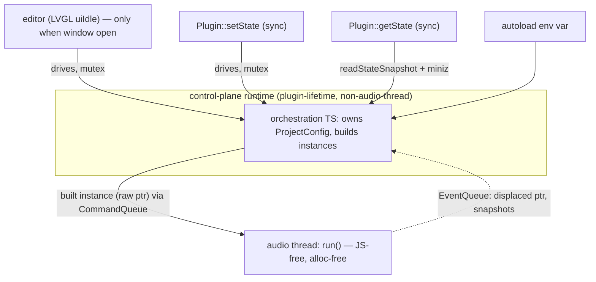

# The scriptable runtime

## Status

**Proposed.** The txiki/QuickJS host substrate is shipped and reusable
([`TjsHostRuntime`](../deps/dpf.js/src/dpfjs/host/TjsHostRuntime.hpp#L35)); what's
proposed is (A) giving it a **plugin-lifetime** existence so orchestration TS runs
whether or not the editor window is open, and (B) collapsing the two hand-written
RPC surfaces + two QuickJS embeddings into **one runtime over one curated binding
set**. Neither is built. The "unify the RPC surface" work was attempted and
explicitly did *not* land as one service — see
[restructure-04](../porting/restructure-04-unify-rpc-surface.md).

## Why

The organizing defect: **the JS runtime is a child of the UI.** The
`LvglJsEngine` (which owns the `TjsHostRuntime`) is a member of `LVGLPluginUI`
([PluginUI.cpp:74](../packages/native/src/PluginUI.cpp#L74)) and is pumped only
from `uiIdle` ([PluginUI.cpp:406](../packages/native/src/PluginUI.cpp#L406),
`jsEngine.tick()` at :454). When a DAW hosts the plugin with the editor closed,
**no JS runs at all** — the runtime is window-lifetime, not plugin-lifetime.

That single fact is the gravity well behind
[the C++/TS boundary](03-cpp-ts-boundary.md) and
[project-state ownership](02-project-state-ownership.md). Because the runtime can
vanish, any orchestration that must work with the UI closed is forced into C++ on
the DSP side:

- **`Plugin::getState` / `setState` are pure C++.** The DSP thread has zero JS
  ([PluginDSP.cpp](../packages/native/src/PluginDSP.cpp) — no `JSContext`, no
  `TjsHostRuntime` include). `getState` zips `project.snapshotConfig()` and
  base64-encodes it inline ([PluginDSP.cpp:221](../packages/native/src/PluginDSP.cpp#L221));
  `setState` base64-decodes, `projectConfigFromZip`, `applyProjectFromConfig`
  ([PluginDSP.cpp:241](../packages/native/src/PluginDSP.cpp#L241)). The zip/base64/
  ProjectConfig machinery lives natively because there's no runtime to hand it to.
- **`RETROPLUG_AUTOLOAD_PROJECT` is implemented twice.** Once on the UI thread
  through the bridge ([PluginUI.cpp:326](../packages/native/src/PluginUI.cpp#L326)
  → `bridge->loadProjectFromPath`) and *again* natively in the DSP constructor
  ([PluginDSP.cpp:110](../packages/native/src/PluginDSP.cpp#L110)) for the headless
  Reaper-render case where the window never opens. The second copy exists purely
  because JS is window-gated.

Separately, the runtime is embedded **twice, differently.** The plugin builds a
`TjsHostRuntime` inside `LvglJsEngine` and binds a `Symbol.for("plugin")`
namespace to `PluginRpcService` (75 methods,
[PluginRpcRegistration.hpp](../packages/native/src/PluginRpcRegistration.hpp)). The
CLI test harness builds a **second** `TjsHostRuntime`
([TestHarness.cpp:129](../packages/native/cli/TestHarness.cpp#L129)) and binds a
`Symbol.for("retroplug")` namespace to `HarnessRpcService` (~52 methods,
[HarnessRpcRegistration.hpp](../packages/native/cli/HarnessRpcRegistration.hpp)).
The two services re-implement the same orchestration — build a system from ROM +
sav, snapshot to `.rplg`, compile+patch a kit, dedup+flush SRAM — with only their
*execution model* genuinely different (see below). That drift is the tax
[restructure-04](../porting/restructure-04-unify-rpc-surface.md) meant to remove
and admits it didn't: *"a **separate** `HarnessRpcService` compiled only into
`retroplug-cli` — `PluginRpcService` is untouched."*

## Design

Two facets, orthogonal but mutually reinforcing.

### (A) The control-plane runtime — make the runtime plugin-lifetime

Promote the txiki runtime from a UI member to a **plugin-lifetime, non-audio-thread
control plane.** It runs the orchestration TS, owns the `ProjectConfig`
([the config-authority split](02-project-state-ownership.md)), builds emulator
instances off the audio thread, and hands the *already-built* instance to the
audio thread through the **existing** `CommandQueue` — the exact
ownership-transfer pattern the UI uses today (UI thread does `make_unique` +
`onActivate`; the DSP swaps a raw pointer with no alloc/free; the displaced
object returns via `EventQueue` for the UI to `delete` — see
[current-state.md](current-state.md) and
[CommandQueue.hpp:26](../packages/native/src/transport/CommandQueue.hpp#L26)).

**It never runs on the audio render callback.** `run()` stays JS-free and
allocation-free; the control plane feeds it only through the lock-free queue.
Audio-thread scripting is a *different* problem with a *different* constraint —
see [MIDI routing scripts](06-midi-routing-scripts.md), which need a runtime on
the audio thread and therefore a no-GC / preallocated discipline this one
deliberately does not.

**Callers of the control-plane runtime:**

| Caller | When | What the TS does |
| --- | --- | --- |
| Editor (LVGL) | Idle, only when the window is open | Drives the same runtime from `uiIdle` — today's pumps, unchanged in spirit |
| `Plugin::setState` | Host restore / project load | Drives the runtime **synchronously**: unzip → build instances → post to `CommandQueue` |
| `Plugin::getState` | Host save | TS assembles the zip from each system's `readStateSnapshot(i)` + miniz |
| Autoload | `RETROPLUG_AUTOLOAD_PROJECT` at construction | Same TS load path — the DSP-side C++ duplicate goes away |

**Threading model (resolved): inline / shared, no dedicated thread.** DPF's
`getState`/`setState` are *synchronous*, and hosts realistically won't call them
from the audio thread at project-load — and a load-time glitch doesn't matter.
So `setState` drives the shared runtime inline and blocks until the instances are
built and queued; the editor drives the *same* runtime from idle when open. The
only contention is editor-idle vs `setState` touching the runtime concurrently —
serialize with a single **mutex** around the runtime. No control thread, no
message pump between them. Per-instance runtime cost is a non-issue and not worth
designing around.

*The runtime becomes the control plane for project/file orchestration; the audio
thread is reached only through the lock-free queues it already uses.*

### (B) One runtime / one binding — the broader reorg

Today four consumers embed the runtime (or would): the plugin's default UI, the
CLI test harness, a future custom standalone, and the UI-test runner. They should
all be **scripts over one runtime + one curated binding set**, chosen by mode:

- **Modes over one binary:** default UI (no flag) / `--render` (headless offline
  render) / `--test` (the TAP harness, software LVGL, no audio device) /
  `--script foo.js` (custom UX, NES/evermidi test tooling, sav authoring).
- **Custom standalone owns `main()`.** It re-provides what DPF's app gives for
  free — an audio device, a window + GL for LVGL, MIDI-in (vendored `miniaudio`
  is the device candidate). This is the largest net-new piece.
- **Keep `retroplug-jack` (the DPF standalone) — for DPF-integration testing
  only.** It stays the easiest way to exercise the format adapters without a DAW;
  it is not the user-facing app.

**What collapses vs. what doesn't.** `PluginRpcService`
([1956 lines](../packages/native/src/PluginRpcService.cpp)) and
`HarnessRpcService` ([320 lines](../packages/native/cli/HarnessRpcService.cpp) +
`TestHarnessImpl`) expose near-disjoint *method names* (only `getFrame` and
`saveSram` collide) but re-implement the same *orchestration*: `loadRom(From
Path)`, save/load `.rplg` (`saveProject`/`saveRplg` ↔ `loadProjectFromPath`/
`loadRplg`), kit patching (`compileAndPatchKit` ↔ `patchKit`), SRAM
dedup+autosave (`pumpSramAutoSave` ↔ `autoSaveSram`). That orchestration is what
belongs in *shared TS over one binding set*, deleting one of the two copies. The
**only** thing that genuinely does not collapse is the execution-model
difference:

| | Plugin | Harness |
| --- | --- | --- |
| Who advances time | The host's audio callback | The test, synchronously — `project->onProcess` in a loop ([TestHarnessImpl.hpp:284](../packages/native/cli/TestHarnessImpl.hpp#L284), `runMs` at :297) |
| How mutations apply | Posted to `CommandQueue`, drained by `run()` | Called on `Project` directly, then `runMs` |

That difference is a **small primitive** (a "step N frames now" vs. "hand a value
to a lock-free queue" seam), not the reason for two 300–2000-line services. The
binding set curates one surface; the two execution models are two thin adapters
under it.

**Transport-agnostic already.** `JsRpcBridge` routes every call through the
single `__rpcSend(request) → response` trampoline the host binds
([TjsHostRuntime.cpp:156](../deps/dpf.js/src/dpfjs/host/TjsHostRuntime.cpp#L156))
and drains async/notification frames through an rpcpp transport
([JsRpcBridge.hpp:54](../deps/dpf.js/src/dpfjs/JsRpcBridge.hpp#L54),
`QuickJSTransport`). Because the C++ host moves only opaque `JSValue`s and never
rpcpp types ([TjsHostRuntime.hpp:34-43](../deps/dpf.js/src/dpfjs/host/TjsHostRuntime.hpp#L34)),
the seam is a single sync function + a pluggable transport — a web port
([porting/18](../porting/18-web-port.md)) could swap the in-process dispatch for
`postMessage` without touching the services.

## C++ vs TS

The runtime lets orchestration move to TS over the
[minimal native contract](README.md). What stays native is the RT and codec core;
what moves is the file/project/instance choreography.

| Concern | Native (stays) | TS (moves onto the contract) |
| --- | --- | --- |
| Audio render (`run()` triad) | ✅ JS-free, alloc-free | — |
| Instance construction | `constructInstance(config, romBytes) → handle` (net-new) | Decides *when/what* to build; sources bytes via tjs fs |
| Byte sourcing (ROM/sav from disk) | tjs fs read/exists/stat/realpath | ✅ the read-a-file, find-the-sibling-`.sav` policy |
| `.rplg` zip/unzip | miniz `zip/unzip` RPC primitive | ✅ assemble/parse entries, base64 for the DPF chunk |
| State snapshot read | `readStateSnapshot(i) → bytes` (exists, triple-buffered, tear-free — [SystemBase.hpp:299](../packages/native/src/system/SystemBase.hpp#L299)) | ✅ getState assembly |
| SRAM | `readSramSnapshot(i)` / `writeSram(i, bytes)` | ✅ dedup + autosave policy (one copy, not two) |
| Kit compile | `compileKit(samples) → bytes` (r8brain + enkiTS) | ✅ which slot, when to patch |
| Save/deactivate trigger | "host is saving / deactivating" callback (net-new, small) | ✅ the SRAM-flush *reaction* |

**The one net-new construction primitive.** `Project::addSystem` today entangles
fs byte-sourcing with emulator construction — `slurpFile`, `slurpSiblingSav`,
`embeddedRom`, then `make_unique<SameBoySystem>` all in one function per variant
([Project.cpp:55-133](../packages/native/src/project/Project.cpp#L55)). The
control plane needs that split: TS sources the bytes (over tjs fs / miniz), a
thin `constructInstance(config, romBytes) → handle` does *only* the emulator
build, and the handle rides the `CommandQueue`. Large blobs (savestates, ROMs)
marshal as `ArrayBuffer`/handles, never JS strings.

## Migration / build steps

Ordered; each independently shippable.

1. **Lift `TjsHostRuntime` out of `LvglJsEngine`'s lifetime.** Give the plugin a
   runtime that exists at construction, before/independent of any window. The
   editor, when it opens, attaches its LVGL display + bundle to the *existing*
   runtime instead of creating one. Behaviour-identical while the window is the
   only driver.
2. **Route `getState`/`setState`/autoload through the runtime.** Replace the
   native zip/base64/ProjectConfig paths in `PluginDSP` with synchronous calls
   into the control-plane TS (guarded by the runtime mutex). Delete the DSP-side
   `RETROPLUG_AUTOLOAD_PROJECT` duplicate. Verify with `pnpm validate`
   (state-restore round-trip) + the Reaper autoload fixtures.
3. **Split `constructInstance` from byte-sourcing.** Carve the emulator-build core
   out of `Project::addSystem`; expose it as a contract primitive; move byte
   sourcing to TS over tjs fs + miniz. `.rplg` round-trips through `saveRplg`/
   `loadRplg` in-harness stay green.
4. **Move the orchestration TS onto one binding set.** Collapse the duplicated
   `loadRom` / save-load-`.rplg` / `patchKit` / SRAM-autosave logic into shared
   TS; keep two thin execution-model adapters (queue vs. `onProcess`). This is
   where `PluginRpcService` and `HarnessRpcService` stop drifting.
5. **Custom standalone owns `main()`.** New binary embedding the runtime + engine,
   re-providing audio device / window+GL / MIDI-in (miniaudio candidate), with
   `--render` / `--test` / `--script` modes. `retroplug-jack` demoted to
   DPF-integration testing.

## Open questions

- **Mutex granularity.** One coarse lock around the whole runtime is the resolved
  default. Does a long `setState` (build N instances) ever stall an open editor's
  idle noticeably enough to matter? Measure before splitting the lock.
- **Bundle identity across modes.** Does the default-UI bundle and the
  orchestration TS share one module graph, or is orchestration a separate entry
  the UI imports? Affects hot-reload ([dpfjs.md](../dpfjs.md)) and what `--script`
  can override.
- **Debug-method gating.** `HarnessRpcService`'s Mesen-debugger / profiling / sav
  fixtures must stay out of the shipping plugin's surface. Structural (separate
  binding module) or build-flag gated, per restructure-04's unresolved
  conditional-registration question.
- **When does audio-thread scripting arrive?** This runtime is explicitly the
  control plane only; the routing-script runtime
  ([06](06-midi-routing-scripts.md)) is deferred and separately constrained.

## Links

- Substrate: [`TjsHostRuntime.hpp`](../deps/dpf.js/src/dpfjs/host/TjsHostRuntime.hpp#L35),
  [`.cpp`](../deps/dpf.js/src/dpfjs/host/TjsHostRuntime.cpp#L156) ·
  [`LvglJsEngine.hpp`](../deps/dpf.js/src/dpfjs/LvglJsEngine.hpp#L92) ·
  [`JsRpcBridge.hpp`](../deps/dpf.js/src/dpfjs/JsRpcBridge.hpp#L37)
- Plugin wiring: [`PluginJsBridge.hpp`](../packages/native/src/PluginJsBridge.hpp#L128) ·
  [`PluginRpcRegistration.hpp`](../packages/native/src/PluginRpcRegistration.hpp) ·
  [`PluginUI.cpp:406`](../packages/native/src/PluginUI.cpp#L406) (uiIdle pump) ·
  [`PluginDSP.cpp:221`](../packages/native/src/PluginDSP.cpp#L221) (get/setState, JS-free)
- Second embedding: [`TestHarness.cpp:129`](../packages/native/cli/TestHarness.cpp#L129) ·
  [`HarnessRpcService.cpp`](../packages/native/cli/HarnessRpcService.cpp) ·
  [`TestHarnessImpl.hpp:284`](../packages/native/cli/TestHarnessImpl.hpp#L284) (sync `onProcess`)
- Construction entanglement: [`Project.cpp:55`](../packages/native/src/project/Project.cpp#L55)
- Contract primitive that exists: [`SystemBase.hpp:299`](../packages/native/src/system/SystemBase.hpp#L299) (`readStateSnapshot`)
- Porting: [restructure-04](../porting/restructure-04-unify-rpc-surface.md) (the unify that didn't fully land) ·
  [restructure-05](../porting/restructure-05-txiki-host-and-cli.md) ·
  [porting/18 web port](../porting/18-web-port.md)
- Siblings: [README](README.md) · [02 project-state ownership](02-project-state-ownership.md) ·
  [03 the C++/TS boundary](03-cpp-ts-boundary.md) ·
  [06 MIDI routing scripts](06-midi-routing-scripts.md) · [current-state](current-state.md)
