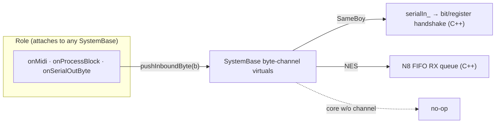

# Cross-core roles

## Status

**Proposed.** "Roles" today are two unrelated shapes — a `RomRole` interface
welded to `SameBoySystem`, and a bespoke `NesN8MidiRole` class owned directly by
`MesenNesSystem`. This doc generalizes the role concept to attach to any
`SystemBase`, folds the NES case in, and classifies each existing role by how
much of it is genuinely core-coupled (native) versus a pure byte transformation
(a [routing-script](06-midi-routing-scripts.md) candidate).

## Why

A *role* is per-ROM-type behaviour composed onto a running emulator instance:
MGB MIDI passthrough, LSDJ sync, Arduinoboy emulation, LSDJ kit patching, the
EverDrive N8 MIDI FIFO. Conceptually every one of these is the same shape —
"attach to a system, react to host MIDI / transport / the audio block, and push
bytes at the emulator." But the code says otherwise:

- **SameBoy** has a real interface, `RomRole` ([RomRole.hpp:16-36](../packages/native/src/system/RomRole.hpp#L16)),
  with `onAttach` / `onMidi` / `onProcessBlock` / `wantsSerialOut` /
  `onSerialOutByte` / `kind`. But every method takes a `SameBoySystem&`, and the
  header forward-declares only `SameBoySystem`. It is structurally impossible to
  attach a `RomRole` to anything else.
- **NES** has no interface at all. `NesN8MidiRole`
  ([NesN8MidiRole.hpp:20-38](../packages/native/src/system/mesen/roles/NesN8MidiRole.hpp#L20))
  is a standalone class with `onAttach(NesConsole&)` and `onMidi(events, count)`,
  owned as a bare `std::unique_ptr<NesN8MidiRole> n8Role_`
  ([MesenNesSystem.hpp:108](../packages/native/src/system/mesen/MesenNesSystem.hpp#L108)),
  always attached on activate
  ([MesenNesSystem.cpp:135-139](../packages/native/src/system/mesen/MesenNesSystem.cpp#L135)),
  fanned to by hand in `onMidi`
  ([MesenNesSystem.cpp:203-206](../packages/native/src/system/mesen/MesenNesSystem.cpp#L203)).

This makes no sense as the system count grows (GBA is already here; more cores
are planned), and it blocks [06](06-midi-routing-scripts.md): the role boundary
is exactly where a user-authored translator script wants to plug in, and that
boundary must not be SameBoy-shaped. The `RoleConfig` tagged union
([RoleConfig.hpp:11-14](../packages/native/src/system/RoleConfig.hpp#L11)) is
likewise SameBoy-only — it lives as `std::vector<RoleConfig> roles` on
`SameBoyConfig` alone ([SameBoyConfig.hpp:97](../packages/native/src/system/sameboy/SameBoyConfig.hpp#L97));
NES/GBA configs carry no roles, which is why the N8 role has to be hardcoded.

## Design

**One role interface, parameterized on `SystemBase&`.** `SystemBase` already
exposes everything the system-agnostic surface of a role needs: `onMidi(events,
count)` ([SystemBase.hpp:81](../packages/native/src/system/SystemBase.hpp#L81)),
the `midiOut()` queue ([SystemBase.hpp:91-92](../packages/native/src/system/SystemBase.hpp#L91)),
the `prepareForBlock`/`stepIfBelowTarget`/`finishBlock` triad
([SystemBase.hpp:63-65](../packages/native/src/system/SystemBase.hpp#L63)), and
`getMemory` ([SystemBase.hpp:178](../packages/native/src/system/SystemBase.hpp#L178)).
Generalize the interface to:

```cpp
class Role {
    virtual void onAttach(SystemBase&) {}
    virtual void onMidi(SystemBase&, const MidiEvent*, uint32_t) {}
    virtual void onProcessBlock(SystemBase&, const AudioBlockInfo&) {}
    virtual bool wantsSerialOut() const { return false; }
    virtual void onSerialOutByte(SystemBase&, uint8_t) {}
    virtual std::string_view kind() const = 0;
};
```

Each `SystemBase` owns a `std::vector<std::unique_ptr<Role>>` and fans MIDI /
block / serial-out to it, exactly as `SameBoySystem` does today
([SameBoySystem.cpp:555-560](../packages/native/src/system/sameboy/SameBoySystem.cpp#L555),
[:700-702](../packages/native/src/system/sameboy/SameBoySystem.cpp#L700)) — but
the fan-out moves up to the base so NES/GBA get it for free instead of
open-coding it.

**Drop `onTransportChange`.** It is declared ([RomRole.hpp:25](../packages/native/src/system/RomRole.hpp#L25))
but **never called** — transport edges are handled inside `onProcessBlock` by
reading `info.transportPlaying`
([LsdjSyncRole.cpp:141](../packages/native/src/system/sameboy/roles/LsdjSyncRole.cpp#L141)).
Remove the dead virtual as part of the generalization; the block already carries
the signal.

**The byte channel is the one thing that isn't system-agnostic.** Roles write
bytes *at the emulator*, and the sink differs per core:

- SameBoy: push into the GB serial-in queue (`system.serialIn_.push_back(b)`,
  reached today as a public member of `SameBoySystem` — a leak the generalization
  should close), drained bit-by-bit by the serial handshake.
- NES: push into the EverDrive N8 FIFO's RX queue (`fifo_.pushByte(b)`,
  [NesN8MidiRole.cpp:28](../packages/native/src/system/mesen/roles/NesN8MidiRole.cpp#L28)).

So the byte *sink* and *source* become small `SystemBase` virtuals — e.g.
`pushInboundByte(uint8_t)` and the `wantsSerialOut`/`onSerialOutByte` capture
gate — default no-op, implemented per core over its own transport. A role calls
`system.pushInboundByte(b)` and works on any core that implements it; on a core
that doesn't, the byte goes nowhere (the role is a no-op, which is correct). This
is the [minimal native contract](03-cpp-ts-boundary.md) at the role boundary: the
role/script is byte-level; the byte→bit→register work stays C++ (see the C++/TS
table below).



*One role interface; the byte sink is a per-core primitive behind a `SystemBase`
virtual.*

### Role classification by coupling

The payoff of generalizing is that it exposes how little of most roles is
actually native. Classify each existing role:

| Role | What it is | Coupling | Destiny |
| --- | --- | --- | --- |
| `MgbPassthroughRole` | forwards every MIDI byte verbatim to GB serial ([MgbPassthroughRole.cpp:5-18](../packages/native/src/system/sameboy/roles/MgbPassthroughRole.cpp#L5)) | **translator** — trivial byte forward | ES5 script ([06](06-midi-routing-scripts.md)) |
| `ArduinoboyMaster` | self-contained byte→MIDI state machine — literally the Arduinoboy MI.OUT firmware ([ArduinoboyMaster.hpp:43-60](../packages/native/src/system/sameboy/roles/ArduinoboyMaster.hpp#L43)); a helper `LsdjSyncRole` owns, not a role itself | **translator** — pure `feed(byte, out)` | ES5 script |
| `LsdjSyncRole` | 8 modes (`LsdjSyncMode` 0–7), MIDI↔serial translation, ~6 transient scalars, ROM-title sniff at attach only ([LsdjSyncRole.hpp:14-88](../packages/native/src/system/sameboy/roles/LsdjSyncRole.hpp#L14), [.cpp:95](../packages/native/src/system/sameboy/roles/LsdjSyncRole.cpp#L95)) | **translator** — byte/MIDI transforms + host-clock emission | ES5 script (biggest, highest-value) |
| `NesN8MidiRole` | `onMidi` forwards bytes to a FIFO; `onAttach` **registers a Mesen memory-mapped IO device** at `$40F0/$40F1` ([NesN8MidiRole.cpp:11-19](../packages/native/src/system/mesen/roles/NesN8MidiRole.cpp#L11)) | **split** — forward is scriptable, IO-device registration is native | fold into `Role`; keep attach native |
| `LsdjKitPatchRole` | live ROM patching — writes kit banks into the running emulator ROM each block ([LsdjKitPatchRole.cpp:47-54](../packages/native/src/system/sameboy/roles/LsdjKitPatchRole.cpp#L47)) | not a translator — a mutation queue on the audio thread | **eliminated**; moves to TS orchestration ([08](08-lsdj.md)) |

Two clarifications the table compresses:

- **`ArduinoboyMaster` is already a role-within-a-role.** It is not a `RomRole`
  subclass — `LsdjSyncRole` owns a `unique_ptr<ArduinoboyMaster>` and feeds it
  each captured serial-out byte ([LsdjSyncRole.cpp:163-166](../packages/native/src/system/sameboy/roles/LsdjSyncRole.cpp#L163)).
  Its `feed(byte, out)` signature is exactly the shape a translator script wants:
  bytes in, `MidiEvent`s out, no system reference. It is the cleanest proof that
  translator roles are portable off the core.
- **`LsdjKitPatchRole` doesn't fit the translator mould and shouldn't try to.**
  It's a mutation queue: `queuePatch` from the DSP command drain, `onProcessBlock`
  writes pending banks into the live ROM via `getMemory(Rom, ReadWrite)`. Under
  [08](08-lsdj.md) the compile + patch orchestration moves to TS over the
  `compileKit` primitive and a `writeMemory` command; the audio-thread role is
  **eliminated** rather than generalized. Cross-core generalization here is moot.

### `RoleConfig` becomes cross-core

Move the `std::vector<RoleConfig> roles` off `SameBoyConfig` and up to shared
system config, so NES/GBA carry roles the same way. The `RoleConfig` tagged
union ([RoleConfig.hpp:11-14](../packages/native/src/system/RoleConfig.hpp#L11))
grows the N8 config as a variant. NES's default-role sniff then adds an
`N8MidiConfig{}` the way SameBoy's sniff adds `LsdjSyncConfig{}` /
`MgbRoleConfig{}` today ([SameBoySystem.cpp:227-247](../packages/native/src/system/sameboy/SameBoySystem.cpp#L227)),
replacing the always-attach hardcode. The default is still "attach on this ROM
kind"; it's just expressed as data that round-trips through project state instead
of a `make_unique` buried in `onActivate`.

## C++ vs TS

The generalization is a pure-C++ refactor (no TS yet), but it draws the line the
routing-script work in [06](06-midi-routing-scripts.md) then crosses. What stays
native at the role boundary:

| Concern | Native? | Why |
| --- | --- | --- |
| Bit↔byte serial handshake (`nextSerialInBit`, `captureSerialOutBit`, `GB_serial_set_data_bit`, `io_registers[SC/SB]`) | **C++** | Register-level GB emulation, per-audio-sample; the synthetic Arduinoboy clock lives here too ([SameBoySystem.cpp:520-552](../packages/native/src/system/sameboy/SameBoySystem.cpp#L520), [:608-615](../packages/native/src/system/sameboy/SameBoySystem.cpp#L608)) |
| N8 FIFO memory-mapped IO device registration (`RegisterIODevice` at `$40F0/$40F1`) | **C++** | Wires into Mesen's `NesMemoryManager` ([NesN8MidiRole.cpp:17](../packages/native/src/system/mesen/roles/NesN8MidiRole.cpp#L17)) |
| Kit bank compile + live ROM write | **C++ primitive** (`compileKit`) + **TS** (orchestration) | perf codec stays native; the patch policy leaves ([08](08-lsdj.md)) |
| Byte-level translation (MGB forward, Arduinoboy decode, LSDJ sync/map/keyboard/passthrough, N8 forward) | **TS-eligible** | pure byte→byte / byte→MIDI; the translator-role script surface ([06](06-midi-routing-scripts.md)) |
| Role interface + fan-out + config plumbing | **C++** | attach/fan-out on the audio thread over `SystemBase` |

The role interface is the seam: native above the byte channel, scriptable at the
byte level. Generalizing it to `SystemBase` is the precondition for the byte
level ever becoming a script.

## Migration / build steps

Each step is independently shippable and behaviour-preserving until the last.

1. **Hoist the role fan-out into `SystemBase`.** Add the `Role` vector, the
   MIDI/block/serial-out fan-out loops, and the byte-channel virtuals
   (`pushInboundByte`, `wantsSerialOut`/`onSerialOutByte` gate) to the base with
   no-op defaults. `SameBoySystem` overrides the byte channel over `serialIn_` /
   `captureSerialOutBit`; its `onMidi`/`finishBlock` fan-out become base calls.
   No role code changes yet.
2. **Reparameterize `RomRole` → `Role` on `SystemBase&`.** Mechanical: the four
   SameBoy roles swap `SameBoySystem&` for `SystemBase&` and reach the byte
   channel through the new virtual instead of the public `serialIn_` member.
   Drop the dead `onTransportChange`.
3. **Fold `NesN8MidiRole` into `Role`.** Its `onMidi` becomes a `Role::onMidi`
   writing via the base byte channel (implemented on `MesenNesSystem` over the
   FIFO); its `onAttach` keeps the native `RegisterIODevice` call, now taking a
   `SystemBase&` and downcasting once to reach the `NesConsole` (the one place a
   role legitimately needs the concrete core).
4. **Make `RoleConfig` cross-core.** Move `roles` to shared config, add the N8
   variant, and express NES's default N8 attach as a sniff-time config entry.
   Now every core attaches roles from data.
5. **(Deferred to [06](06-midi-routing-scripts.md))** Replace the translator
   roles' C++ bodies with ES5 scripts behind the byte channel; and
   **(deferred to [08](08-lsdj.md))** delete `LsdjKitPatchRole`, moving patch
   orchestration to TS.

Steps 1–4 are the cross-core refactor and can land before any scripting exists.
Verify with the existing harness suites — the LSDJ sync/arduinoboy/kit tests
under [test/ts/gb/lsdj/](../test/ts/gb/lsdj/) and the NES MIDI path exercise
every role through the same code the plugin runs.

## Open questions

- **Where does the concrete-core downcast belong?** `NesN8MidiRole::onAttach`
  genuinely needs a `NesConsole`. Options: a checked downcast inside the role
  (simple, one site), or a typed capability accessor on `SystemBase` (e.g.
  `nesConsole()` returning `nullptr` off-core). Lean toward the downcast until a
  second core-specific attach appears.
- **Is the byte channel one stream or two?** SameBoy has a single bidirectional
  serial line (in-queue + out-capture); the N8 has separate RX/TX FIFOs. A single
  `pushInboundByte` + `onSerialOutByte` pair covers both today, but a future core
  with multiple independent byte ports (multiple link ports, a second UART) would
  want a channel id. Defer until such a core exists.
- **Do roles need ordering guarantees?** Today fan-out order is
  instantiation order and roles are assumed independent (LSDJ sync + kit patch are
  "orthogonal", [LsdjKitPatchRole.hpp:44-45](../packages/native/src/system/sameboy/roles/LsdjKitPatchRole.hpp#L44)).
  Once translator scripts can both consume and emit on the same byte channel,
  ordering (and re-entrancy) needs a defined contract — flagged for [06](06-midi-routing-scripts.md).

## Links

- Role interface: [RomRole.hpp](../packages/native/src/system/RomRole.hpp) ·
  config union: [RoleConfig.hpp](../packages/native/src/system/RoleConfig.hpp) ·
  base surface: [SystemBase.hpp:63-92](../packages/native/src/system/SystemBase.hpp#L63)
- SameBoy roles:
  [MgbPassthroughRole](../packages/native/src/system/sameboy/roles/MgbPassthroughRole.cpp) ·
  [ArduinoboyMaster](../packages/native/src/system/sameboy/roles/ArduinoboyMaster.hpp) ·
  [LsdjSyncRole](../packages/native/src/system/sameboy/roles/LsdjSyncRole.cpp) ·
  [LsdjKitPatchRole](../packages/native/src/system/sameboy/roles/LsdjKitPatchRole.cpp)
- NES role: [NesN8MidiRole](../packages/native/src/system/mesen/roles/NesN8MidiRole.cpp) ·
  owner [MesenNesSystem.cpp:135-206](../packages/native/src/system/mesen/MesenNesSystem.cpp#L135)
- Fan-out + byte handshake: [SameBoySystem.cpp:478-560](../packages/native/src/system/sameboy/SameBoySystem.cpp#L478)
- Construction seam (`constructInstance` groundwork): [Project.cpp:55-133](../packages/native/src/project/Project.cpp#L55)
- Siblings: [MIDI routing as scripts](06-midi-routing-scripts.md) ·
  [The LSDj subsystem](08-lsdj.md) ·
  [The C++/TS boundary](03-cpp-ts-boundary.md) ·
  [current-state.md](current-state.md)
- Porting history: [07-mgb-role.md](../porting/07-mgb-role.md) ·
  [09-lsdj-arduinoboy.md](../porting/09-lsdj-arduinoboy.md) ·
  [10-lsdj-kit-patching.md](../porting/10-lsdj-kit-patching.md) ·
  [17-mesen.md](../porting/17-mesen.md)
