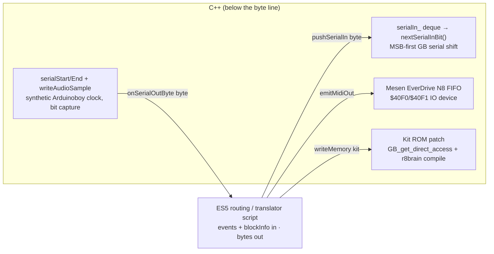

# MIDI routing as hot-reloadable scripts

## Status

**Proposed** — the highest-value / highest-risk track. Nothing here is built;
routing and the translator roles are C++ today (and RT-clean). This doc argues
that most of that C++ is *not* DSP — it's byte arithmetic and small state
machines — and that pulling it into hot-reloadable ES5 scripts unlocks two wins
at once: fast iteration on routing/translation, and **the same script running on
a microcontroller** to build Arduinoboy-like hardware. It is honest about the
one hard prerequisite (audio-thread RT-safety), which is deliberately deferred.

## Why

Two bodies of code shape how host MIDI reaches an emulator, and both are small,
branchy, and non-numeric:

1. **The routing decision** — `Project::dispatchMidi`
   ([project/Project.hpp:117](../packages/native/src/project/Project.hpp#L117)),
   ~50 lines of channel-nibble/bit arithmetic choosing which system(s) an event
   lands on. Four modes (`SendToAll` / `FourChannelsPerInstance` /
   `OneChannelPerInstance` / `MidiChannelToInstance`,
   [ProjectConfig.hpp:29](../packages/native/src/project/ProjectConfig.hpp#L29)),
   with system/realtime/SysEx broadcast to all. The comment already declares it
   "Realtime-safe: no allocation, no I/O" — it is pure decision logic.
2. **The translator roles** — the byte↔byte / byte↔MIDI state machines:
   `LsdjSyncRole`'s eight sync modes
   ([roles/LsdjSyncRole.cpp](../packages/native/src/system/sameboy/roles/LsdjSyncRole.cpp)),
   `MgbPassthroughRole`
   ([roles/MgbPassthroughRole.cpp](../packages/native/src/system/sameboy/roles/MgbPassthroughRole.cpp)),
   and the `ArduinoboyMaster` MI.OUT decoder
   ([roles/ArduinoboyMaster.cpp](../packages/native/src/system/sameboy/roles/ArduinoboyMaster.cpp)).
   These are literal reimplementations of the trash80 Arduinoboy AVR firmware:
   `feed(byte, out)` is a two-scalar state machine (`pendingCmd_`,
   `pendingValueExpected_`) turning a 7-bit serial stream into MIDI events. The
   only emulator coupling is an **attach-time ROM sniff** (`isArduinoboyBuild`
   reads `system.rom_` once in `onAttach`,
   [LsdjSyncRole.cpp:94](../packages/native/src/system/sameboy/roles/LsdjSyncRole.cpp#L94));
   the per-block path never touches live emulator state.

Both are iterated rarely because a change means a C++ rebuild. And the second
body is *the exact code an Arduinoboy clone would run on an AVR* — today it lives
only inside the plugin. The owner's thesis: make routing and the translators
**hot-reloadable ES5 scripts**, keep them to the AVR firmware vocabulary
(int/bit ops, const tables, a few scalars, push-bytes), and the same source
compiles once for QuickJS in the plugin and again for a microcontroller.

## Design

### Two tiers

| Tier | Today | As a script | Emulator access |
| --- | --- | --- | --- |
| Routing **decision** | `Project::dispatchMidi` (nibble math) | trivial; a pure `(event, blockInfo, sysCount) → targets[]` function | none |
| **Translator** roles | `LsdjSyncRole` / `MgbPassthrough` / `ArduinoboyMaster` | byte↔byte/MIDI state machine + a PPQ-clock iterator | attach-time ROM sniff only |

Tier 1 is the cheap, obvious first move — no live state at all, and the wrap-`%N`
target selection is already isolated. Tier 2 is where the payoff (and the MCU
story) lives, but also where the state machines and timing live.

### The per-block script API

A script is invoked once per audio block per render unit. Inputs and outputs are
deliberately narrow — the AVR firmware vocabulary, nothing more:

**Inputs**
- MIDI events for this block: `{ frame, size, data[4] }`
  ([transport/MidiTypes.hpp:10](../packages/native/src/transport/MidiTypes.hpp#L10);
  SysEx `> kDataSize=4` bytes rides `dataExt` and is skipped by the byte-level
  translators today).
- `AudioBlockInfo { frames, sampleRate, tempo, ppqPosBlockStart, transportPlaying }`
  ([system/SystemTypes.hpp:14](../packages/native/src/system/SystemTypes.hpp#L14)).
- System index + system count (routing needs `% N`; translators need "who am I").

**Outputs** (each maps 1:1 to an existing native sink)
| Script call | Native sink today |
| --- | --- |
| `pushSerialIn(sys, byte)` | `serialIn_.push_back(byte)` (LsdjSync/MGB do exactly this) |
| `emitMidiOut(sys, bytes, frame)` | `midiOut()` queue, drained to `writeMidiEvent` at [PluginDSP.cpp:719](../packages/native/src/PluginDSP.cpp#L719) |
| `pressButton(sys, button, down)` | `SameBoySystem::pressButton` (queued at [SameBoySystem.cpp:576](../packages/native/src/system/sameboy/SameBoySystem.cpp#L576)) |
| `writeMemory(sys, type, offset, bytes)` **[kit only]** | `LsdjKitPatchRole::queuePatch` → `GB_get_direct_access` |

**State** — a handful of scalars, retained across blocks. This is exactly what
the roles carry today: `LsdjSyncRole` holds `arduinoboyPlaying_`,
`effectiveDivisor_`, `lastRow_`, `keyboardOctave_`, `nextClockTick_`
([LsdjSyncRole.hpp:77](../packages/native/src/system/sameboy/roles/LsdjSyncRole.hpp#L77));
`ArduinoboyMaster` holds two. No heap, no growing collections — scalars only.

**Timing** — a PPQ-tick iterator: the host gives `ppqPosBlockStart` + `frames` +
`tempo`, and the script wants "call me at each 24-PPQN tick that falls in this
block, with a sample offset." That is `PpqUtil::eachTick`
([util/PpqUtil.hpp:26](../packages/native/src/util/PpqUtil.hpp#L26)) — it already
carries `nextTick` across blocks so the clock never drifts a tick at a block
edge. `LsdjSyncRole`'s `MidiSync` clock is *just* `eachTick(...) →
pushSerialIn(0xF8)` ([LsdjSyncRole.cpp:154](../packages/native/src/system/sameboy/roles/LsdjSyncRole.cpp#L154)).
The iterator is the one non-trivial primitive the script API must expose; on an
MCU the equivalent is a hardware-timer ISR.

### The byte↔bit boundary (scripts stay above it)

Scripts operate on **bytes**. Everything below a byte stays C++, because it is
either genuine hardware emulation or a perf codec:

- **GB serial-register handshake** — `nextSerialInBit` shifts one byte out MSB-
  first ([SameBoySystem.cpp:537](../packages/native/src/system/sameboy/SameBoySystem.cpp#L537)),
  `captureSerialOutBit` reassembles the outgoing stream
  ([:520](../packages/native/src/system/sameboy/SameBoySystem.cpp#L520)), and the
  synthetic external clock lives in `writeAudioSample` gated on
  `(SC & 0x81) == 0x80` ([:608](../packages/native/src/system/sameboy/SameBoySystem.cpp#L608)).
  Bits are the emulator's business; a script that had to reason about
  `serialBitsRemaining_` would not be MCU-portable anyway. Scripts see whole
  bytes via `onSerialOutByte`.
- **Mesen FIFO IO-device** — `NesN8MidiRole` pushes host MIDI bytes into the
  EverDrive N8 RX queue behind `$40F0/$40F1`
  ([mesen/roles/NesN8MidiRole.hpp](../packages/native/src/system/mesen/roles/NesN8MidiRole.hpp)).
  The memory-mapped device stays C++; a cross-core routing script (see
  [05](05-roles-cross-core.md)) would still just `pushSerialIn`-equivalent bytes.
- **Kit ROM patch** — sample compile (r8brain + enkiTS) and the direct-access ROM
  write are a perf codec + emulator poke; the script only names a slot and hands
  down bytes.

### ES5 / MCU portability

Enumerate what routing + translation actually *use*, and it is the AVR firmware
vocabulary — nothing that needs a rich runtime:

| Needs | Present in routing/translator code | MCU-portable? |
| --- | --- | --- |
| integer + bit ops (`& 0xF0`, `>> `, `note - 30`) | everywhere (dispatchMidi, LsdjSync handlers) | yes |
| array indexing into const tables | `kKeyboardNoteMap` / `kKeyboardLowOctaveMap` | yes (flash tables) |
| a few persistent scalars | role transient state | yes (globals) |
| push bytes / emit events | `pushSerialIn` / `emitMidiOut` | yes (UART / MIDI TX) |
| a per-tick timing callback | `PpqUtil::eachTick` | yes (timer ISR) |

Inherently **non-portable**, and therefore explicitly host-only:
- **Heap / STL as transport.** The plugin ferries bytes through
  `std::deque<uint8_t> serialIn_`, `std::vector<::MidiEvent> pendingMidi_` /
  `midiOut()`, `std::deque pendingButtons_`
  ([SameBoySystem.hpp:172,190,196](../packages/native/src/system/sameboy/SameBoySystem.hpp#L172)).
  On an MCU these become fixed-size ring buffers. The *script* never sees the
  container — it calls `pushSerialIn` — so the same source binds to a `std::deque`
  in the plugin and a `uint8_t ring[N]` on the AVR. Keep the script API strictly
  push/scalar so this substitution stays mechanical.
- **Emulator calls.** `writeMemory` (kit), the ROM sniff, `getFrame`/`getMemory`
  — meaningless on hardware. A portable translator must not depend on them; the
  kit-patch tier is host-only by construction, and the ROM sniff is an attach-time
  input the harness/host supplies, not a live call.

Practical shape: one `route.es5.js` per behavior (a `sync-lsdj.js`,
`mgb-passthrough.js`, `arduinoboy-master.js`), authored against the tiny API,
hot-reloaded in the plugin, and cross-compiled (or interpreted by a matching
tiny VM) on the MCU. The ArduinoboyMaster decoder is already unit-tested against
the firmware spec
([test/ArduinoboyMasterTests.cpp](../packages/native/test/ArduinoboyMasterTests.cpp)),
which becomes the script's conformance suite.

## C++ vs TS

| Concern | Stays C++ | Becomes a script |
| --- | --- | --- |
| GB serial bit shift / handshake / synthetic clock | ✅ | |
| Mesen FIFO IO-device, kit compile + ROM patch | ✅ | |
| Triple-buffer / queue plumbing, `writeMidiEvent` drain | ✅ | |
| PPQ-tick math (`eachTick`) | ✅ (exposed to scripts as an iterator) | calls it |
| Routing decision (nibble → target systems) | | ✅ |
| Byte→serial / byte→MIDI translation (LSDj modes, MGB, MI.OUT) | | ✅ |

The native contract a routing script needs is a **superset of the control-plane
contract** ([03](03-cpp-ts-boundary.md)) but bound on the audio thread and
byte-oriented: read `MidiEvent[]` + `AudioBlockInfo` + `(index, count)`; write
`pushSerialIn` / `emitMidiOut` / `pressButton` / `writeMemory`; iterate
`eachTick`. All four output sinks already exist; only the *invocation* (calling
JS from `RomRole::onProcessBlock` / `onMidi`) and the marshalling are new.

## Migration / build steps

Each is independently shippable; earlier ones de-risk the RT question before it
matters.

1. **Freeze the script ABI in C++ first.** Refactor `dispatchMidi` and the
   translator roles to route every side effect through the four-sink +
   `eachTick` surface above, still in C++. No behavior change; this proves the
   API is sufficient and gives the scripts a reference oracle.
2. **Tier-1 routing as a script, control-plane-authored.** Emit the routing
   decision as a table/script the audio thread *reads* but doesn't yet execute
   per-event (e.g. precomputed target masks per channel, rebuilt on config
   change off the audio thread). Zero audio-thread JS; ships the "routing is
   data, not code" idea safely.
3. **A translator VM on the audio thread, behind a flag.** Run one script
   (`arduinoboy-master.js` is the cleanest — pure decode, two scalars) through a
   QuickJS context from `onSerialOutByte`. **Not RT-safe yet** (see below); gate
   it to the CLI/harness and offline render where a GC pause is harmless. Verify
   byte-for-byte against `ArduinoboyMasterTests`.
4. **Port the remaining translators + tier-1 execution** once the VM path is
   trusted. Hot-reload wiring (file-watch → recompile → swap context) reuses the
   control-plane reloader ([04](04-scriptable-runtime.md)).
5. **RT-harden the VM** (the deferred work — its own milestone): no-GC /
   zero-alloc / preallocated marshalling, ideally the *same* small VM targeted at
   the MCU. Only after this does the audio-thread flag flip on for the plugin.
6. **MCU target.** Cross-compile the ES5 sources (or run the tiny VM) on an AVR /
   ARM, ring buffers for `serialIn`/`midiOut`, timer ISR for `eachTick`. This is
   the north star, not a near-term deliverable.

## RT-safety (explicit and honest)

This is the load-bearing risk, stated plainly:

- **The DSP path has zero JS today.** `PluginDSP.cpp` contains no QuickJS/txiki
  include or call; the runtime runs UI-thread-only and window-gated. Routing and
  roles are hand-written C++ precisely *because* the audio thread has never had a
  script engine.
- **QuickJS as shipped is `malloc` + mark-sweep GC.** A per-block script that
  allocates (event objects, byte arrays) will, eventually, GC on the audio
  thread — an unbounded pause and a hard RT violation. `dispatchMidi`'s own
  comment ("no allocation, no I/O") is the bar a script has to clear, and a
  stock VM does not.
- **Therefore the feature is NOT gated on RT-safety** — by decision. Build the
  routing-script functionality first (allocations and all), proven in the
  CLI/harness/offline paths where a pause is invisible, and harden later with a
  no-GC / zero-alloc / preallocated-marshalling VM. The memory pool is premature
  until the scripts exist. Do not let step 5 block steps 1–4.

Note the contrast with [04](04-scriptable-runtime.md): the **control-plane**
runtime is inline/synchronous on `get/setState` and the editor idle — a GC there
is fine (load-time glitches don't matter). The routing VM shares the *language*
and ideally the *engine*, but lives under an entirely different constraint (hard
RT), which is why it is a separate, later, riskier track.

## Open questions

- **One VM or many?** A single audio-thread context evaluating every unit's
  script, or one context per render unit? Per-unit isolates state cleanly but
  multiplies engine memory; a shared context needs explicit `(sys, count)`
  threading. (Per-instance runtime cost is a non-issue by decision — this is
  about correctness/isolation, not cost.)
- **Event marshalling shape.** Copy each `MidiEvent` into a JS object (alloc), or
  expose a flat typed-array view the script indexes (no alloc, closer to the MCU
  ring-buffer model)? The latter pre-solves half of step 5.
- **Which VM survives to the MCU?** Stock QuickJS for the plugin and a separate
  hand-rolled ES5-subset interpreter for the AVR, or one tiny no-GC VM used in
  both? The "same script, same engine" promise is strongest with the latter but
  is the largest build.
- **SysEx.** The byte translators skip `size > 4` events today
  ([LsdjSyncRole.cpp:231](../packages/native/src/system/sameboy/roles/LsdjSyncRole.cpp#L231)).
  Does the script API expose `dataExt`, or is SysEx permanently out of scope for
  the byte-serial path?
- **Cross-core translators.** How does a routing script address a Mesen FIFO vs a
  SameBoy serial line through one `pushSerialIn`? Depends on the role
  generalization in [05](05-roles-cross-core.md).

## Links

**Code**
- [project/Project.hpp:117](../packages/native/src/project/Project.hpp#L117) — `dispatchMidi`, the routing decision (tier 1).
- [project/ProjectConfig.hpp:29](../packages/native/src/project/ProjectConfig.hpp#L29) — `MidiRouting` modes.
- [PluginDSP.cpp:343](../packages/native/src/PluginDSP.cpp#L343) / [:666](../packages/native/src/PluginDSP.cpp#L666) — host MIDI in; per-event dispatch, routing read once/block.
- [PluginDSP.cpp:719](../packages/native/src/PluginDSP.cpp#L719) — `midiOut()` → `writeMidiEvent` drain (the `emitMidiOut` sink).
- [roles/LsdjSyncRole.cpp](../packages/native/src/system/sameboy/roles/LsdjSyncRole.cpp) / [.hpp:14](../packages/native/src/system/sameboy/roles/LsdjSyncRole.hpp#L14) — the eight sync modes + transient scalars.
- [roles/MgbPassthroughRole.cpp](../packages/native/src/system/sameboy/roles/MgbPassthroughRole.cpp) — raw MIDI → serial.
- [roles/ArduinoboyMaster.cpp](../packages/native/src/system/sameboy/roles/ArduinoboyMaster.cpp) — MI.OUT byte→MIDI state machine (the AVR firmware port).
- [system/SameBoySystem.cpp:520](../packages/native/src/system/sameboy/SameBoySystem.cpp#L520) / [:537](../packages/native/src/system/sameboy/SameBoySystem.cpp#L537) / [:608](../packages/native/src/system/sameboy/SameBoySystem.cpp#L608) — the byte↔bit boundary (capture, shift-out, synthetic clock).
- [util/PpqUtil.hpp:26](../packages/native/src/util/PpqUtil.hpp#L26) — `eachTick`, the PPQ-tick iterator.
- [transport/MidiTypes.hpp:10](../packages/native/src/transport/MidiTypes.hpp#L10) / [system/SystemTypes.hpp:14](../packages/native/src/system/SystemTypes.hpp#L14) — the script's input structs.
- [test/ArduinoboyMasterTests.cpp](../packages/native/test/ArduinoboyMasterTests.cpp) — the decoder conformance suite (becomes the script's oracle).

**Porting log**
- [porting/06-midi-routing.md](../porting/06-midi-routing.md), [07-mgb-role.md](../porting/07-mgb-role.md), [08-lsdj-sync.md](../porting/08-lsdj-sync.md), [09-lsdj-arduinoboy.md](../porting/09-lsdj-arduinoboy.md), [10-lsdj-kit-patching.md](../porting/10-lsdj-kit-patching.md), [17-mesen.md](../porting/17-mesen.md).

**Sibling architecture docs**
- [05-roles-cross-core.md](05-roles-cross-core.md) — generalize roles across system types (a routing script must address any core, not just SameBoy).
- [04-scriptable-runtime.md](04-scriptable-runtime.md) — the runtime + hot-reloader; **note** the control-plane runtime is inline/synchronous and GC-tolerant, whereas this audio-thread VM is hard-RT.
- [08-lsdj.md](08-lsdj.md) — the LSDj subsystem (sav codec, kit compile/patch) that the kit-only `writeMemory` sink lives under.
- [01-block-runner.md](01-block-runner.md) — the triad (`prepareForBlock → step → finishBlock`) that hosts `onProcessBlock`.
