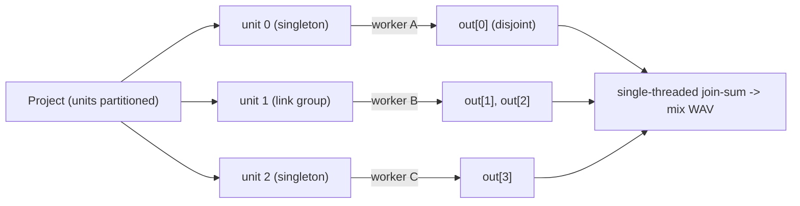

# 07 — Multithreading

## Status

**Mixed.** Offline parallel render is **shipped** (one enkiTS task per render
unit, byte-identical to the single-threaded path, TSan-clean —
[`OfflineRender.cpp`](../packages/native/src/system/OfflineRender.cpp)). Render-
from-UI and realtime per-instance threading are **proposed / future**.

## Why

Render units are independent — a standalone system, or a SameBoy link group
whose members ferry serial bits only among *themselves*. Nothing in one unit's
step touches another unit's state or buffer. That independence is latent
parallelism the single-threaded paths leave on the table:

- **Offline render** of an N-instance project is embarrassingly parallel — each
  unit renders its own whole-song buffer, and the mix is a single-threaded
  join-sum at the end. This is the pressing need (bounce-to-WAV of a multi-
  instance project) and the safe one (no deadline, no host thread).
- **Realtime** could farm units off the audio thread too, but audio-thread
  fork-join is genuinely risky (deadline, priority inversion, glitch fallback),
  so it stays future work — offline covers the demand.

The prerequisite for both is [01](01-block-runner.md): a `runUnit()` that
advances one unit with no knowledge of threads, queues, or buffer ownership.
Multithreading is just "call `runUnit()` from more than one thread over disjoint
buffers." The parallel renderer is the **first real consumer of the runner
beyond the single-threaded paths** — it's what proves the runner's thread-
agnosticism was real and not aspirational.

## Design

### Offline parallel render (shipped, as-built)

[`renderUnitsParallel(Project&, OfflineRenderParams)`](../packages/native/src/system/OfflineRender.cpp#L83)
renders a fixed-transport, scripted-input-free audio render across an enkiTS
pool and returns one interleaved-L/R buffer per system slot.

**One task per unit, one worker per unit.** `UnitRenderTask` is an
`enki::ITaskSet` with `m_SetSize == 1`
([OfflineRender.cpp:35](../packages/native/src/system/OfflineRender.cpp#L35)) —
so the *whole* unit runs on a single worker thread, block by block, for the
entire timeline. That is load-bearing for Mesen: its cores gate work on an
`IsEmulationThread()` check, so the thread that steps a unit must not change
mid-render.

**Partitioning mirrors `runBlock`.** Each link group becomes one multi-member
task ([OfflineRender.cpp:117](../packages/native/src/system/OfflineRender.cpp#L117)),
each unlinked system a singleton task
([:126](../packages/native/src/system/OfflineRender.cpp#L126)) — the exact same
link-vs-singleton split the realtime `runBlock` makes, so the unit set is
identical. `LinkGroup` caches its members as base pointers
([`membersBase()`](../packages/native/src/system/sameboy/LinkGroup.hpp#L40)) so
the task takes a `SystemBase* const*` with no per-block allocation.

**Per-block body = `runUnit()`.** Each task's `ExecuteRange` loops over blocks,
zeroes its own slot scratch (members SUM into the bus), calls the shared
[`runUnit()`](../packages/native/src/system/BlockRunner.cpp#L26) — the same
prepare → round-robin-step → finish triad the audio thread uses — then appends
each member's block into that member's whole-song buffer
([OfflineRender.cpp:42-67](../packages/native/src/system/OfflineRender.cpp#L42)).
Per-unit `ppq` is accumulated identically per task
([:65](../packages/native/src/system/OfflineRender.cpp#L65)), so the result is
deterministic regardless of interleaving.

**The join-sum is single-threaded.** `renderUnitsParallel` returns the per-slot
buffers; the caller sums them for the mix on one thread
([TestHarnessImpl.hpp:530-544](../packages/native/cli/TestHarnessImpl.hpp#L530)).
No thread ever atomically adds into a shared bus.



*One enkiTS task per unit, each writing DISJOINT per-slot buffers; the mix is a
serial sum, not a concurrent one.*

#### The parallelism invariant

**Concurrently-rendered units write disjoint buffers.** Each slot belongs to
exactly one unit → one worker, so no two threads touch the same buffer
([OfflineRender.hpp:26-30](../packages/native/src/system/OfflineRender.hpp#L26)).
`out[slot]` is `reserve()`-d up front to its full length so the per-block
`push_back` never reallocates
([OfflineRender.cpp:87-92](../packages/native/src/system/OfflineRender.cpp#L87)),
and the per-slot block scratch (`bl`/`br`) is likewise per-slot. Because units
step only their own members' state and write only their own buffers, there is no
shared mutable state to guard — no mutex on the hot path. `runUnit()` itself
never owns or zeroes buffers, which is precisely what lets it be called
concurrently.

#### The Mesen thread rebind

A Mesen unit can be *booted* on the main thread and later *rendered* on a worker.
`MesenNesSystem::prepareForBlock` rebinds the emulation thread to whoever drives
the block when it isn't already bound
([MesenNesSystem.cpp:228-234](../packages/native/src/system/mesen/MesenNesSystem.cpp#L228),
GBA the same at
[MesenGbaSystem.cpp:224-228](../packages/native/src/system/mesen/MesenGbaSystem.cpp#L224)):

```cpp
if (!emu_->IsEmulationThread()) {
    emu_->SetEmulationThreadId(std::this_thread::get_id());
}
```

This replaced a one-time `threadIdSet_` latch — a cheap thread-id compare that
rebinds on the main→worker (and back) transition, so `IsEmulationThread()`
checks inside `cpu->Exec()` / `RunFrame()` pass on whichever thread is driving.
(Related: [porting/20 — remove Mesen's dead run-loop threading](../porting/20-mesen-single-thread-runloop.md).)

#### Shipped consumer + verification

Wired to the CLI harness as
[`emu.renderWavPerSystemParallel(mix, perSystem[], ms)`](../packages/native/cli/TestHarnessImpl.hpp#L501)
(RPC at
[HarnessRpcService.cpp:262](../packages/native/cli/HarnessRpcService.cpp#L262)) —
faster than the single-threaded `renderWavPerSystem` on multi-unit projects and
not SameBoy-only (covers Mesen). The streaming single-threaded path stays for
hour-scale renders where the in-RAM per-unit buffers would OOM.

Verified byte-identical + thread-safe by
[`ParallelRenderTests.cpp`](../packages/native/test/ParallelRenderTests.cpp)
(3 SameBoys; 2 standalone + a link group; 2 Mesen NES on two workers) and
`render_parallel.test.ts` (mix == sum of per-system). These double as the
ThreadSanitizer gate (`tools/run-sanitizers.sh thread`). Commit `14cffe46`
shipped it; `d8790dd5` closed the review-found determinism-gate gaps that let
the proof pass vacuously (a silent Mesen ROM comparing zero-vs-zero; byte-
identical per-slot config hiding a routing cross-wire; block-aligned totals
never exercising the partial final block).

### Render-from-UI (proposed)

A UI-triggered bounce must **not** touch the live audio-thread instances (they're
mid-playback, DSP-owned). The plan, which leans on
[02](02-project-state-ownership.md):

1. UI triggers a render with its **authoritative** `ProjectConfig` (02 makes the
   UI the config owner when open).
2. On a worker thread, build a **fresh, throwaway** `Project` from that config —
   a second set of emulator instances, booted from the same ROMs/savestates,
   entirely independent of the live ones.
3. Run `renderUnitsParallel` (or the single-threaded runner for very long
   renders) over the fresh project → WAV.

This is clean *precisely because the UI owns the config* — there is no need to
snapshot or freeze the live instances, no cross-thread read of DSP state. The
fresh-Project construction is the same `constructInstance` primitive the boundary
work needs (see below and [03](03-cpp-ts-boundary.md)); the render core already
exists. What's missing is the trigger + the fresh-build wiring, not the engine.

### Realtime per-instance threading (future, not scheduled)

Noted for completeness; nothing is built. The pattern:

- Process **one unit inline on the audio thread**; farm the rest to a
  **dedicated realtime worker pool**; **fork-join within the block deadline**.
- **Adaptive activation** — only fork when `unit count × block size` makes the
  sync overhead worth it; a 1-unit or tiny-block project stays single-threaded.
- **Glitch fallback** on overrun — if a worker misses the deadline, fall back
  rather than underrun the host.
- **Link-group-as-unit still holds** — a link group is one indivisible task on
  one thread (its members ferry serial bits mid-block and can't be split).
- Stereo-mode MT (everyone sums into one pair) would use per-thread scratch + a
  single-threaded join-sum, **not** atomic adds — the same disjoint-buffer
  discipline as offline.

Deferred because audio-thread fork-join is genuinely risky (priority inversion,
deadline misses, glitch handling) and offline render covers the pressing need.
RT-safety of the units themselves is a separate, also-deferred concern (see the
scripting deferral in [06](06-midi-routing-scripts.md)).

## C++ vs TS

Multithreading is almost entirely native — it *is* DSP (emulator stepping across
threads). TS's only role is on the render-from-UI **trigger**, not the render.

| Concern | Side | Notes |
| --- | --- | --- |
| enkiTS pool, task partitioning, `runUnit()` loop | **C++** | Realtime-adjacent; stays native forever. |
| Disjoint-buffer discipline, join-sum, ppq accumulation | **C++** | The parallelism invariant. |
| Mesen `IsEmulationThread()` rebind | **C++** | Core-internal threading. |
| *Triggering* a render-from-UI | **TS** | Orchestration: pick output path, params, fire it. |
| Building the fresh `Project` for render-from-UI | **C++ primitive, TS-driven** | `constructInstance(config, romBytes)` (net-new, split from [`Project::addSystem`](../packages/native/src/project/Project.cpp#L55)); TS supplies the authoritative config + ROM bytes. |
| Writing the WAV / progress reporting | mixed | Native WAV writer + `tjs` fs; TS owns the file path and UX. |

The render engine (`renderUnitsParallel`) is currently exposed only on the CLI
`HarnessRpcService`, not the plugin `PluginRpcService`. Render-from-UI needs it
(or a thin wrapper) surfaced as a native primitive the control-plane runtime can
call — a small addition to the [minimal native contract](README.md), not new DSP.

## Migration / build steps

1. **Offline parallel render — done** (`14cffe46` + `d8790dd5`).
   `renderUnitsParallel` + `runUnit()` factoring; Mesen main→worker rebind; CLI
   `renderWavPerSystemParallel`; byte-identity + TSan gate.
2. **Expose the renderer as a plugin-side native primitive** — lift
   `renderUnitsParallel` (or a wrapper) onto the control-plane surface so TS can
   invoke it. Depends on [02](02-project-state-ownership.md) (UI-authoritative
   config) + `constructInstance` from [03](03-cpp-ts-boundary.md).
3. **Render-from-UI** — TS trigger builds a fresh `Project` on a worker from the
   authoritative config and runs step 2's primitive → WAV. Independently
   shippable once 2 lands.
4. **(Future, unscheduled) Realtime per-instance MT** — dedicated RT worker
   pool, adaptive fork-join, glitch fallback, on the proven runner.

## Open questions

- **Fresh-Project construction cost** for render-from-UI — booting a second set
  of instances (esp. re-slurping ROM/savestate bytes) on the worker. Acceptable
  for a bounce (no deadline), but the savestate seeding path wants confirming.
- **Scheduler lifetime** — the offline path spins up and tears down a local
  `enki::TaskScheduler` per call
  ([OfflineRender.cpp:134-137](../packages/native/src/system/OfflineRender.cpp#L134)).
  Fine for a one-shot bounce; a long-lived shared pool would matter only if
  renders became frequent/interactive.
- **Realtime worker-pool priority + glitch policy** — entirely open; the whole
  realtime track is deferred until there's a demonstrated need.
- Confirm **link-group-as-unit** holds in the (future) realtime path exactly as
  it does offline.

## Links

- Render core: [`OfflineRender.hpp`](../packages/native/src/system/OfflineRender.hpp) ·
  [`OfflineRender.cpp:83`](../packages/native/src/system/OfflineRender.cpp#L83) ·
  [`renderWavPerSystemParallel`](../packages/native/cli/TestHarnessImpl.hpp#L501)
- The shared runner: [`runUnit()`](../packages/native/src/system/BlockRunner.cpp#L26) ·
  [`BlockRunner.hpp`](../packages/native/src/system/BlockRunner.hpp)
- Mesen rebind:
  [`MesenNesSystem.cpp:228`](../packages/native/src/system/mesen/MesenNesSystem.cpp#L228) ·
  [`MesenGbaSystem.cpp:224`](../packages/native/src/system/mesen/MesenGbaSystem.cpp#L224)
- Units: [`LinkGroup.hpp`](../packages/native/src/system/sameboy/LinkGroup.hpp) ·
  [`Project::addSystem`](../packages/native/src/project/Project.cpp#L55)
- Tests: [`ParallelRenderTests.cpp`](../packages/native/test/ParallelRenderTests.cpp) ·
  `test/ts/cli/render_parallel.test.ts`
- Sibling docs: [01 — The Block Runner](01-block-runner.md) (the runner this
  farms), [02 — Project-state ownership](02-project-state-ownership.md)
  (authoritative config for render-from-UI),
  [03 — The C++/TS boundary](03-cpp-ts-boundary.md) (`constructInstance`),
  [current-state.md](current-state.md).
