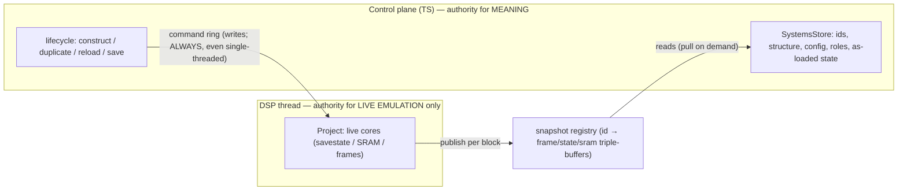

# 09 — Project isolation (DSP-only, one door in, one door out)

## Status

**Proposed.** This is the greenfield realization of the ownership line drawn in
[02](02-project-state-ownership.md) and the boundary of [03](03-cpp-ts-boundary.md),
taken to its strict end: `Project` becomes **DSP-runtime-only**, and the control
plane reaches it through exactly two doors — a command ring in, a snapshot
registry out. The pieces exist in greenfield today (the per-system triple-buffers,
the `EngineInvoker` command ring, `constructSystem`, the state snapshot); what's
missing is the *invariant* and three changes that make it airtight. Nothing here
is shipped.

**Decided in review:** the control plane holds structure + as-loaded state and
**pulls** live state from the registry on demand (save/duplicate) — no continuous
TS mirror (the registry already *is* the published copy).

## Why

Greenfield already split authority the way [02](02-project-state-ownership.md)
argued — TS stores own the project model, the DSP owns the live cores — but the
boundary is porous in two concrete ways, and both have already drawn blood.

**1. Reads walk the live `Project`.** `getFrame` / `readState` / `readSram` do
`engine_.findSystem(id)`
([Engine.cpp](../packages/native-greenfield/src/Engine.cpp)) — a walk of the
system list the DSP thread mutates — and then dereference the core. Worse, the
published snapshots live **as members on `SystemBase`** (`FrameBufferTriple`,
`stateSnapshot_` — [SystemBase.hpp](../packages/native/src/system/SystemBase.hpp#L296-L340)),
*inside* `Project`. So "the control plane reads a system's frame/state" literally
means "walk the DSP's live structure and dereference a core the DSP owns." The
tear-free triple-buffer makes the *byte read* safe; locating it does not.

**2. Two mutation paths, forked on `audioRunning_`.** Every live-core op chooses
between `DirectInvoker` (quiescent, straight into `Project`) and `QueuedInvoker`
(running, via the ring), gated by the `audioRunning_` flag
([BackendFacade.hpp:95-104](../packages/native-greenfield/src/BackendFacade.hpp#L95)).
The "quiescent-only" branches touch the live core directly and are hard-guarded
`if (audioRunning_) return …`. That fork — not any single method — is the root of
a whole silent-failure class we've hit one at a time:

- `pressButton` mutated the core directly + bailed while audio ran → keyboard did
  nothing in the plugin ([fixed](../packages/native-greenfield/src/EngineInvoker.cpp) by routing through the ring).
- `duplicateSystem` cloned the *live* core + bailed while audio ran → Duplicate
  silently added nothing in the standalone (the store reads null as "append
  nothing").
- `readState` / `readSram` / `reloadSystem` are **still** guarded — dead the moment
  the audio thread runs.

Each fix has been "make *this* op cross the boundary correctly." The invariant
below makes the boundary uncrossable-by-accident instead, and deletes the fork.

## Design

**`Project` is DSP-runtime-only.** It is touched on the DSP thread and nowhere
else — by the ring drain (applying writes), `processBlock` (evolving), and the
snapshot publish (bytes out). The control plane never holds a `SystemBase*`, never
walks the system list, never allocates an id from it. It reaches the DSP through
two one-way doors:

| State | Lives where | Authority |
| --- | --- | --- |
| Live cores — savestate, SRAM, framebuffers (evolving) | Only inside `Project`, on the DSP thread | **DSP** |
| Published copies — frame/state/sram snapshots | The **registry** (off `SystemBase`), DSP writes / control reads | DSP writes, control reads |
| Structure, ids, config, roles, as-loaded state | The TS `SystemsStore` | **Control plane** |

### The linchpin: a snapshot registry, off `SystemBase`

For "no `Project` access" to be *true*, the published copies can't live on the
cores. Move frame/state/sram publication into an **id-keyed registry** the DSP
writes and the control plane reads, independent of `Project`:

- DSP, per block: evolve `Project`, then publish `{frame, state, sram}` for each id
  into the registry (the same tear-free triple-buffers, relocated — `SameBoySystem::finishBlock`
  already calls `publishStateSnapshot`, [SameBoySystem.cpp:715](../packages/native/src/system/sameboy/SameBoySystem.cpp#L715);
  it just writes to a shared registry instead of a `this->` member).
- Control plane: reads the registry by id. `getFrame`/`readState`/`readSram` become
  registry lookups, not `Project` walks. **No `findSystem`, no core deref, no
  `audioRunning_` guard** — reads are always safe because they read a published
  copy, never the live core.

This is the biggest single piece and everything else depends on it.

### One mutation path — the ring, always (delete `DirectInvoker`)

Make the SPSC command ring the *sole* way to change `Project`, in every context.
Single-threaded hosts (tests, CLI, offline render) push then **drain synchronously**;
the overhead is a lock-free push + a same-thread pop (a few atomics + a POD/pointer
copy), and because you drain immediately the ring depth never matters.

The prize is not just thread-safety — it's **collapsing the fork**. With one path,
`DirectInvoker`, `audioRunning_`, the read guards, and every "quiescent vs running"
mode-branch **disappear**, and with them the entire silent-failure class above.
Reads deliberately do *not* go through the ring — they read the registry — so
there's no round-trip and no ordering dependency on the drain.

### Identity + state in TS; construct = build (sync) + handoff (queued)

A one-way ring can't return anything, so the control plane must never *need* an
answer from `Project`. Two moves make that hold:

1. **TS owns the next-id counter.** `constructSystem` *takes* an id instead of
   allocating + returning one. All construction is already TS-driven, so TS is the
   natural sole allocator, and the command becomes fire-and-forget.
2. **Construct splits in two.** The part that can fail — read the ROM, boot the
   core, run load-time roles — runs **control-side, synchronously, fail-fast**
   (the core is standalone until handoff, so no `Project` is involved) and returns
   success + the freshly-booted initial state. Only the adopt (a pointer + the
   TS-owned id) goes on the ring, and that can't meaningfully fail. So "did it
   load?" stays synchronous without ever querying `Project`.

The native surface shrinks to orthogonal primitives: `buildSystem(spec, id) →
queued handoff`, the registry reads, the DSP loop. The "snatch the built state
before handoff" subtlety becomes simply "`buildSystem` returns the state it just
booted."

### Lifecycle in TS

`duplicate` / `reload` / `save` stop being bespoke native methods that reach into
`engine_` and become `SystemsStore` orchestration over the primitives:

- **duplicate** = pull the source's state from the registry → `buildSystem` from
  those bytes (a fresh TS id) → handoff. (Today's `constructSystem` already accepts
  `stateBytes`/`sramBytes` — [toBuildSpec](../packages/native-greenfield/src/EngineRpcService.cpp#L45),
  [SameBoyBackend::build](../packages/native-greenfield/src/SameBoyBackend.cpp#L62) — so this is
  wiring, not new capability.)
- **reload** = pull SRAM from the registry → `buildSystem` cold-booting the ROM with
  that SRAM, `replaceId: srcId` → handoff (the replace hands the displaced core back
  on the release ring for off-thread delete).
- **save** = pull the latest snapshots from the registry → serialize the TS model.
  `Project` is never touched for serialization (the [02](02-project-state-ownership.md)
  goal, completed: config *and* state come from the control-plane's view).

`duplicateSystem` / `reloadSystem` are deleted.

### Load-time roles (TS)

Legacy has a native role that, when LSDj loads with no SRAM, synthesizes an empty
LSDj sav to skip the slow cartridge SRAM init. That has to be TS now — and
greenfield already ships the sav codec (`savFromJson`), so it's a few lines. Home
it as a **pre-build hook** in the construct/adopt flow
([systemsStore.ts](../packages/retroplug-greenfield/src/systemsStore.ts)), keyed on
ROM identity, running before `buildSystem`. It's genuinely missing today, so this is
parity, not extra scope.

## C++ vs TS

| Concern | Stays C++ | Moves to / stays TS |
| --- | --- | --- |
| Boot a core, `GB_save_state`, evolve a block | ✅ irreducible (`buildSystem`, the DSP loop) | invoked *from* TS |
| Publish snapshots into the registry | ✅ DSP thread | — |
| `Project` mutation | ✅ DSP thread, ring-drain only | commanded from TS |
| Id allocation | — | ✅ TS owns the counter |
| Lifecycle orchestration (dup/reload/save) | — | ✅ TS over primitives |
| Load-time roles (empty LSDj sav, …) | — | ✅ TS (sav codec exists) |
| Reads (frame/state/sram) | ✅ publish | ✅ read the registry, never `Project` |

## Migration / build steps

Each step stands alone and leaves the plugin working.

1. **Snapshot registry.** Relocate frame/state/sram publication off `SystemBase`
   into an id-keyed, control-plane-readable store; point `getFrame`/`readState`/
   `readSram` at it. Drops the `findSystem` walk + the read guards. *The linchpin.*
2. **TS owns next-id + one path.** `constructSystem` takes an id; delete
   `DirectInvoker` / `audioRunning_` / the guards / the mode-branches; single-threaded
   hosts push-then-drain. *This is where the bug class dies.*
3. **Lifecycle to TS.** `duplicate`/`reload`/`save` become `SystemsStore`
   orchestration over `buildSystem` + registry reads; drop the bespoke native methods.
4. **Load-time roles** (TS) + **`rfl::Bytestring` input fields** so the pulled
   state rides a `Uint8Array` both ways instead of a `number[]` (the reader already
   marshals typed arrays for `Bytestring` — [Reader.hpp:147-165](../deps/dpf.js/deps/rpcpp/src/qjs/Reader.hpp#L147);
   the input fields are just typed `std::vector<std::uint8_t>` today).
5. **Unification** — one authoritative control-plane model, the UI a *view* onto it.
   Forced anyway by the DAW-load scenario (below).

## Open questions

- **Structural snapshot.** Reads by id still need to know *which ids exist* and find
  the registry slot without racing an add/remove. Publishing the id set (the
  structure) alongside the per-id snapshots closes the last window — the deeper
  end-state 02 gestured at. Registry slot lifetime across add/remove (reuse vs
  tombstone) wants nailing down.
- **Single-threaded drain ergonomics.** Where the explicit drain lives (does
  `renderAudio` drain first? a `flush()` helper?), and the `construct → drain →
  render → publish → read` ordering a test must respect to see fresh state (the
  build-time initial state covers "read before first block").
- **One producer.** User edits originate in the editor JS context; a DAW `setState`
  load lands in the control-plane context. For both to feed *one* store + ring, the
  UI must be a view onto the control plane, not a second owner — i.e. the SPSC
  single-producer invariant *is* the unification. Ordering against an in-flight
  `setState` needs care.
- **Dropped-command feedback.** A full ring drops an op (rare, user-initiated). The
  build already failed-fast synchronously, but does TS want to know an adopt was
  dropped, or is best-effort fine (as today)?

## Links

- **Greenfield code**
  - [BackendFacade.hpp:95-104](../packages/native-greenfield/src/BackendFacade.hpp#L95) — owns the one `Engine` + `active_`/`audioRunning_` fork (the thing this doc deletes)
  - [EngineInvoker.hpp](../packages/native-greenfield/src/EngineInvoker.hpp) / [DspCommand.hpp](../packages/native-greenfield/src/DspCommand.hpp) — the command ring (the surviving write door)
  - [EngineRpcService.cpp:45-92](../packages/native-greenfield/src/EngineRpcService.cpp#L45) — `toBuildSpec`/`constructSystem` (already state-seedable) + the guarded `duplicate`/`read*`
  - [SystemBase.hpp:296-340](../packages/native/src/system/SystemBase.hpp#L296) — the snapshot triple-buffers that must move off the core
  - [systemsStore.ts](../packages/retroplug-greenfield/src/systemsStore.ts) — the control-plane model that becomes the lifecycle owner
- **Sibling docs**
  - [02-project-state-ownership.md](02-project-state-ownership.md) — the authority line this completes (state, not just config)
  - [03-cpp-ts-boundary.md](03-cpp-ts-boundary.md) — the thin-primitive contract this narrows to `buildSystem` + registry reads
  - [07-multithreading.md](07-multithreading.md) — the ring + triple-buffers this makes the *only* doors; render-from-UI wants the same all-queue path
  - [current-state.md](current-state.md) — as-is `Project` / snapshot reference
