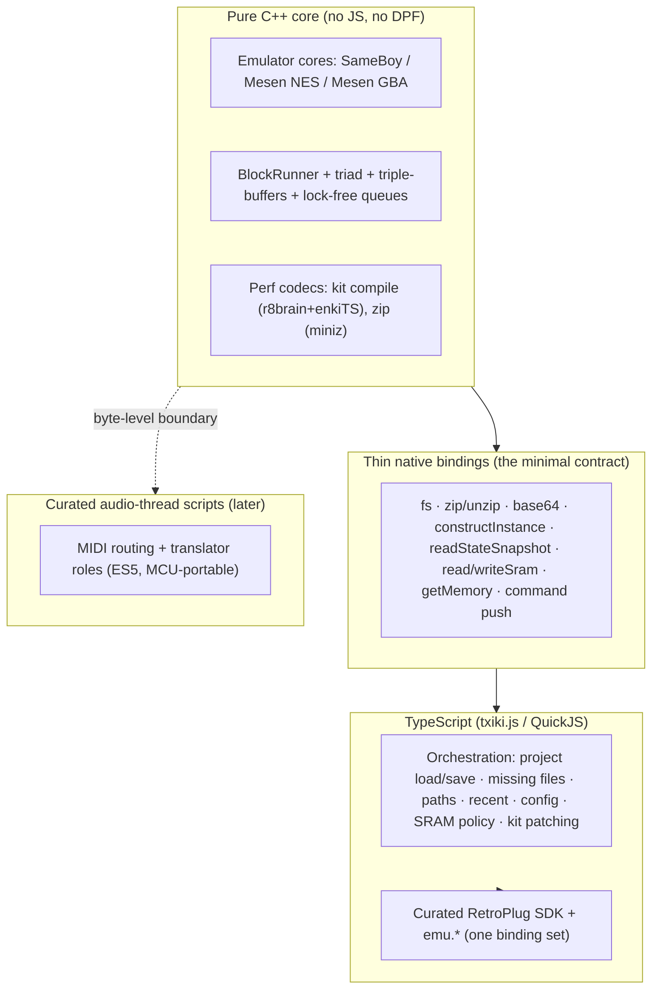

# RetroPlug2 — Architecture

> **Status: living design, not a committed plan.** These are proposals we
> iterate on. For the *as-is* system see [current-state.md](current-state.md);
> for the migration log see [`porting/`](../porting/). Nothing here is scheduled
> — the point is to shape today's architecture so these directions stay cheap to
> reach.

This directory replaces the old single `DESIGN.md` — there was too much ground to
keep in one file. Each numbered doc is one work-stream, self-contained, with its
own status.

## The thesis

**C++ should be used only where it is genuinely needed** — realtime DSP (the
emulator cores, the block runner, the lock-free queues and triple-buffers), the
plugin-format ABI, and a few perf-critical binary codecs. Everything else —
project load/save, missing-file handling, path portability, recent files, user
config, SRAM pairing/mirror policy, schema versioning, kit patching — is
orchestration over plain data and the filesystem, and belongs in TypeScript.

### Why so much of it is in C++ today — the "gravity well"

Almost none of that logic is native because it's DSP. It's native because of a
data-locality accident:

1. **`ProjectConfig` is a C++ `reflect-cpp` struct**, so everything that touches
   project config got written next to it — and `PluginRpcService.cpp` (≈1950
   lines, ~64% orchestration) ballooned proxying it back to the UI.
2. **JS was window-gated.** The txiki.js runtime ran *only* on the editor/UI
   thread. So when a DAW calls `setState` with the plugin window closed, there
   was no runtime to orchestrate the load — and it *had* to be C++.

The fix is two moves that reinforce each other: give the plugin an
**always-available runtime** ([04](04-scriptable-runtime.md)) so orchestration TS
runs regardless of UI state, and **move the orchestration into TS**
([03](03-cpp-ts-boundary.md)) over a small set of thin native primitives.

## The layers

## The minimal native contract

Everything the TS orchestration needs from C++ is a small, enumerable set of
primitives — **most already exist**. This is the whole surface the boundary
([03](03-cpp-ts-boundary.md)) rests on.

| Primitive | Purpose | Status |
| --- | --- | --- |
| `tjs.*` fs (read / write / exists / stat / realpath) | file + path I/O | txiki built-in |
| `zip` / `unzip` (miniz, via RPC) | `.rplg` PKZIP assembly | miniz exists → expose |
| `base64` | DPF state string wrapper | trivial |
| `readStateSnapshot(i) → bytes` | per-instance savestate, race-free | **exists** (triple-buffered) |
| `readSramSnapshot(i)` / `writeSram(i, bytes)` | live/snapshotted SRAM | ~exists (`getMemory` + `stateRegions`) |
| `constructInstance(config, romBytes) → handle` | build + activate an emulator | **net-new** (split from `Project::addSystem`) |
| `getMemory` / `subscribeMemory` / `getFrame` / `getRegisters` | UI/debug reads | exist |
| command push (add/replace/remove system, settings) | hand work to the audio thread | exists |
| host-saving / deactivating callback | fire the SRAM flush policy | net-new (small) |
| `compileKit(samples) → bytes` | kit bank compile (perf) | exists as `KitCompiler` |

Large blobs (savestates, ROMs) cross as `ArrayBuffer`/handles, never JS strings.
Config type-safety is kept by generating the TS project schema from the same
source as the C++ structs (the RPC codegen already emits TS types).

## Settled decisions

- Runtime is **txiki.js (tjs) / QuickJS**, not Node.
- **miniz stays**, exposed as a native zip/unzip primitive (no JS zip lib).
- **efsw stays** as the native file-changed event source; only the *reaction*
  moves to TS.
- The control-plane runtime uses the **inline/synchronous model** — `get/setState`
  drive it directly; no dedicated thread ([04](04-scriptable-runtime.md)).
- Audio-thread RT-safety for routing scripts is **deferred** — functionality
  first, no-GC/preallocation later ([06](06-midi-routing-scripts.md)).
- **Roles are cross-core** (attach to any system), not SameBoy-specific
  ([05](05-roles-cross-core.md)).

## The docs

| # | Doc | Status |
| --- | --- | --- |
| 01 | [The Block Runner (render core)](01-block-runner.md) | Shipped + 1 deferred |
| 02 | [Project-state ownership (split authority)](02-project-state-ownership.md) | Steps 1–3 shipped |
| 03 | [The C++/TS boundary](03-cpp-ts-boundary.md) | Increments 1–3 shipped (harness serialization; plugin save/export; plugin load + missing-files) |
| 04 | [The scriptable runtime](04-scriptable-runtime.md) | §A always-available runtime shipped |
| 05 | [Cross-core roles](05-roles-cross-core.md) | Proposed |
| 06 | [MIDI routing as hot-reloadable scripts](06-midi-routing-scripts.md) | Proposed |
| 07 | [Multithreading](07-multithreading.md) | Offline shipped + future |
| 08 | [The LSDj subsystem](08-lsdj.md) | Proposed |
| — | [current-state.md](current-state.md) | The as-is reference |

## Suggested sequencing

1. **Project-state split authority** ([02](02-project-state-ownership.md)) —
   removes the settings round-trip bug class; frames config ownership.
2. **The always-available runtime** ([04](04-scriptable-runtime.md) §A) — the one
   unlock that lets orchestration leave C++.
3. **Evacuate orchestration to TS, leaf-first** ([03](03-cpp-ts-boundary.md)) —
   each pure-data module behind the native contract, independently shippable and
   already testable via the harness.
4. **Collapse the two RPC services into one binding set**
   ([04](04-scriptable-runtime.md) §B).
5. **Cross-core roles** ([05](05-roles-cross-core.md)), then **routing scripts**
   ([06](06-midi-routing-scripts.md)) — the highest-value/highest-risk track.
