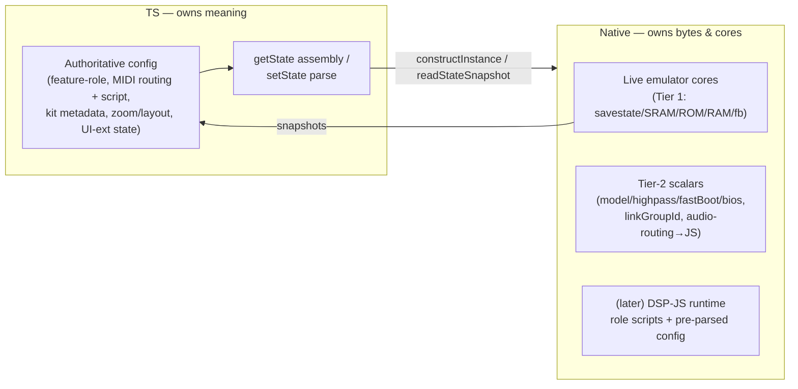

> **Status:** design — captured from a design discussion; forward-looking (informs the greenfield build), not yet implemented.

# The DSP data model — native owns bytes and cores, TS owns meaning

## Context

Today `ProjectConfig` is a reflect-cpp C++ struct. Because it is a C++ struct,
it became a **gravity well**: config logic got written next to it in C++ simply
because that's where the type lived (see
[the C++/TS boundary](../../../architecture/03-cpp-ts-boundary.md)). Greenfield
moves config **authority** to TS — the DSP keeps only the replica it actually
needs (see
[project-state ownership](../../../architecture/02-project-state-ownership.md)).

The design discussion pushed on a further consequence: once the DSP can run JS
(see [MIDI-routing scripts](../../../architecture/06-midi-routing-scripts.md)),
**most config never needs to be a C++ struct at all**. The reflect-cpp struct
that anchors the gravity well can largely disappear. This doc captures the data
model that falls out of that: what native is allowed to type, and what it must
treat as opaque bytes.

## The rule

> **Native TYPES a field only if C++ branches on it to render a block.**
> Everything else is an opaque blob that ONLY JS ever parses.

Compressed to a one-liner worth putting on a feature card:

> **Native owns bytes and cores; TS owns meaning.**

If C++ never inspects a field to decide how to run a DSP block, C++ has no
reason to know that field's shape. It stores and ferries the bytes; TS is the
only side that parses them.

## The three tiers

Applying the rule sorts every piece of per-instance data into one of three
tiers:

| Tier | What | Where it lives | Does C++ parse it? |
| --- | --- | --- | --- |
| **1 — irreducibly native** | Running emulator cores + raw bytes: savestate / SRAM / ROM / framebuffer / RAM | On the DSP; pumped to TS via snapshots | N/A — this is live state, not config |
| **2 — typed native, but tiny** | A handful of scalars the render loop branches on: `model` / `highpass` / `fastBoot` / `bios`; `linkGroupId`; audio-routing | On the core / block runner as core state, **not** a persisted struct | Yes — but only these scalars |
| **3 — opaque to C++** | Everything with "meaning": feature-role config, MIDI-routing config + script, kit metadata, project zoom/layout, UI-extension state | TS owns it; native stores/ferries it as bytes | **Never** |

**Tier 1 — irreducibly native (live state).** The running cores and their raw
byte regions can only exist on the DSP. They are read *out* to TS as snapshots;
they are not config and don't participate in the "who owns the type" question.

**Tier 2 — typed native, but tiny.** A small set of scalars genuinely have to
be C++-typed because the render path branches on them:

- **`model` / `highpass` / `fastBoot` / `bios`** — the emulator core reads
  these. They are passed at instance construction and held as **core state**,
  not as a persisted config struct.
- **`linkGroupId`** — the block runner partitions on it to interleave `GB_run`
  mid-block (see [the block runner](../../../architecture/01-block-runner.md)).
  This is genuinely real-time C++ — but it's just an integer.
- **audio-routing** — today a `MultiOutRouter` enum, but this is **moving to
  JS** (see [audio routing and streams](./06-audio-routing-and-streams.md)), so
  even this scalar is on its way out of the typed-native set.

Essentially a handful of scalars per instance.

**Tier 3 — opaque to C++ (everything with "meaning").** Feature-role config,
MIDI-routing config and its script, kit metadata, project zoom/layout,
UI-extension state — none of these change how C++ runs a block. C++ stores and
ferries them as bytes and never looks inside.

## The consequence — push it all the way

The interesting result is that **native does not need `ProjectConfig` even for
state serialization**:

- **`getState`** — assembly moves to TS (see
  [the scriptable runtime](../../../architecture/04-scriptable-runtime.md),
  step 2). Native hands TS the raw snapshot bytes (`readStateSnapshot`); TS
  assembles the `.rplg` from **its** authoritative config. Native never
  serializes config.
- **`setState`** — the chunk goes to the TS runtime, which parses it and calls
  `constructInstance`, passing the Tier-2 scalars. Native never parses the
  `.rplg`.

So the reflect-cpp `ProjectConfig` struct on the DSP **largely dies**. What
native ends up holding is:

- live cores (Tier 1),
- Tier-2 scalars, and
- (later) a **DSP-JS runtime** holding role scripts and their pre-parsed config.

This is the endgame of
[project-state ownership](../../../architecture/02-project-state-ownership.md)
("authoritative config in TS; the DSP holds only the replica it needs") taken
to its limit — and the replica shrinks to almost nothing.

## Implications for current work

When writing the real `Backend` adapter, **resist rebuilding typed native
representations of role / routing / feature config.**

- [`applyRoleConfig`](../src/backend.ts) **stays** — but only for Tier-2. It
  applies **system-role** config (a backend's own knobs; native reads
  `model` / `highpass`).
- **Feature-role config should NEVER get a C++ struct.** It stays TS-owned and,
  when the DSP-JS runtime lands, ships as a **blob + script** (see
  [the DSP-JS runtime](./03-dsp-js-runtime.md)).

Greenfield is already aligned here: feature-role config is pure TS. The point
of writing this down is to **not regress** — when the adapter tempts you to
"just add it to the config struct," that's the gravity well reasserting itself.
Keep meaning in TS; give C++ only the scalars it branches on.

## Links

- [02 — project-state ownership](../../../architecture/02-project-state-ownership.md)
- [03 — the C++/TS boundary](../../../architecture/03-cpp-ts-boundary.md)
- [04 — the scriptable runtime](../../../architecture/04-scriptable-runtime.md)
- [06 — MIDI-routing scripts](../../../architecture/06-midi-routing-scripts.md)
- [03 — the DSP-JS runtime](./03-dsp-js-runtime.md)
- [06 — audio routing and streams](./06-audio-routing-and-streams.md)
