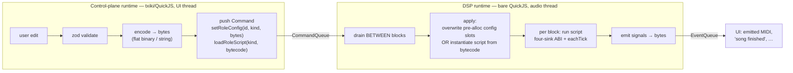

# The DSP-side JS runtime — a second QuickJS context, fed by bytes

> **Status:** design — captured from a design discussion; forward-looking (informs the greenfield build), not yet implemented.

## Context

[architecture/06-midi-routing-scripts.md](../../../architecture/06-midi-routing-scripts.md)
wants MIDI routing and translator roles — LSDj sync, MGB, Arduinoboy — expressed
as hot-reloadable ES5 scripts that eventually run **on the audio thread**. The
control-plane scriptable runtime described in
[architecture/04-scriptable-runtime.md](../../../architecture/04-scriptable-runtime.md)
is txiki/QuickJS living on the UI/control thread: it owns config authority,
orchestration, and the full runtime surface (fs, the event loop). That runtime
is fine for the control plane and useless for the audio thread.

So the DSP needs its **own** JS runtime. This doc captures the decision to run a
second, bare QuickJS context on the audio thread and — the maintainer's key
question — how config and script code cross the thread boundary between the two
runtimes without ever sharing a JS object.

## Two runtimes, never shared

There are two JS runtimes, and they are deliberately different builds on
different threads:

| | Control-plane runtime | DSP runtime |
| --- | --- | --- |
| Engine | txiki/QuickJS | **bare** QuickJS context |
| Thread | UI / control thread | audio thread |
| Surface | full runtime — fs, orchestration, the event loop | none of it |
| Owns | config authority (JSON/zod/schema work) | per-block translation only |
| GC | tolerated | hard-RT constraint (see [RT staging](#rt-staging-honest-about-doc-06s-deferral)) |

The DSP runtime does **not** and **cannot** use txiki. libuv, fs, and the event
loop are meaningless and unusable on the audio thread — and the DSP needs none
of them. It also cannot share the UI thread's runtime: it is a different thread,
under a hard real-time constraint.

Critically, the two runtimes **never share an object**. Two separate
`JSRuntime`s means two separate heaps and two separate garbage collectors; a
`JSValue` from one is meaningless in the other. You cannot move an object from
one context to the other — there is no pointer you can hand across, no
"preallocated object" that both sides see.

## How they communicate: bytes over the existing queues

Communication between the two runtimes is **bytes** over the existing lock-free
queues that native already uses:

- `CommandQueue` — UI → DSP
- `EventQueue` — DSP → UI

This is the exact transport the block runner already relies on (see
[architecture/01-block-runner.md](../../../architecture/01-block-runner.md) and
the queue seam in
[architecture/04-scriptable-runtime.md](../../../architecture/04-scriptable-runtime.md)).
JS never shares heap across the boundary. The C++ queues are the transport, and
**each side (de)serializes** its own end.

## Crossing config: you pass bytes, not an object

The maintainer's framing was "how do we pass a preallocated object between the
two contexts?" The answer is that you don't pass an object at all — you pass
bytes, and each side (de)serializes. The design splits by *what* is moving:

### Config data → a compact flat binary

Config changes cross as a compact **flat binary**. On the DSP side the script
reads it through a `DataView` / typed-array into **pre-allocated slots**:

- The script's state is allocated **once** at script init.
- A config change **overwrites** those fields from the incoming bytes — no new
  allocation, no GC pressure.
- The DSP **never sees JSON**. All the JSON / zod / schema validation stays on
  the control plane, where txiki and config authority already live.

This is exactly doc-06's "expose a flat typed-array view the script indexes"
([architecture/06-midi-routing-scripts.md](../../../architecture/06-midi-routing-scripts.md),
Open questions).

### The script itself → QuickJS bytecode

The translator script crosses as **QuickJS bytecode**, not source:

- Compile the ES5 translator to bytecode on the control plane (`JS_WriteObject`).
- Ship the bytes over the queue.
- `JS_ReadObject` + instantiate on the DSP context — **no source re-parse on
  the audio thread**.

Bytecode is for **code**, not config data. The distinction is load-bearing:

> Bytecode ships the **script** (once); a flat binary ships the **config** (per
> change, zero-alloc). Neither is a shared object — each is bytes the receiving
> side reconstructs into its own heap.

## RT staging: honest about doc-06's deferral

Doc-06 explicitly **defers** RT-safety, and this design matches that. The seam
we lock in now is the same in both the sloppy first cut and the hardened
version; only the *encoding* tightens.

| | Functional first cut | Hardening pass |
| --- | --- | --- |
| Config encoding | a JSON / msgpack string the DSP parses **once** at config-change time (a rare event; allocations tolerated) | a flat binary read through a `DataView` / typed-array into pre-allocated slots (zero-alloc) |
| Script encoding | QuickJS bytecode | QuickJS bytecode |
| Transport | bytes over the queue, deserialized on the DSP between blocks | *identical* |

Because a config change is rare, parsing a string at that moment is acceptable
for the first cut. The flat-binary / `DataView` discipline is the hardening
pass. **The seam is identical either way** — bytes over the queue, deserialized
on the DSP between blocks — so the seam is what we commit to now, and the
encoding is free to tighten later.

## The flow end to end

Walking it through:

1. **Control plane.** A user edit is `zod`-validated, encoded to bytes, and
   pushed as a Command — e.g. `setRoleConfig(id, kind, bytes)` for a config
   change, or `loadRoleScript(kind, bytecode)` to (re)load the translator.
2. **DSP drains between blocks.** The audio thread drains the `CommandQueue`
   *between* blocks and either updates the script's config (overwriting the
   pre-allocated slots) or instantiates the script from its bytecode.
3. **Per block.** The audio-thread script runs the doc-06 **four-sink ABI** —
   `pushSerialIn` / `emitMidiOut` / `pressButton` / `writeMemory` (kit only),
   plus the `eachTick` PPQ iterator — over its inputs: the block's
   `MidiEvent[]`, the `AudioBlockInfo`, and the `systemIndex` / `systemCount`.
4. **DSP → UI signals.** Anything the DSP needs to report back — emitted MIDI,
   "song finished", and similar — returns as **bytes over the `EventQueue`**.

## Implications for current work

- The greenfield stores (`systemsStore`, `projectStore`, roles via
  `RoleRegistry` / `RoleType` in [../src/systemRoles.ts](../src/systemRoles.ts))
  live entirely on the **control plane**. They are the authority that validates
  and encodes config; they never reach across into the DSP runtime.
- The `RoleType` `behavior?` / `ui?` placeholders are the natural home for
  "this role compiles to a DSP bytecode blob + a config encoder." The seam this
  doc locks in — Command carrying `bytes` / `bytecode` — is what those
  placeholders will eventually target.
- Nothing here requires the hardened flat-binary encoding to land first. Build
  against the seam (bytes over the queue); start with a parsed string; tighten
  to a `DataView` later without moving the boundary.

## Open questions

- The precise flat-binary layout for each role's config (field order, fixed
  widths, versioning of the *wire* shape) — deferred to the hardening pass and
  to [./02-dsp-data-model.md](./02-dsp-data-model.md).
- How role scripts are packaged and versioned as bytecode, and where
  compilation sits in the build — see [./04-extension-model.md](./04-extension-model.md).
- Doc-06's own open questions (per-block GC behaviour of stock QuickJS, MCU VM
  choice) still stand and bound how "bare" the DSP context can be long-term.

## Links

- [architecture/04-scriptable-runtime.md](../../../architecture/04-scriptable-runtime.md) — the control-plane txiki/QuickJS runtime and the `CommandQueue` / `EventQueue` seam.
- [architecture/06-midi-routing-scripts.md](../../../architecture/06-midi-routing-scripts.md) — MIDI routing / translator roles as hot-reloadable scripts; the four-sink ABI and the flat typed-array view.
- [architecture/01-block-runner.md](../../../architecture/01-block-runner.md) — the realtime block runner and the lock-free queues this design reuses as transport.
- [./02-dsp-data-model.md](./02-dsp-data-model.md) — the DSP-side data model / flat-binary layout.
- [./04-extension-model.md](./04-extension-model.md) — how roles/extensions package their behaviour and config.
