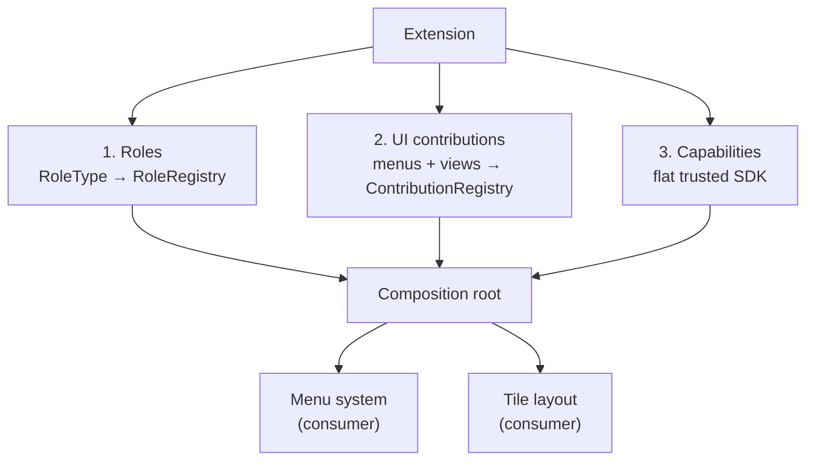

# The extension model — roles, contributions, and a flat trusted SDK

> **Status:** design — captured from a design discussion; forward-looking (informs the greenfield build), not yet implemented.

## Context

The guiding vision is: **imagine any LSDj functionality is provided by another
user as an extension.** LSDj is not special — it is simply the first, most
elaborate extension. If the orchestration layer is built so that even the
built-in LSDj support is "just an extension," then third parties can build the
same class of thing without touching the core.

The bar for "the same class of thing" is set by the reference features in
[./01-reference-features.md](./01-reference-features.md) — the **LSDj HD Player**
and the **Sample Patcher**. Between them they need: a new role, a custom UI that
takes over (or sits beside) a system's tile, menu items injected into the system
menu, live 60fps rendering driven off emulator memory, memory *writes* back into
a running instance, and per-role export. Everything below exists to make those
buildable by an extension, not hardcoded into the app.

## The extension model is THREE things, not one

It is tempting to think "extension = plugin" and give it one entry point. The
design deliberately splits the surface into three distinct concerns, because
they attach at different seams and carry different data.

### 1. Roles — greenfield already has this

A role is a `RoleType` (`kind`, `category`, a zod `schema`, and the deferred
`behavior?` / `ui?` placeholders) registered on the `RoleRegistry` and attached
to a system by a `RomProvider` predicate over the ROM header. This is already
built in [../src/systemRoles.ts](../src/systemRoles.ts).

The two currently-**deferred** fields are exactly where an extension plugs its
logic in:

| Field | What an extension fills it with |
| --- | --- |
| `behavior` | The DSP four-sink translator script — the byte/MIDI behaviour of the role (see [./03-dsp-js-runtime.md](./03-dsp-js-runtime.md)). |
| `ui` | A UI descriptor for the role. |

So "LSDj sync" is a feature role whose `behavior` is a translator script; the
role machinery to carry it already exists. The extension model does not
reinvent roles — it *fills in* the placeholders the registry already reserves.

### 2. UI contributions — new

Roles cover DSP behaviour and per-role config. They do **not** cover the app
chrome: the menus and the views an extension wants to surface. That is a second,
new contribution surface.

**Menus are data-driven contributions.** An extension registers menu items, each
with a **predicate** (e.g. "only for LSDj instances") and an **action** (open a
view / run a command). Menu injection is **first-class**: the menu system is a
`ContributionRegistry` that sits *alongside* the `RoleRegistry`, and the
**built-in menu items are contributions too**. Nothing is hardcoded — the same
mechanism the core uses to populate the menu is the one extensions use to inject
into it. "LSDj HD Player" appearing in the system menu is just a contribution
with an LSDj predicate.

**Views are React components hosted by the tile layout in three modes.** The
tile layout can hand a system's slot to an extension-provided view in one of:

| Mode | Meaning | Reference feature |
| --- | --- | --- |
| REPLACE | The view takes over the layout for a system. | HD Player takes over a system's tile. |
| ADJACENT | The view sits beside the instance. | Sample Patcher docked next to the instance. |
| OVERLAY | The view is composited over the instance (e.g. toggled by a button combo). | Patcher overlaid on the instance. |

Views are **React components** (decided). Custom rendering — drawing LSDj fonts
and palettes from pumped SRAM/RAM/ROM — lives **inside** a React component (a
canvas or custom widget within its React tree). There is **no separate view
runtime**: an extension's exotic pixel-drawing is a React component like any
other, it just paints from live memory.

### 3. Capabilities — a flat trusted SDK

**Trusted extensions get everything (decided).** RetroPlug is a niche tool for a
small, technical community; there is **no sandboxing and no capability-gating**.
An extension is trusted code, so the design does not spend complexity budget on
permission boundaries that would only get in the way.

Everything an extension can do is exposed through **one flat, named, stable
SDK** — not raw `emu.*`. The `emu.*` facade stays what it is today: a test/dev
convenience (see [./07-host-consumption.md](./07-host-consumption.md)), *not* the
extension contract. The SDK surface is:

- **Register roles + contributions** — the two registries above.
- **Live state subscription** — `subscribeMemory(region, Hz)` + `getFrame`: the
  memory-snapshot *pump*, distinct from the one-shot export reads
  (`readState` / `readSram`) already built on the Backend.
- **Memory writes** — `writeMemory` (this is what the Sample Patcher needs).
- **Kit compilation** — `compileKit`.
- **Step / inspect** — instruction stepping and state inspection, for building
  exports.

The key framing: it is a **named, stable SDK**, deliberately curated, so that
extensions depend on a versioned surface rather than the raw dev facade.

## The live subscription pump — a real Backend addition

HD-Player-class views render continuously from three memory regions at once:
SRAM (the song), RAM (the playback position), and ROM (the kits), at roughly
60fps. That is a fundamentally different access pattern from the one-shot
`readState` / `readSram` reads that export uses.

It needs a **subscribe-to-memory-regions-at-Hz** surface delivered as *events* —
call this out as a **real Backend addition beyond the export reads**. It is not
a re-skin of `readState`; it is a streaming subscription.

The native side already publishes triple-buffered memory snapshots from the
audio thread (the pump described in [../src/backend.ts](../src/backend.ts)'s
"Live emulator reads" section, and in the multithreading design). The
subscription surface **exposes those existing snapshots as subscriptions** —
the plumbing exists; what is new is the subscribe/deliver-as-events shape on top
of it.

| Surface | Shape | Used by |
| --- | --- | --- |
| `readState` / `readSram` | one-shot pull | export (already built) |
| `subscribeMemory(region, Hz)` + `getFrame` | streaming subscription, delivered as events | HD-Player-class live views (new) |

## Implications for current work

Nothing here needs building now. But two design shapes must be preserved so the
extension model can land later without a rewrite:

1. **Model contributions as a registry from the start.** The composition
   root — the thing that wires the greenfield stores into an app a host drives —
   should treat menus / views / exports as a `ContributionRegistry` alongside
   the `RoleRegistry`, *even for the built-ins*. Concretely: keep the **menu
   system and the tile layout as consumers of a registry**, never hardcoded.
   Built-in menu items should already be registered as contributions, so the
   extension path is the same path.

2. **Keep the state-read seam open to subscriptions.** The Backend's live-read
   seam should be extensible to **subscriptions**, not just the export pull
   reads. Don't build `subscribeMemory` yet — but don't design the seam in a way
   that assumes reads are always one-shot.

Both are "keep the door open" constraints on how the composition root and the
Backend seam are shaped, not new code to write today.

## Links

- [./01-reference-features.md](./01-reference-features.md) — the HD Player + Sample Patcher that set the bar.
- [./03-dsp-js-runtime.md](./03-dsp-js-runtime.md) — the `behavior` translator scripts a role's DSP fills.
- [./05-export-and-render.md](./05-export-and-render.md) — per-role export and rendering.
- [./07-host-consumption.md](./07-host-consumption.md) — how a host drives the app; `emu.*` as the dev facade vs. the SDK.
- [../../../architecture/05-roles-cross-core.md](../../../architecture/05-roles-cross-core.md) — cross-core roles (native design).
- [../../../architecture/06-midi-routing-scripts.md](../../../architecture/06-midi-routing-scripts.md) — MIDI routing as hot-reloadable scripts.
- [../src/systemRoles.ts](../src/systemRoles.ts) — the `RoleType` / `RoleRegistry` the model builds on.
