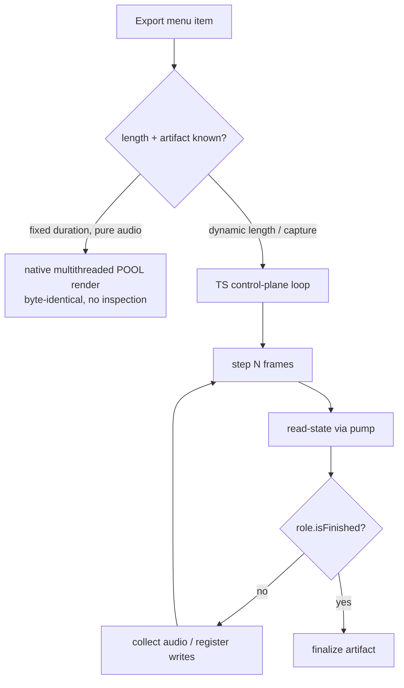

# Export & offline render — control-plane-orchestrated and per-role

> **Status:** design — captured from a design discussion; forward-looking (informs the greenfield build), not yet implemented.

## Context

The CLI already ships offline render: a multithreaded, byte-identical pool
render over the native block runner
([../../../architecture/01-block-runner.md](../../../architecture/01-block-runner.md),
`OfflineRender` / `renderUnitsParallel`). The maintainer wants **export driven
from a UI menu item** — the user picks "Export…" and chooses a format for the
current selection.

The naive move is a single monolithic native `renderOffline(duration)` behind
the menu. That breaks down the moment export becomes **per-role**:

- **LSDj songs have no duration up front.** A song should render until an **HFF
  (end) command** is reached — that is exactly how `lsdpack` knows a song has
  finished. You cannot ask the user for a duration, and you cannot know it
  before the run; the stop condition is discovered by inspecting emulator state
  as the render proceeds.
- **`.gbs` export is not audio at all.** lsdpack-style `.gbs` is a
  **register-write ripper** — it captures the stream of writes to the sound
  registers, not rendered PCM. A generic "render N seconds of audio" primitive
  has nothing to give it.

So export cannot be one native call. It splits into two paths, and most of the
policy belongs in TS.

## Two paths

The core distinction of this design: **fixed-duration pure audio** vs.
**role-aware / dynamic-length / capture** export.

### 1. Fixed-duration pure audio → native multithreaded pool render

When the caller knows the duration and only wants PCM, use the existing native
**multithreaded pool** render. It is byte-identical to the serial path, does no
mid-render inspection, and farms units across the worker pool. This is the fast
bulk path, and a native primitive is exactly right for it — there is no policy
to express, just "render this timeline to these buffers."

This backs the built-in **Export WAV** with a user-supplied length.

### 2. Role-aware / dynamic-length / capture → control-plane step-and-inspect

When the length is dynamic (LSDj until HFF) or the artifact is not audio
(`.gbs` register writes), TS drives the render **one block at a time**:

- step the native render forward one block,
- read emulator state via the pump,
- ask a **role-provided stop condition** ("has an HFF been reached?") each
  block,
- **collect** as it goes — audio for a WAV, or register writes for a `.gbs`.

This is precisely the CLI harness's `runMs`-loop + read-state model. The block
runner doc already notes that the **single-threaded path** is the one that
supports mid-render inspection — the parallel pool is a pure-audio path, and
mid-render MIDI/serial capture and scripted input stay on the single-threaded
harness path
([../../../architecture/01-block-runner.md](../../../architecture/01-block-runner.md)).
Step-and-inspect export rides on that same single-threaded, inspectable path.

| | Path 1 — pool render | Path 2 — step-and-inspect |
| --- | --- | --- |
| Length | fixed, known up front | dynamic (role decides when done) |
| Threading | multithreaded pool | single-threaded, inspectable |
| Inspection | none (byte-identical bulk) | per-block state read via pump |
| Artifact | PCM audio | audio **or** register writes / other capture |
| Driver | native primitive | TS control plane + role |
| Example | Export WAV (duration) | LSDj Song (until HFF), `.gbs` (register ripper) |

## Export is a contribution

Export is modeled as a **contribution**, tying into the extension model
([./04-extension-model.md](./04-extension-model.md)). A role contributes both
the export **format** and the **drive/stop logic** for it:

- `setup(system)` — prepare the render for this system,
- `isFinished(state)` (or a custom `run`) — the per-block stop condition, and
- `collect(...)` — accumulate the artifact (audio blocks, or register writes).

The **export menu lists the formats applicable to the current selection**:

- the built-in **Export WAV** (fixed duration → pool render), plus
- role-contributed formats — e.g. **LSDj Song** (step-until-HFF) and **`.gbs`**
  (register capture).

`.gbs` is the sharpest proof of why this has to be a contribution rather than a
generic native render: it is **not audio**, it is a register-write ripper, so it
can never live behind a "render audio for N seconds" native call. The role owns
what "export" even *means* for its format.

## The native surface stays primitive

Native exposes only primitives:

- **step-N-frames**,
- **read-audio-block**,
- **read-state**, and
- the **pool** for the fixed-duration path.

The **policy** — when to stop, and what to capture — lives in **TS / the role**.
This is the same "native owns bytes; TS owns meaning" split described in
[./02-dsp-data-model.md](./02-dsp-data-model.md), applied to rendering: native
produces frames, samples, and register/memory state on demand; the role decides
when the song has ended and assembles the artifact.

## Implications for current work

- The export/render system is **control-plane-orchestrated over native
  step/inspect primitives with role contributions** — **not** a
  `Backend.renderOffline`. The Backend surface stays primitive
  (step / read-audio / read-state / pool); it does not grow a monolithic
  offline-render-with-a-duration method.
- The composition root's **export menu should be fed by export
  contributions** — the built-in WAV format plus whatever the active roles
  contribute for the current selection.
- The fixed-duration WAV path can still delegate to the fast native pool render;
  only the dynamic/capture formats need the step-and-inspect loop.

## Open questions

- Exact shape of the export-contribution interface (`setup` / `isFinished` /
  `collect` vs. a role-owned custom `run`) — the split above is the intent, the
  precise signatures are not yet fixed.
- How a role signals "no natural end" (a format that genuinely needs a
  user-supplied duration or a safety cap) inside the step-and-inspect loop.
- Where the pool (path 1) and the single-threaded inspectable loop (path 2)
  share code vs. stay separate, given the byte-identical guarantee only holds
  for the pure-audio pool.

## Links

- [../../../architecture/01-block-runner.md](../../../architecture/01-block-runner.md) — block runner, `OfflineRender` pool + single-threaded inspection path
- [../../../architecture/07-multithreading.md](../../../architecture/07-multithreading.md) — offline pool + threading model
- [./04-extension-model.md](./04-extension-model.md) — the contribution/extension model export plugs into
- [./02-dsp-data-model.md](./02-dsp-data-model.md) — "native owns bytes; TS owns meaning"
- [./01-reference-features.md](./01-reference-features.md) — feature reference this export work sits within
