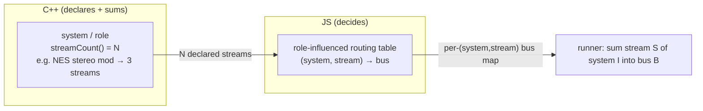

> **Status:** design — captured from a design discussion; forward-looking (informs the greenfield build), not yet implemented.

# Audio routing & per-system streams — a JS decision

## Context

Audio routing today is a single **project-wide enum**. The native
[`MultiOutRouter`](../../../architecture/01-block-runner.md) carries an
`AudioRouting` mode with three values — `Stereo`, `TwoPerInstance`,
`OnePerInstance` — and maps every system's slot onto host output channels
accordingly. In the greenfield project config this survives as a placeholder
integer field ([`audioRouting`](../src/projectConfig.ts) — `0 Stereo /
1 TwoPerInstance / 2 OnePerInstance`).

The decision captured here: **move the routing DECISION to JS**, the same way
MIDI routing's Tier-1 decision moves to JS in
[06-midi-routing-scripts.md](../../../architecture/06-midi-routing-scripts.md).
Routing is orchestration policy — "which audio lands on which bus" — not DSP,
so it belongs on the TS side of the boundary rather than baked into a native
enum.

## The concrete driver

This is not abstract generality. The maintainer runs a specific hardware
setup and wants the software to **replicate it as an audio-routing mode**: the
NES **"stereo mod."**

The stereo mod is a hardware modification that taps the NES audio into
separate outputs:

| Tap | Channels |
| --- | --- |
| Output A | the two pulse channels |
| Output B | triangle / noise / DMC |
| Output C | expansion audio (when an expansion-audio cart is present) |

The maintainer wants per-system routing rich enough to model exactly this —
one system fanning its internal voices out to two or three independent
outputs. A single project-wide `Stereo / TwoPerInstance / OnePerInstance`
enum cannot express it.

## Why it's bigger than an enum

Routing is more than "which bus." A system emits **multiple independent
streams**, and routing then maps those streams to buses. That is precisely the
**deferred per-channel stream split** already designed (but not yet built) in
[01-block-runner.md](../../../architecture/01-block-runner.md): the runner's
`AudioRouter::bus` already takes a `streamIndex`, `SystemBase::streamCount()`
is the additive hook, and the router resolves `(system, streamIndex) → bus`
independently per stream.

So the durable model has **two parts**, on opposite sides of the C++/TS
boundary:

| Part | Where | What it does |
| --- | --- | --- |
| **Stream declaration** | native (a system / role) | a system or role **declares N output streams** — the doc-01 split. e.g. a NES-stereo-mod role declares a *pulse-pair* stream, a *tri-noi-dmc* stream, and an *expansion* stream. |
| **Routing decision** | **JS** | maps `(system, stream) → output bus` — a **role-influenced table**, not a project-wide enum. |

With those in place, native routing collapses to a single mechanical
operation: **sum stream S of system I into bus B, per the JS-produced table.**
The runner already supports this the moment such a table exists — no change to
its hot path, only to *which router the driver constructs* (the seam
[01-block-runner.md](../../../architecture/01-block-runner.md) calls out as
the TS-owned policy).

## Consequence

The current `AudioRouting` enum
([`audioRouting`](../src/projectConfig.ts)) is a **placeholder**. Do not treat
it as the final model. The durable model is:

- **per-system stream declarations** (native), plus
- a **JS `(system, stream) → bus` map** (the routing decision).

Combined with MIDI routing *also* becoming a JS decision
([06-midi-routing-scripts.md](../../../architecture/06-midi-routing-scripts.md)
Tier-1), the native **routing typed surface trends toward ~zero** — routing
becomes data the runner consumes, authored on the TS side, not a typed enum
frozen in C++. This is consistent with the direction in
[./02-dsp-data-model.md](./02-dsp-data-model.md).

## Implications for current work

- The greenfield `audioRouting` integer is a stand-in kept only until the
  stream-declaration + routing-table model lands. New code should not build
  durable behaviour around its three enum values as though they were the
  eventual API.
- The native prerequisite (declared streams + a richer router keyed by
  `(system, stream)`) is the doc-01 deferred split; the greenfield layer owns
  the **decision** (the table), not the declaration or the summing.

## Open questions

These are inherited from the doc-01 stream-split design and remain genuinely
unresolved; they are not decided here:

- **Stream identity across backends** — GB's channels, NES's APU voices, and
  GBA audio don't share a taxonomy. Does the routing table key on an opaque
  per-backend stream index, or a normalised channel enum? (See
  [01-block-runner.md](../../../architecture/01-block-runner.md) "Open
  questions.")
- **Declared bus count vs host reality** — realtime output is bounded by the
  DPF-declared output-bus count, fixed at instantiation. Whether per-system
  streams need a configurable bus count (a re-instantiation boundary) or a
  generous fixed count with a router-side mapping suffices is open.

## Links

- [../../../architecture/01-block-runner.md](../../../architecture/01-block-runner.md) — the render core, the `AudioRouter` seam, and the deferred per-channel stream split (`streamCount()`, `(system, streamIndex) → bus`).
- [../../../architecture/06-midi-routing-scripts.md](../../../architecture/06-midi-routing-scripts.md) — MIDI routing as a JS (Tier-1) decision; the model this doc mirrors for audio.
- [./02-dsp-data-model.md](./02-dsp-data-model.md) — the DSP data model the shrinking native routing surface is consistent with.
- [../src/projectConfig.ts](../src/projectConfig.ts) — the placeholder `audioRouting` enum field.
