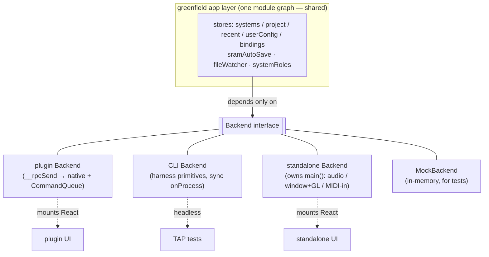

# Host consumption — plugin, CLI, standalone, and emu.*

> **Status:** design — captured from a design discussion; forward-looking (informs the greenfield build), not yet implemented.

## Context

The greenfield app layer — the stores already built in
[`../src/`](../src/backend.ts) (systemsStore, projectStore, recentStore,
userConfigStore, bindingsStore, sramAutoSave, fileWatcher, systemRoles, plus
zod config validation) — is deliberately **host-agnostic TS over a single seam**:
the [`Backend`](../src/backend.ts) interface. It never imports a plugin, a CLI,
or a window; it depends only on `Backend`.

This doc pins the other side of that seam: how the **plugin**, the **CLI
harness**, and the future **custom standalone** consume the app layer — and,
answering a question the maintainer raised earlier, where the `emu.*` interface
lands once orchestration lives in the shared app layer.

It layers the app/host-boundary decisions on top of the whole-system native
design, chiefly [the scriptable runtime](../../../architecture/04-scriptable-runtime.md)
(one runtime / one binding set) and [the C++/TS boundary](../../../architecture/03-cpp-ts-boundary.md).

## The core shape

The app layer is **one host-agnostic module graph** that depends only on
`Backend`. A host is not a fork of it — a host is a small amount of wiring that
varies **exactly three things**:

1. **The `Backend` implementation** — how the primitives reach native. This is
   where the doc-04(B) *execution-model* difference hides: the plugin applies
   mutations by posting to the `CommandQueue` drained by `run()`, while the CLI
   harness advances time synchronously in a `project->onProcess` loop. The app
   layer never learns which — [`constructSystem`](../src/backend.ts) returns a
   handle either way, and every other primitive is likewise phrased as "do this,
   give me the result." `MockBackend` (the in-memory mock the greenfield tests
   already inject) is simply a **fourth implementation** of the same interface,
   no more special than the other three.
2. **The driving loop** — who calls the idle pumps (`fileWatcher.pump`,
   `sramAutoSave.pump`) and the triggers (SRAM flush-on-save at `getState`/quit;
   load/save on `setState`). The pumps and triggers are app-layer functions; the
   host decides *when* to call them (a UI idle tick, a host save callback, a test
   stepping frames).
3. **UI presence** — the plugin and standalone mount React on the stores; the
   CLI is headless and drives the stores directly.

Everything else — project orchestration, systems lifecycle, config, recent
files, roles, SRAM policy, file-watch reactions — is **shared**, written once.

That shared orchestration is exactly what
[`PluginRpcService`](../../../architecture/04-scriptable-runtime.md) (75 methods)
and the CLI's `HarnessRpcService` (52 methods) currently **duplicate** in C++.
Wiring the greenfield app layer under both hosts *is*
[architecture/04 step 4](../../../architecture/04-scriptable-runtime.md) —
"move the orchestration TS onto one binding set" — and it deletes one of the two
copies. Seen from native, the [`Backend`](../src/backend.ts) interface is the
**TS-side spec of doc-04's "one curated binding set"**: the minimal contract the
runtime must expose for orchestration to live in TS.

## Per host

### Plugin

The app layer runs on the **already-shipped control-plane runtime**
([architecture/04 §A](../../../architecture/04-scriptable-runtime.md): the txiki
runtime promoted to plugin-lifetime, surviving window close/reopen). Its
`Backend` forwards over the in-process `__rpcSend` trampoline to thin native
primitives plus command-push to the audio thread.

`getState` / `setState` / autoload drive the app layer **synchronously**
([doc-04 step 2](../../../architecture/04-scriptable-runtime.md)) — the same
synchronous entry points that today reach into pure-C++ project machinery.

Because the React UI **shares that runtime**, it consumes the stores
**directly, in-process** — same module graph, same objects. The RPC *getters*
that today shuttle state from orchestration to UI (`getProjectView` and the
rest) largely **evaporate**: there is no process boundary to cross between the UI
and the orchestration it renders. The only RPC that genuinely remains is
**TS↔native** (the `Backend` primitives) and **TS↔DSP** (commands out,
triple-buffered snapshots back — the reads described in
[02 project-state ownership](../../../architecture/02-project-state-ownership.md)).

### CLI (`--test`)

The harness provides a `Backend` over its own primitives, with **synchronous
execution** (the `project->onProcess` loop). The *same* app layer runs here, so
project / systems / config orchestration is testable **headlessly against the
real emulator** — not just the mock. This graduates the greenfield stores from
`MockBackend` to the actual native core without changing a line of app-layer
code: same interface, real implementation.

### Standalone

Doc-04's **custom-standalone-owns-`main()`** binary re-provides what DPF gives
the plugin for free — an audio device, a window + GL for LVGL, MIDI-in — and
drives the **same app layer** through its own `Backend`. `retroplug-jack` (the
DPF standalone) demotes to **DPF-integration testing only**; it is no longer the
user-facing app.

## emu.* — it survives, but shrinks

The maintainer asked earlier what becomes of `emu.*` once orchestration is
shared TS. Answer: it survives, but it shrinks, because `emu.*` today straddles
**two altitudes** that this design separates.

| Altitude | What it is | Fate |
| --- | --- | --- |
| **Low-level emulator control / introspection** — `readMemory`, `getRegisters`, `step`, `getFrame`, `getApuState`, `chord`/`tap`, MIDI injection, `drainMidi`/`drainSerial`, `runMs`, `writeWav`, the Mesen debugger | The facade for **testing** and **DSP / ROM development** (e.g. evermidi) | **Stays** as the test/dev facade — unchanged |
| **Orchestration** — `loadRom`, `saveRplg`/`loadRplg`, `savFromJson`, `patchKit` | This **is** the app layer (plus the LSDj extension) | Becomes **thin wrappers that delegate** to the app layer — one orchestration implementation, not a second copy |

So the orchestration half of `emu.*` stops being an independent implementation
and becomes a thin veneer over the shared stores; the low-level half remains a
first-class test/dev tool.

Both `emu.*` and `Backend` are **curated views over the same one binding set**
([doc-04 §B](../../../architecture/04-scriptable-runtime.md)) — siblings at
different altitudes: "poke the emulator" versus "orchestrate the project." They
are not competitors; they are two windows onto the same underlying surface.

Extensions do **not** reach for raw `emu.*`: they use the **named SDK**
([04 extension model](./04-extension-model.md)). And per the maintainer's steer,
`emu.*` stays a **test/dev facade** — the `--script` power-user mode is served by
the SDK, not by exposing raw `emu.*` as the public scripting surface.

## One runtime / one binding set

This host-consumption picture is the app-layer face of
[doc-04 §B](../../../architecture/04-scriptable-runtime.md). The four consumers —
the plugin UI, the CLI harness, the custom standalone, and the UI-test runner —
are all **scripts over one runtime + one curated binding set**, selected by
**mode**:

| Mode | Consumer |
| --- | --- |
| default (no flag) | plugin / standalone UI |
| `--render` | headless offline render |
| `--test` | the TAP harness (software LVGL, no audio device) |
| `--script foo.js` | custom UX, NES/evermidi tooling, sav authoring |

The two RPC services (`PluginRpcService`, `HarnessRpcService`) **collapse** into
the shared surface. The **only** thing that genuinely does not collapse is the
**execution model** — the CommandQueue-vs-`onProcess` difference — and that is a
thin adapter under the binding set, not a reason for two large parallel
services. The [`Backend`](../src/backend.ts) interface is the TS-side spec of
that one binding set.

## Implications for current work

- The greenfield stores need **no host-specific branches**. Keep every store
  depending only on `Backend`; resist leaking plugin/CLI/standalone assumptions
  into the app layer. Where behaviour must vary by host, it varies through the
  three knobs above (Backend impl, driving loop, UI presence), never through a
  conditional inside a store.
- The real (non-mock) `Backend` adapter is the wiring that lands last, once the
  logic is proven against `MockBackend` — as the [`Backend`](../src/backend.ts)
  header already states. Wiring it under the CLI harness first (real emulator,
  headless) is the cheapest way to graduate the tests off the mock.
- `emu.*` orchestration methods should be refactored to **delegate**, not
  reimplement, so there is exactly one orchestration implementation to maintain.

## Open questions

- **Bundle identity across modes.** Do the default-UI bundle and the
  orchestration TS share one module graph, or is orchestration a separate entry
  the UI imports? (Carried over from
  [doc-04's open questions](../../../architecture/04-scriptable-runtime.md);
  affects hot-reload and what `--script` can override.)
- **Debug-method gating.** The low-level `emu.*` facade (Mesen debugger,
  profiling, sav fixtures) must stay out of the shipping plugin's surface —
  structurally (separate binding module) or build-flag gated. Unresolved in
  doc-04; the same question applies to how the facade is exposed here.

## Links

- [architecture/04 — the scriptable runtime](../../../architecture/04-scriptable-runtime.md) (one runtime / one binding set; §A control plane, §B the reorg)
- [architecture/03 — the C++/TS boundary](../../../architecture/03-cpp-ts-boundary.md)
- [architecture/02 — project-state ownership](../../../architecture/02-project-state-ownership.md)
- [`../src/backend.ts`](../src/backend.ts) — the single native-backend contract (the TS-side binding-set spec)
- Sibling plans: [04 extension model](./04-extension-model.md) · [02 DSP data model](./02-dsp-data-model.md)
